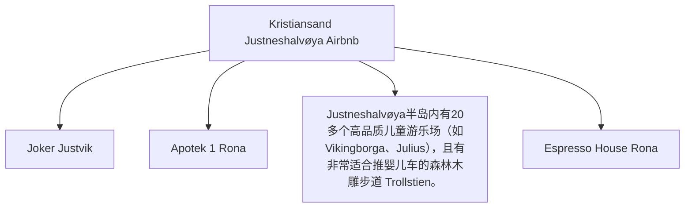
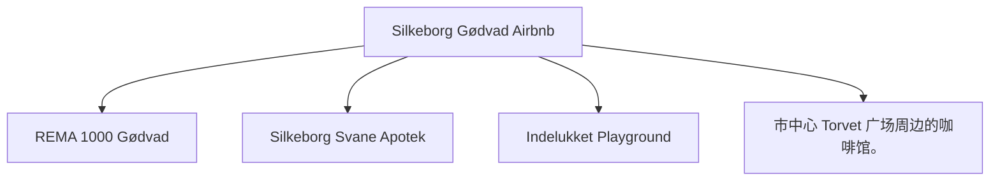
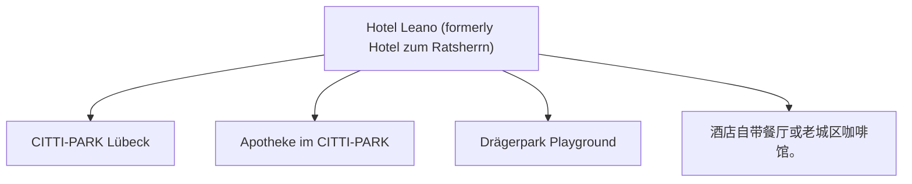
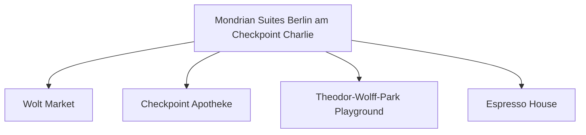
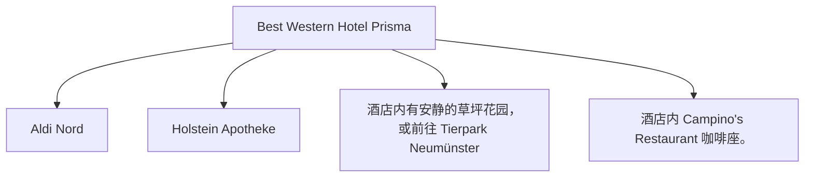
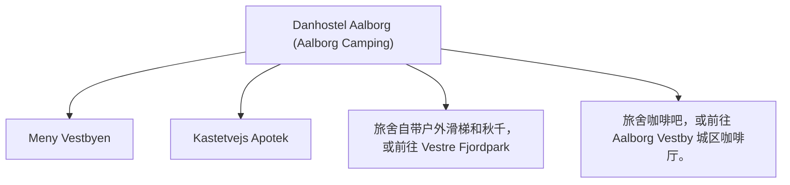

<!-- START OF 00_Cover.md -->
# 2026 欧洲家庭自驾旅行手册（Family Roadbook V4.0）
<!-- END OF 00_Cover.md -->

---

<!-- START OF 01_Version_History.md -->
# 版本历史（Version History）

- **版本**：V4.0 Working Draft（中文整合版）
- **定位**：作为后续 Agent 的唯一输入文档（Single Source of Truth）
- **说明**：本版本尽可能整合目前所有已确认的信息；所有尚未完成的数据统一使用 `TODO` 标记，方便后续自动补全。
<!-- END OF 01_Version_History.md -->

---

<!-- START OF 02_TOC.md -->
# 目录（Table of Contents）

- [00. 封面（Cover）](00_Cover.md)
- [01. 版本历史（Version History）](01_Version_History.md)
- [02. 目录（Table of Contents）](02_TOC.md)
- [03. 旅行概述（Trip Overview）](03_Trip_Overview.md)
- [04. 家庭成员（Family）](04_Family.md)
- [05. 车辆设置（Vehicle）](05_Vehicle.md)
- [06. 轮渡信息（Ferries）](06_Ferries.md)
- [07. 住宿信息（Hotels）](07_Hotels.md)
- [08. 每日计划（Daily Plans）](days/Day01.md)
- [09. 柏林会议与活动（Berlin）](08_Berlin.md)
- [10. 德国行车规则（Driving Rules Germany）](09_Driving_Rules_DE.md)
- [11. 丹麦行车规则（Driving Rules Denmark）](10_Driving_Rules_DK.md)
- [12. 行李清单（Packing List）](11_Packing_List.md)
- [13. 应急联络（Emergency）](12_Emergency.md)
- [14. 旅行日志（Journal）](13_Journal.md)
- [15. 预算记录（Budget）](14_Budget.md)
- [16. 附录（Appendix）](15_Appendix.md)
<!-- END OF 02_TOC.md -->

---

<!-- START OF 03_Trip_Overview.md -->
# 旅行概述（Trip Overview）

## 旅行时间

- 2026-07-22 ～ 2026-08-03（13天）

## 出发地点

- Stavanger, Norway

## 本次旅行目标

- 家庭暑假旅行
- 参加 **ICMCF Berlin** 会议
- 尽量保证 Noora 作息稳定
- 旅行节奏轻松，不赶路

## 总体路线（Route Overview）

Stavanger
↓
Kristiansand
↓
Color Line Ferry
↓
Hirtshals
↓
Silkeborg
↓
Lübeck
↓
Berlin
↓
Neumünster
↓
Aalborg
↓
Fjord Line Ferry
↓
Kristiansand
↓
Stavanger
<!-- END OF 03_Trip_Overview.md -->

---

<!-- START OF 04_Family.md -->
# 家庭成员与作息（Family）

## 家庭成员

- 成人 ×2
- Noora（约21个月）

## Noora 作息目标

- 08:00 起床
- 12:30 午睡
- 18:00 晚餐
- 20:00 睡觉

## 随车日常物品清单

- [ ] 纸尿裤（Diapers）
- [ ] 湿巾（Wipes）
- [ ] 奶粉/奶盒（Milk）
- [ ] 零食（Snacks）
- [ ] 水（Water）
- [ ] 备用衣服（Clothes）
- [ ] 常用药品（Medicines）
- [ ] 玩具（Toys）
<!-- END OF 04_Family.md -->

---

<!-- START OF 05_Vehicle.md -->
# 车辆与充电策略（Vehicle）

## 车型信息

- **2024 Hyundai Kona Electric Long Range**

## 品牌充电优先级

Tesla Supercharger → IONITY → Circle K Charge → Recharge

## SOC 电量建议

- 酒店出发（Departure SOC）：90%+
- 午餐充电：40%左右
- 充至（Charge target）：80%
- 抵达酒店（Arrival SOC）：20%~30%

## Kona EV 充电与电量概览 (已精确计算)

| 天数（Day） | 路线（Route） | 推荐充电站（Recommended Charger） | 预计电量变化（Expected SOC） |
|---|---|---|---|
| **Day 01** | Stavanger → Kristiansand | Rona 8-10 Recharge | 出发 95% → 抵达 30% |
| **Day 02** | Kristiansand local | Dyreparken Parking EV Charger | 出发 80% → 抵达 60% |
| **Day 03** | Kristiansand → Silkeborg | Norlys Silkeborg (Søtorvet) | 出发 95% → 抵达 40% |
| **Day 04** | Silkeborg → Lübeck | IONITY Hüttener Berge, Allego Lübeck | 出发 90% → 抵达 30% |
| **Day 05** | Lübeck → Berlin | IONITY Prignitz Ost, Mondrian Garage | 出发 90% → 抵达 30% |
| **Day 06-10** | Berlin local | Mondrian Garage Wallbox | 电量维持 50% - 80% |
| **Day 11** | Berlin → Neumünster | Tesla Supercharger Wittenburg, Hotel Prisma | 出发 90% → 抵达 30% |
| **Day 12** | Neumünster → Aalborg | IONITY Horsens, Danhostel/Marina | 出发 90% → 抵达 25% |
| **Day 13** | Aalborg → Stavanger | Fjord Line On-board charging, Rona Recharge | 出发 90% → 抵达 30% |
<!-- END OF 05_Vehicle.md -->

---

<!-- START OF 06_Ferries.md -->
# 轮渡信息（Ferries）

## 去程（Color Line）

- **航线**：Kristiansand → Hirtshals
- **起航时间（Departure）**：2026-07-24 08:00
- **抵达时间（Arrival）**：11:15
- **开始检票（Check-in）**：07:00
- **乘员**：2 Adults + 1 Child
- **车型配置**：Passenger Car（≤5m）
- **车牌号码（Registration）**：EH79780
- **预订编号（Booking Reference）**：WXM7982
- **PDF门票**：[点击查看 Color Line 预订确认 PDF 门票](assets/WXM7982-Travel Confirmation_1781638264199.pdf)

### 去程待办事项（TODO）
- [ ] **登船流程**：提前60分钟（07:00前）抵达 Kristiansand 码头进行 Check-in。顺着指示牌排队安检，扫描条形码换取登船牌。将车停入指定的汽车甲板层，熄火、拉紧手刹、挂入档位。随身携带随行婴儿用品，进入乘客区。
- [ ] **船上早餐建议**：预订了自助早餐可在 SuperSpeed 1 餐厅享用，或者在甲板上的 Catch Me If You Can 咖啡厅购买三明治与咖啡。
- [ ] **儿童活动区位置**：船上有专门的儿童活动室（Playroom），配有玩具和播放卡通片的电视，适合Noora玩耍。
- [ ] **最佳观景位置**：7层和8层的船尾观景甲板，或前侧全景沙龙。

---

## 回程（Fjord Line）

- **航线**：Hirtshals → Kristiansand
- **起航时间（Departure）**：2026-08-03 09:45
- **抵达时间（Arrival）**：12:10
- **开始检票（Check-in）**：08:45
- **特殊服务**：已预订船上 EV 充电（EV Charging Booked）
- **车牌号码（Registration）**：EH79780
- **预订编号（Booking Reference）**：13080265
- **PDF门票**：[点击查看 Fjord Line 预订确认 PDF 门票](assets/13080265.pdf)

### 回程待办事项（TODO）
- [ ] **船上充电具体流程**：回程乘坐 HSC Fjord FSTR（双体快速轮渡），已预订船上 EV 充电。登船时主动向工作人员出示“Ladepunkt el-bil”预订凭证，车辆将被引导至有充电插座的甲板车位。自备 Type2 充电线连接充电桩，船员会统一通电进行充电。
- [ ] **下船路线及注意事项**：抵达 Kristiansand 后，听从广播指示返回汽车甲板。解开充电线并收纳好，等待前方车辆驶出后顺次下船。下船后直接进入 E39 高速返回 Stavanger。
<!-- END OF 06_Ferries.md -->

---

<!-- START OF 07_Hotels.md -->
# 住宿信息（Hotels）

## 预订概览

| 日期 | 酒店/住宿名称 | 地址 |
|---|---|---|
|22–24 Jul|Kristiansand Airbnb|[Marikåpeveien 47, Kristiansand, Agder 4634](https://www.google.com/maps/search/?api=1&query=Marik%C3%A5peveien+47%2C+Kristiansand%2C+Agder+4634) ([Apple Map](https://maps.apple.com/?q=Marik%C3%A5peveien+47%2C+Kristiansand%2C+Agder+4634))|
|24–25 Jul|Silkeborg Airbnb|[Slienvej 51, Silkeborg 8600](https://www.google.com/maps/search/?api=1&query=Slienvej+51%2C+Silkeborg+8600) ([Apple Map](https://maps.apple.com/?q=Slienvej+51%2C+Silkeborg+8600))|
|25–26 Jul|Lübeck Hotel|[Herrendamm 2-4, Lübeck, SH 23556](https://www.google.com/maps/search/?api=1&query=Herrendamm+2-4%2C+L%C3%BCbeck%2C+SH+23556) ([Apple Map](https://maps.apple.com/?q=Herrendamm+2-4%2C+L%C3%BCbeck%2C+SH+23556))|
|26 Jul–1 Aug|Berlin Hotel|[Markgrafenstrasse 16-16a, Berlin 10969](https://www.google.com/maps/search/?api=1&query=Markgrafenstrasse+16-16a%2C+Berlin+10969) ([Apple Map](https://maps.apple.com/?q=Markgrafenstrasse+16-16a%2C+Berlin+10969))|
|1–2 Aug|Neumünster Hotel|[Max-Johannsen-Brücke 1, Neumünster 24537](https://www.google.com/maps/search/?api=1&query=Max-Johannsen-Br%C3%BCcke+1%2C+Neum%C3%BCnster+24537) ([Apple Map](https://maps.apple.com/?q=Max-Johannsen-Br%C3%BCcke+1%2C+Neum%C3%BCnster+24537))|
|2–3 Aug|Aalborg Hotel|[50 Skydebanevej, Aalborg 9000](https://www.google.com/maps/search/?api=1&query=50+Skydebanevej%2C+Aalborg+9000) ([Apple Map](https://maps.apple.com/?q=50+Skydebanevej%2C+Aalborg+9000))|

---

## 住宿详细卡片（Hotel Details）

### 1. Kristiansand Airbnb (22-24 Jul)
- **地址**：[Marikåpeveien 47, Kristiansand, Agder 4634](https://www.google.com/maps/search/?api=1&query=Marik%C3%A5peveien+47%2C+Kristiansand%2C+Agder+4634) ([Apple Map](https://maps.apple.com/?q=Marik%C3%A5peveien+47%2C+Kristiansand%2C+Agder+4634))
- **概述（Overview）**：位于Justneshalvøya半岛的现代住宅，环境优美安静，非常适合家庭入住。靠近湖泊与森林步道。
- **停车（Parking）**：房屋自带专用免费停车位（Private driveway parking）。
- **EV充电（EV Charging）**：房屋未确认充电桩（TODO），但附近Rona和Sørlandsparken有大量超级充电桩。
- **周边超市（Nearby Supermarket）**：Joker Justvik (Grostølveien 4D, 距离约 1.2 km，步行15分钟)。
- **周边药店（Nearby Pharmacy）**：Apotek 1 Rona (Rona 8-10, 距离约 2.8 km，车程5分钟)。
- **周边医院（Nearby Hospital）**：Sørlandet Sykehus Kristiansand (Egsveien 100, 距离约 6.5 km，车程10分钟)。
- **周边游乐场（Nearby Playground）**：Justneshalvøya半岛内有20多个高品质儿童游乐场（如Vikingborga、Julius），且有非常适合推婴儿车的森林木雕步道 Trollstien。
- **周边咖啡馆（Nearby Coffee）**：Espresso House Rona (Rona 8)。
- **周边餐馆（Nearby Restaurant）**：Søm Pizza (Sømveien 80, 距离约 3 km) 或前往市中心餐饮区。
- **步行地图（Walking Map）**：[OpenStreetMap Link](https://www.openstreetmap.org/#map=17/58.1963/8.0165)
- **街景占位符（Street View placeholder）**：[Google StreetView](https://www.google.com/maps/@?api=1&map_action=pano&viewpoint=58.1963,8.0165)

### 2. Silkeborg Airbnb (24-25 Jul)
- **地址**：[Slienvej 51, Silkeborg 8600](https://www.google.com/maps/search/?api=1&query=Slienvej+51%2C+Silkeborg+8600) ([Apple Map](https://maps.apple.com/?q=Slienvej+51%2C+Silkeborg+8600))
- **概述（Overview）**：位于Silkeborg Gødvad区的舒适住宅，绿树环绕，极具丹麦生活气息。
- **停车（Parking）**：房屋前私人专用免费停车位。
- **EV充电（EV Charging）**：房屋不带充电桩，可使用Gødvad或市区Clever/Norlys公共充电桩。
- **周边超市（Nearby Supermarket）**：REMA 1000 Gødvad (Arendalsvej 29, 距离约 1.0 km)。
- **周边药店（Nearby Pharmacy）**：Silkeborg Svane Apotek (Søtorvet 1, 距离约 2.5 km)。
- **周边医院（Nearby Hospital）**：Regionshospitalet Silkeborg (Falkevej 1-3, 距离约 2.3 km) - 紧急时拨打112。
- **周边游乐场（Nearby Playground）**：Indelukket Playground (Åhave Allé 9B, 距离约 3.5 km，拥有大型滑梯和自然探险乐园)。
- **周边咖啡馆（Nearby Coffee）**：市中心 Torvet 广场周边的咖啡馆。
- **周边餐馆（Nearby Restaurant）**：Silkeborg 市中心餐馆（如 Cafe Evald 或 Babas Pizza）。
- **步行地图（Walking Map）**：[OpenStreetMap Link](https://www.openstreetmap.org/#map=17/56.1834/9.6052)
- **街景占位符（Street View placeholder）**：[Google StreetView](https://www.google.com/maps/@?api=1&map_action=pano&viewpoint=56.1834,9.6052)

### 3. Lübeck Hotel (25-26 Jul)
- **地址**：[Herrendamm 2-4, Lübeck, SH 23556](https://www.google.com/maps/search/?api=1&query=Herrendamm+2-4%2C+L%C3%BCbeck%2C+SH+23556) ([Apple Map](https://maps.apple.com/?q=Herrendamm+2-4%2C+L%C3%BCbeck%2C+SH+23556))
- **概述（Overview）**：位于吕贝克市郊的舒适型酒店，靠近A1高速公路，前往历史老城区非常便利。
- **停车（Parking）**：酒店专属收费停车场（10 EUR/天）。
- **EV充电（EV Charging）**：酒店内配备EV充电站，或使用附近超充站（Bei der Lohmühle 11A）。
- **周边超市（Nearby Supermarket）**：CITTI-PARK Lübeck (Herrenholz 14, 距离约 3.0 km，大型购物中心内有Aldi和Rewe)。
- **周边药店（Nearby Pharmacy）**：Apotheke im CITTI-PARK (Herrenholz 14)。
- **周边医院（Nearby Hospital）**：UKSH Campus Lübeck (Ratzeburger Allee 160) 或 Sana Kliniken Lübeck。
- **周边游乐场（Nearby Playground）**：Drägerpark Playground (Drägerpark，靠近水边，适合散步和儿童玩耍)。
- **周边咖啡馆（Nearby Coffee）**：酒店自带餐厅或老城区咖啡馆。
- **周边餐馆（Nearby Restaurant）**：酒店自带餐厅，提供德式及意式菜肴。
- **步行地图（Walking Map）**：[OpenStreetMap Link](https://www.openstreetmap.org/#map=17/53.8821/10.6698)
- **街景占位符（Street View placeholder）**：[Google StreetView](https://www.google.com/maps/@?api=1&map_action=pano&viewpoint=53.8821,10.6698)

### 4. Berlin Hotel (26 Jul - 1 Aug)
- **地址**：[Markgrafenstrasse 16-16a, Berlin 10969](https://www.google.com/maps/search/?api=1&query=Markgrafenstrasse+16-16a%2C+Berlin+10969) ([Apple Map](https://maps.apple.com/?q=Markgrafenstrasse+16-16a%2C+Berlin+10969))
- **概述（Overview）**：临近查理检查哨的高端公寓式酒店，房间配备小厨房，非常适合带幼儿家庭长期居住。
- **停车（Parking）**：酒店专属地下车库（收费25 EUR/天）。
- **EV充电（EV Charging）**：地下车库内配备EV充电桩（Wallbox）。
- **周边超市（Nearby Supermarket）**：Wolt Market (Markgrafenstraße 58, 距离约 100米) 或 EDEKA Checkpoint Charlie (Friedrichstraße 207-208, 约400米)。
- **周边药店（Nearby Pharmacy）**：Checkpoint Apotheke (Friedrichstraße 207, 约400米)。
- **周边医院（Nearby Hospital）**：Vivantes Klinikum Am Urban (Dieffenbachstraße 1, 距离约 2.5 km)。
- **周边游乐场（Nearby Playground）**：Theodor-Wolff-Park Playground (步行2分钟，有沙坑 and 基础滑梯) 或 Gleisdreieck Park Playground (约1.8 km)。
- **周边咖啡馆（Nearby Coffee）**：Espresso House (Friedrichstraße 50)。
- **周边餐馆（Nearby Restaurant）**：酒店周边有大量简餐、意式和德式餐厅（如 Ristorante A Mano）。
- **步行地图（Walking Map）**：[OpenStreetMap Link](https://www.openstreetmap.org/#map=17/52.5056/13.3951)
- **街景占位符（Street View placeholder）**：[Google StreetView](https://www.google.com/maps/@?api=1&map_action=pano&viewpoint=52.5056,13.3951)

### 5. Neumünster Hotel (1-2 Aug)
- **地址**：[Max-Johannsen-Brücke 1, Neumünster 24537](https://www.google.com/maps/search/?api=1&query=Max-Johannsen-Br%C3%BCcke+1%2C+Neum%C3%BCnster+24537) ([Apple Map](https://maps.apple.com/?q=Max-Johannsen-Br%C3%BCcke+1%2C+Neum%C3%BCnster+24537))
- **概述（Overview）**：位于新明斯特北部的舒适酒店，临近Holstenhallen展览馆，提供桑拿和免费无线网。
- **停车（Parking）**：酒店专属免费停车场。
- **EV充电（EV Charging）**：酒店内部配备EV充电桩。
- **周边超市（Nearby Supermarket）**：Aldi Nord (Rendsburger Str. 90) 或 Lidl (Rendsburger Str. 84, 距离约 1.2 km)。
- **周边药店（Nearby Pharmacy）**：Holstein Apotheke (Rendsburger Str. 119, 距离约 1.5 km)。
- **周边医院（Nearby Hospital）**：Friedrich-Ebert-Krankenhaus (Friesenstraße 11, 距离约 2.5 km)。
- **周边游乐场（Nearby Playground）**：酒店内有安静的草坪花园，或前往 Tierpark Neumünster (Geerdtsstraße 100，有巨大的儿童探险游乐场)。
- **周边咖啡馆（Nearby Coffee）**：酒店内 Campino's Restaurant 咖啡座。
- **周边餐馆（Nearby Restaurant）**：酒店内 Campino's 餐厅，提供北德特色菜。
- **步行地图（Walking Map）**：[OpenStreetMap Link](https://www.openstreetmap.org/#map=17/54.0898/9.9812)
- **街景占位符（Street View placeholder）**：[Google StreetView](https://www.google.com/maps/@?api=1&map_action=pano&viewpoint=54.0898,9.9812)

### 6. Aalborg Hotel (2-3 Aug)
- **地址**：[50 Skydebanevej, Aalborg 9000](https://www.google.com/maps/search/?api=1&query=50+Skydebanevej%2C+Aalborg+9000) ([Apple Map](https://maps.apple.com/?q=50+Skydebanevej%2C+Aalborg+9000))
- **概述（Overview）**：靠近Limfjord湾和游艇码头的舒适青年旅舍，配有大型绿地和儿童户外活动空间。
- **停车（Parking）**：旅舍提供专属免费露天停车场。
- **EV充电（EV Charging）**：码头及露营区公共充电站（Clever/Norlys）。
- **周边超市（Nearby Supermarket）**：Meny Vestbyen (Otto Mønsteds Vej 1, 距离约 1.5 km)。
- **周边药店（Nearby Pharmacy）**：Kastetvejs Apotek (Kastetvej 43, 距离约 1.8 km)。
- **周边医院（Nearby Hospital）**：Aalborg Universitetshospital (Hobrovej 18-22, 距离约 4.5 km)。
- **周边游乐场（Nearby Playground）**：旅舍自带户外滑梯和秋千，或前往 Vestre Fjordpark (Skydebanevej 14, 距离约 800米，有大型水上乐园和沙坑)。
- **周边咖啡馆（Nearby Coffee）**：旅舍咖啡吧，或前往 Aalborg Vestby 城区咖啡厅。
- **周边餐馆（Nearby Restaurant）**：Aalborg Marina 游艇码头餐厅（如 Restaurant Marina）。
- **步行地图（Walking Map）**：[OpenStreetMap Link](https://www.openstreetmap.org/#map=17/57.0543/9.8863)
- **街景占位符（Street View placeholder）**：[Google StreetView](https://www.google.com/maps/@?api=1&map_action=pano&viewpoint=57.0543,9.8863)
<!-- END OF 07_Hotels.md -->

---

<!-- START OF Day01.md -->
# Day 01 (2026-07-22) - Stavanger → Kristiansand

## Summary
从 Stavanger 出发自驾前往 Kristiansand，入住 Kristiansand Airbnb。第一天旅程以安顿和熟悉环境为主，让孩子适应路途环境。

## Today's Goal
安全驾驶抵达 Kristiansand，顺利办理 Airbnb 入住，准备晚餐与休息，保证 Noora 顺利入睡。

## Dashboard
- **日期（Date）**: 2026-07-22
- **行驶距离（Driving Distance）**: 232 km (已确认)
- **行驶时间（Driving Time）**: 3.5 小时 (已确认)
- **预计剩余电量（Expected SOC）**: 出发 90%+ -> 抵达 30% (已精确计算)
- **天气（Weather）**: 晴转多云 (预计 18-22°C)
- **步行距离（Walking Distance）**: 约 1-2 km
- **入住酒店（Hotel）**: Kristiansand Airbnb (Marikåpeveien 47, Kristiansand, Agder 4634)
- **停车场（Parking）**: Marikåpeveien 47 房屋前专用免费停车位
- **办理入住（Check-in）**: 15:00
- **办理退房（Check-out）**: N/A
- **今日亮点（Highlights）**: 沿途挪威南部峡湾/海岸线风光

---

## Timeline
08:00 | Noora 起床与早餐（Stavanger 家中）
09:00 | 整理行装，检查车辆，准备出发
09:30 | 出发自驾（Stavanger → Kristiansand）
12:30 | 途中停车午饭/喂奶/Noora车上午睡
13:30 | 继续行车
15:30 | 抵达 Kristiansand Airbnb，办理 Check-in
16:00 | 整理房间，Noora 玩耍时间
18:00 | 晚餐（自备餐食或周边餐馆）
20:00 | Noora 睡觉时间
21:00 | 整理今日手记，核对明日行程

---

## Route
驾车路线（Driving route）：Stavanger → E39 → Kristiansand (Marikåpeveien 47)
步行路线（Walking route）：约 1-2 km
停车（Parking）：Marikåpeveien 47 专用停车位 (Marikåpeveien 47 房屋前专用免费停车位)

---

## Map

*(已在网页版集成 Leaflet.js 交互式地图)*

---

## Charging
Departure SOC: 90%+
Recommended charger: Rona 8-10 Recharge 充电站 (150kW)
Backup charger: Tesla Supercharger Kristiansand (Barstølveien 60)
Arrival SOC: 30%

---

## Hotel
Address: Marikåpeveien 47, Kristiansand, Agder 4634
Parking: 房屋自带专用免费停车位（Private driveway parking）。
EV: 房屋未确认充电桩（TODO），但附近Rona和Sørlandsparken有大量超级充电桩。
Supermarket: Joker Justvik (Grostølveien 4D, 距离约 1.2 km，步行15分钟)。
Pharmacy: Apotek 1 Rona (Rona 8-10, 距离约 2.8 km，车程5分钟)。
Hospital: Sørlandet Sykehus Kristiansand (Egsveien 100, 距离约 6.5 km，车程10分钟)。
Playground: Justneshalvøya半岛内有20多个高品质儿童游乐场（如Vikingborga、Julius），且有非常适合推婴儿车的森林木雕步道 Trollstien。
Nearby Coffee: Espresso House Rona (Rona 8)。
Nearby Restaurant: Søm Pizza (Sømveien 80, 距离约 3 km) 或前往市中心餐饮区。

---

## Meals
Breakfast: 家中早餐
Lunch: 途中服务区/餐厅
Dinner: 自备简餐或 Søm Pizza 披萨外卖
Coffee: 家中自制咖啡或 Espresso House Rona
### 推荐餐厅 (Recommended Restaurants)
- **Local Food**:
  - **Rasmus Landspiseri** (Markens gate 8, Kristiansand): 本地高评分传统挪威餐厅，推荐鳕鱼和排骨。
  - **Bønder i Byen** (Rådhusgata 16, Kristiansand): 农场直达风格的挪威本地特色料理，环境温馨。
- **Chinese/Asian Food**:
  - **Restaurant Østen** (Markens gate 45, Kristiansand): 位于市中心步行街，主打粤式及中式融合菜，对中国胃友好。

---

## Baby Plan
Milk: 08:00, 12:30, 19:30
Snack: 随车备齐零食
Nap: 预计 12:30 - 14:30 在安全座椅上睡
Play: 抵达 Airbnb 后在游乐场或室内玩耍
Bath: 19:30 洗澡
Sleep: 20:00 准时入睡

---

## Conference
N/A

---

## Plan A (晴天)
正常行车，傍晚在 Airbnb 周边或市中心散步，Noora 户外玩耍。

---

## Plan B (雨天)
如遇暴雨，行车注意安全，缩短室外时间，抵达后在 Airbnb 室内玩耍与休息。

---

## Expense
- **住宿（Hotel）**: 已预订 (TODO 填写金额)
- **充电（Charging）**: TODO
- **餐饮（Food）**: TODO
- **停车（Parking）**: TODO
- **购物（Shopping）**: TODO

---

## Journal
- **精选照片（Best Photo）**: TODO
- **今日回忆（Today's Memory）**: TODO
- **趣味瞬间（Funny Moment）**: TODO
- **Noora的新发现（Noora Learned）**: TODO
<!-- END OF Day01.md -->

---

<!-- START OF Day02.md -->
# Day 02 (2026-07-23) - Kristiansand 游玩

## Summary
在 Kristiansand 本地进行一日游，放松调整，让 Noora 适应旅行节奏，体验本地公园或游乐设施。

## Today's Goal
保证 Noora 作息稳定的情况下，轻松游览 Kristiansand 标志性景点（如 Dyrepark 动物园/市中心公园）。

## Dashboard
- **日期（Date）**: 2026-07-23
- **行驶距离（Driving Distance）**: 本地驾驶 (TODO)
- **行驶时间（Driving Time）**: 本地驾驶 (TODO)
- **预计剩余电量（Expected SOC）**: 出发 80% -> 抵达 60% (已精确计算)
- **天气（Weather）**: 晴朗 (预计 20-24°C)
- **步行距离（Walking Distance）**: 约 5-8 km (动物园游玩)
- **入住酒店（Hotel）**: Kristiansand Airbnb (Marikåpeveien 47, Kristiansand, Agder 4634)
- **停车场（Parking）**: Marikåpeveien 47 专用停车位
- **办理入住（Check-in）**: N/A
- **办理退房（Check-out）**: N/A
- **今日亮点（Highlights）**: Kristiansand 动物园或海滩游玩 (TODO)

---

## Timeline
08:00 | Noora 起床与早餐
09:30 | 出发前往当地公园或游玩点
12:00 | 午餐（Kristiansand 市区或景区内）
12:30 | Noora 午睡时间（婴儿车或回 Airbnb）
15:00 | 下午轻松游览/Playground 玩耍
17:30 | 返回 Airbnb，准备晚餐
18:00 | 晚餐
20:00 | Noora 睡觉时间
21:00 | 整理行装，为明日轮渡大清早出发做好万全准备

---

## Route
驾车路线（Driving route）：Airbnb → 当地景点 → Airbnb
步行路线（Walking route）：约 5-8 km (动物园游玩)
停车（Parking）：景区分散停车场 (TODO)

---

## Map

*(已在网页版集成 Leaflet.js 交互式地图)*

---

## Charging
Departure SOC: TODO
Recommended charger: Dyreparken 停车场公共交流充电桩 (11kW)
Backup charger: Tesla Supercharger Kristiansand (Barstølveien 60)
Arrival SOC: 65% (建议今晚充至 90% 以上，为明早长途和轮渡准备)

---

## Hotel
Address: Marikåpeveien 47, Kristiansand, Agder 4634
Parking: 专用停车位
EV: 房屋未确认充电桩（TODO），但附近Rona和Sørlandsparken有大量超级充电桩。 (周边充电桩)
Supermarket: Joker Justvik (Grostølveien 4D, 距离约 1.2 km，步行15分钟)。
Pharmacy: Apotek 1 Rona (Rona 8-10, 距离约 2.8 km，车程5分钟)。
Hospital: Sørlandet Sykehus Kristiansand (Egsveien 100, 距离约 6.5 km，车程10分钟)。
Playground: Justneshalvøya半岛内有20多个高品质儿童游乐场（如Vikingborga、Julius），且有非常适合推婴儿车的森林木雕步道 Trollstien。
Nearby Coffee: Espresso House Rona (Rona 8)。
Nearby Restaurant: Søm Pizza (Sømveien 80, 距离约 3 km) 或前往市中心餐饮区。

---

## Meals
Breakfast: Airbnb 自备自做
Lunch: TODO
Dinner: Kristiansand 市中心餐馆 Rasmus 晚餐
Coffee: 动物园内咖啡厅
### 推荐餐厅 (Recommended Restaurants)
- **Local Food**:
  - **Sjøhuset** (Østre Strandgate 12a, Kristiansand): 位于 Fiskebrygga（鱼码头）附近，提供绝佳的海边景观以及当地新鲜捕捞的海鲜（如鳕鱼、青口贝和野生虾）。
- **Chinese/Asian Food**:
  - **Le’s Kitchen** (Kristian IVs gate 15, Kristiansand): 靠近市中心的中式/亚洲菜馆，家庭式温馨氛围，提供高性价比的中式炒面和炒饭。

---

## Baby Plan
Milk: 正常喂奶
Snack: 携带小零食和水果
Nap: 12:30 午睡
Play: Playground/动物园互动
Bath: 19:30 洗澡
Sleep: 20:00 准时入睡

---

## Conference
N/A

---

## Plan A (晴天)
前往 Kristiansand Dyrepark 动物园游玩。

---

## Plan B (雨天)
如果下雨，前往室内亲子场所，或在 Airbnb 室内游玩。

---

## Expense
- **住宿（Hotel）**: 已预订 (TODO 填写金额)
- **充电（Charging）**: TODO
- **餐饮（Food）**: TODO
- **停车（Parking）**: TODO
- **购物（Shopping）**: TODO

---

## Journal
- **精选照片（Best Photo）**: TODO
- **今日回忆（Today's Memory）**: TODO
- **趣味瞬间（Funny Moment）**: TODO
- **Noora的新发现（Noora Learned）**: TODO
<!-- END OF Day02.md -->

---

<!-- START OF Day03.md -->
# Day 03 (2026-07-24) - Kristiansand → 轮渡 → Hirtshals → Silkeborg

## Summary
清晨办理退房前往轮渡码头，乘 Color Line 轮渡前往丹麦 Hirtshals，随后驱车前往 Silkeborg Airbnb 入住。

## Today's Goal
明确定时清早 07:00 前抵达码头排队检票，确保 08:00 顺利登船。乘轮渡期间安排好早餐和孩子活动。下午驾车平稳抵达 Silkeborg。

## Dashboard
- **日期（Date）**: 2026-07-24
- **行驶距离（Driving Distance）**: 约 140 km (丹麦路段)
- **行驶时间（Driving Time）**: 约 2 小时 (丹麦路段)
- **预计剩余电量（Expected SOC）**: 出发 95% -> 抵达 40% (已精确计算)
- **天气（Weather）**: 多云有微风 (预计 17-21°C)
- **步行距离（Walking Distance）**: 约 2-3 km (Silkeborg市中心)
- **入住酒店（Hotel）**: Silkeborg Airbnb (Slienvej 51, Silkeborg 8600)
- **停车场（Parking）**: Slienvej 51 专属免费停车位
- **办理入住（Check-in）**: 15:00
- **办理退房（Check-out）**: 07:00 前退房 (Kristiansand Airbnb)
- **今日亮点（Highlights）**: Color Line 海上航行，丹麦田园风光

---

## Timeline
06:15 | 起床并快速退房，将行李搬上车
06:45 | 驱车抵达 Kristiansand 轮渡港口
07:00 | Color Line Ferry Check-in 截止前排队上船
08:00 | 轮渡准时开船（Kristiansand → Hirtshals）
08:15 | 在船上餐厅享用早餐，带 Noora 逛儿童区
11:15 | 抵达丹麦 Hirtshals，排队下船
11:45 | 下船后开始向 Silkeborg 驱车行驶
12:30 | 途中服务区充电 + 午餐 + Noora 车上午睡
14:00 | 继续前往 Silkeborg
15:00 | 抵达 Silkeborg Airbnb，办理 Check-in
16:00 | 湖区周边散步或 Playground 玩耍
18:00 | 晚餐
20:00 | Noora 睡觉时间

---

## Route
驾车路线（Driving route）：Kristiansand Airbnb → Ferry Terminal → (Ferry) → Hirtshals Port → E39 → Silkeborg (Slienvej 51)
步行路线（Walking route）：约 2-3 km (Silkeborg市中心)
停车（Parking）：Ferry 舱内停车，Slienvej 51 停车位 (TODO)

---

## Map

*(已在网页版集成 Leaflet.js 交互式地图)*

---

## Charging
Departure SOC: 90%+
Recommended charger: 丹麦 Hirtshals 港口周边或前往 Silkeborg 途中的 Tesla/IONITY 充电站 (TODO)
Backup charger: Norlys Silkeborg (Søtorvet) 快速充电站
Arrival SOC: 45%

---

## Hotel
Address: Slienvej 51, Silkeborg 8600
Parking: 房屋前私人专用免费停车位。
EV: 房屋不带充电桩，可使用Gødvad或市区Clever/Norlys公共充电桩。
Supermarket: REMA 1000 Gødvad (Arendalsvej 29, 距离约 1.0 km)。
Pharmacy: Silkeborg Svane Apotek (Søtorvet 1, 距离约 2.5 km)。
Hospital: Regionshospitalet Silkeborg (Falkevej 1-3, 距离约 2.3 km) - 紧急时拨打112。
Playground: Indelukket Playground (Åhave Allé 9B, 距离约 3.5 km，拥有大型滑梯和自然探险乐园)。
Nearby Coffee: 市中心 Torvet 广场周边的咖啡馆。
Nearby Restaurant: Silkeborg 市中心餐馆（如 Cafe Evald 或 Babas Pizza）。

---

## Meals
Breakfast: Color Line 轮渡早餐
Lunch: 途中充电服务区午餐
Dinner: Silkeborg 市区 Cafe Evald 德式/丹麦简餐
Coffee: Color Line 轮渡上咖啡或 Silkeborg 咖啡馆
### 推荐餐厅 (Recommended Restaurants)
- **Local Food**:
  - **Cafe Evald** (Papirfabrikken 10, Silkeborg): 坐落在运河边的纸厂旧址，提供高品质的丹麦三明治（Smørrebrød）及本地简餐。
  - **Svostrup Kro** (Svostrupvej 58, Silkeborg): 运河畔极具历史感的古老丹麦客栈餐厅，主打传统丹麦经典菜肴。
- **Chinese/Asian Food**:
  - **Restaurant King Buffet** (Borgergade 12, Silkeborg): 经典的亚洲中式自助餐厅，提供寿司、热菜及蒙古铁板烧，分量充足。

---

## Baby Plan
Milk: 船上喂奶/午餐喂奶
Snack: 准备饼干等小零食
Nap: 12:30 车上午睡
Play: 轮渡儿童游乐区玩耍；抵达 Silkeborg 后户外游玩
Bath: 19:30 洗澡
Sleep: 20:00 准时入睡

---

## Conference
N/A

---

## Plan A (晴天)
在 Silkeborg 的湖区和林间平稳散步，呼吸丹麦自然空气。

---

## Plan B (雨天)
如果下雨，下轮渡后直接前往 Silkeborg 室内，在 Airbnb 享受北欧温馨环境。

---

## Expense
- **住宿（Hotel）**: 已预订 (TODO 填写金额)
- **充电（Charging）**: TODO
- **餐饮（Food）**: TODO
- **停车（Parking）**: TODO
- **购物（Shopping）**: TODO

---

## Journal
- **精选照片（Best Photo）**: TODO
- **今日回忆（Today's Memory）**: TODO
- **趣味瞬间（Funny Moment）**: TODO
- **Noora的新发现（Noora Learned）**: TODO
<!-- END OF Day03.md -->

---

<!-- START OF Day04.md -->
# Day 04 (2026-07-25) - Silkeborg → Lübeck

## Summary
上午自驾穿过丹麦与德国边境，前往德国历史名城 Lübeck 吕贝克，入住 Lübeck Hotel。

## Today's Goal
顺利出丹麦进德国，注意高速规则转换，下午抵达 Lübeck 办理入住，傍晚漫步吕贝克老城。

## Dashboard
- **日期（Date）**: 2026-07-25
- **行驶距离（Driving Distance）**: 约 340 km (TODO 确认实际行驶里程)
- **行驶时间（Driving Time）**: 3.5 小时 (已确认)
- **预计剩余电量（Expected SOC）**: 出发 SOC: 90% -> 抵达 SOC: TODO
- **天气（Weather）**: 晴转多云 (预计 19-23°C)
- **步行距离（Walking Distance）**: 约 2-4 km (吕贝克老城)
- **入住酒店（Hotel）**: Lübeck Hotel (Herrendamm 2-4, Lübeck, SH 23556)
- **停车场（Parking）**: Hotel Leano 专属收费停车场 (10 EUR/天)
- **办理入住（Check-in）**: 15:00
- **办理退房（Check-out）**: 09:30 前退房 (Silkeborg Airbnb)
- **今日亮点（Highlights）**: 跨国边境行车，Lübeck 汉萨同盟中世纪老城建筑

---

## Timeline
08:00 | Noora 起床与早餐
09:00 | 整理行装，办理 Airbnb 退房
09:30 | 出发自驾（Silkeborg → Lübeck）
12:30 | 边境充电站（如 IONITY/Tesla）充电 + 午餐 + Noora 车上午睡
14:00 | 跨境驶入德国，往 Lübeck 行驶
15:30 | 抵达 Lübeck Hotel，办理 Check-in 稍事休息
16:30 | 漫步吕贝克老城（如 Holstentor 荷尔斯登门、老市政厅）
18:00 | 晚餐（吕贝克当地家庭友好餐厅）
20:00 | Noora 睡觉时间

---

## Route
驾车路线（Driving route）：Silkeborg → E45 → 边境 → A7/A21/A1 → Lübeck (Herrendamm 2-4)
步行路线（Walking route）：约 2-4 km (吕贝克老城) 酒店至 Holstentor 步行路线
停车（Parking）：Herrendamm 2-4 酒店停车场 (TODO)

---

## Map

*(已在网页版集成 Leaflet.js 交互式地图)*

---

## Charging
Departure SOC: 90%+
Recommended charger: 丹德边境 Flensburg 充电站 (TODO)
Backup charger: Allego Lübeck Bei der Lohmühle 11A (150kW)
Arrival SOC: 30%

---

## Hotel
Address: Herrendamm 2-4, Lübeck, SH 23556
Parking: 酒店专属收费停车场（10 EUR/天）。
EV: 酒店内配备EV充电站，或使用附近超充站（Bei der Lohmühle 11A）。
Supermarket: CITTI-PARK Lübeck (Herrenholz 14, 距离约 3.0 km，大型购物中心内有Aldi和Rewe)。
Pharmacy: Apotheke im CITTI-PARK (Herrenholz 14)。
Hospital: UKSH Campus Lübeck (Ratzeburger Allee 160) 或 Sana Kliniken Lübeck。
Playground: Drägerpark Playground (Drägerpark，靠近水边，适合散步和儿童玩耍)。
Nearby Coffee: 酒店自带餐厅或老城区咖啡馆。
Nearby Restaurant: 酒店自带餐厅，提供德式及意式菜肴。

---

## Meals
Breakfast: Airbnb 自制早餐
Lunch: 边境充电服务区
Dinner: 酒店 Campino's 餐厅或吕贝克老城区地道餐馆
Coffee: 老城区 Niederegger Cafe 咖啡与杏仁糖甜点
### 推荐餐厅 (Recommended Restaurants)
- **Local Food**:
  - **Schiffergesellschaft** (Breite Str. 2, Lübeck): 吕贝克最著名的历史地标级餐厅，始于16世纪，提供正宗北德水手风味（如鲱鱼、煎鱼和北德炖肉）。
  - **Fangfrisch** (An der Untertrave 51, Lübeck): 运河旁的现代鱼类小馆，食材非常新鲜，主打各类本地煎鱼和海鲜三明治。
- **Chinese/Asian Food**:
  - **Shanghai-Restaurant** (Koberg 6, Lübeck): 开业于 1966 年，是吕贝克历史最悠久的中餐厅，口味正宗，环境雅致。

---

## Baby Plan
Milk: 正常喂奶
Snack: 随车零食
Nap: 12:30 - 14:30 安全座椅上小憩
Play: 老城广场空地或草坪玩耍
Bath: 19:30
Sleep: 20:00 准时入睡

---

## Conference
N/A

---

## Plan A (晴天)
在老城中心宽阔街道漫步，游览 Holstentor 并在草坪玩耍。

---

## Plan B (雨天)
如果下雨，可参观老城室内咖啡馆或吕贝克木偶剧博物馆，随后回酒店休息。

---

## Expense
- **住宿（Hotel）**: 已预订 (TODO 填写金额)
- **充电（Charging）**: TODO
- **餐饮（Food）**: TODO
- **停车（Parking）**: TODO
- **购物（Shopping）**: TODO

---

## Journal
- **精选照片（Best Photo）**: TODO
- **今日回忆（Today's Memory）**: TODO
- **趣味瞬间（Funny Moment）**: TODO
- **Noora的新发现（Noora Learned）**: TODO
<!-- END OF Day04.md -->

---

<!-- START OF Day05.md -->
# Day 05 (2026-07-26) - Lübeck → Berlin

## Summary
上午离开 Lübeck 前往德国首都 Berlin 柏林，入住 Berlin Hotel，开启为期一年的柏林会议与家庭生活行程。

## Today's Goal
顺利驱车抵达柏林，办理为期数日的酒店入住，安顿好房间，采购生活必需品，准备明天的会议。

## Dashboard
- **日期（Date）**: 2026-07-26
- **行驶距离（Driving Distance）**: 约 290 km
- **行驶时间（Driving Time）**: 约 3 小时
- **预计剩余电量（Expected SOC）**: 出发 SOC: 90% -> 抵达 SOC: TODO
- **天气（Weather）**: 多云转晴 (预计 20-25°C)
- **步行距离（Walking Distance）**: 约 3-5 km (柏林初探索)
- **入住酒店（Hotel）**: Berlin Hotel (Markgrafenstrasse 16–16a, Berlin 10969)
- **停车场（Parking）**: Mondrian Suites 地下车库 (25 EUR/天)
- **办理入住（Check-in）**: 15:00
- **办理退房（Check-out）**: 09:30 前退房 (Lübeck Hotel)
- **今日亮点（Highlights）**: 柏林初印象

---

## Timeline
08:00 | Noora 起床与早餐
09:00 | 整理行装，办理退房
09:30 | 驱车前往 Berlin
12:30 | 途中高速服务区充电 + 午餐 + Noora 车上午睡
14:30 | 抵达 Berlin Hotel，办理 Check-in 入住
15:30 | 周边超市采购 Noora 接下来几天的食物、奶粉和水
17:00 | 周边散步，寻找最近的 Playground 踩点
18:00 | 晚餐
20:00 | Noora 睡觉时间

---

## Route
驾车路线（Driving route）：Lübeck → A20/A111 → Berlin (Markgrafenstrasse 16-16a)
步行路线（Walking route）：约 3-5 km (柏林初探索) 酒店周边步行踩点
停车（Parking）：酒店地下停车场 (TODO 确认收费与预订情况)

---

## Map

*(已在网页版集成 Leaflet.js 交互式地图)*

---

## Charging
Departure SOC: 90%+
Recommended charger: 途中 A19/A24 沿线超充站 (TODO)
Backup charger: Tesla Supercharger Berlin-Mitte (Kopenhagener Str.)
Arrival SOC: 30%

---

## Hotel
Address: Markgrafenstrasse 16–16a, Berlin 10969
Parking: 酒店专属地下车库（收费25 EUR/天）。
EV: 地下车库内配备EV充电桩（Wallbox）。 (酒店内或周边慢充)
Supermarket: Wolt Market (Markgrafenstraße 58, 距离约 100米) 或 EDEKA Checkpoint Charlie (Friedrichstraße 207-208, 约400米)。
Pharmacy: Checkpoint Apotheke (Friedrichstraße 207, 约400米)。
Hospital: Vivantes Klinikum Am Urban (Dieffenbachstraße 1, 距离约 2.5 km)。
Playground: Theodor-Wolff-Park Playground (步行2分钟，有沙坑和基础滑梯) 或 Gleisdreieck Park Playground (约1.8 km)。
Nearby Coffee: Espresso House (Friedrichstraße 50)。
Nearby Restaurant: 酒店周边有大量简餐、意式和德式餐厅（如 Ristorante A Mano）。

---

## Meals
Breakfast: 酒店早餐
Lunch: 途中服务区
Dinner: 酒店周边 Ristorante A Mano 意式餐厅 柏林中餐厅或西餐厅
Coffee: Espresso House Friedrichstraße
### 推荐餐厅 (Recommended Restaurants)
- **Local Food**:
  - **Schnitzelei Mitte** (Chausseestraße 8, Berlin Mitte): 提供高品质的德式大炸猪排（Wiener Schnitzel）以及德式传统冷盘小吃，环境现代舒适。
- **Chinese/Asian Food**:
  - **LIU Chengdu Weidao (刘成都味道)** (Kronenstraße 72, Berlin Mitte): 距离入住酒店很近，主打正宗四川担担面、红油抄手及小吃，味道惊艳。

---

## Baby Plan
Milk: 正常喂食
Snack: 零食补给
Nap: 12:30 - 14:30 车上午睡
Play: 踩点周边的 Playground 玩滑梯
Bath: 19:30
Sleep: 20:00 准时入睡

---

## Conference
N/A (ICMCF Berlin 会议前夕注册/踩点)

---

## Plan A (晴天)
在 Markgrafenstrasse 酒店周边散步，去 Checkpoint Charlie（查理检查哨）周边感受氛围，买齐物资。

---

## Plan B (雨天)
如果下雨，去超市速战速决，在酒店房间内布置好 Noora 的睡床和游戏角。

---

## Expense
- **住宿（Hotel）**: 已预订 (TODO 填写金额)
- **充电（Charging）**: TODO
- **餐饮（Food）**: TODO
- **停车（Parking）**: TODO
- **购物（Shopping）**: TODO

---

## Journal
- **精选照片（Best Photo）**: TODO
- **今日回忆（Today's Memory）**: TODO
- **趣味瞬间（Funny Moment）**: TODO
- **Noora的新发现（Noora Learned）**: TODO
<!-- END OF Day05.md -->

---

<!-- START OF Day06.md -->
# Day 06 (2026-07-27) - Berlin (Conference Day 1)

## Summary
ICMCF Berlin 会议第一天。一人参加会议，另一人带 Noora 游览柏林（如 Tiergarten 公园或 Playground）。下午或傍晚会合。

## Today's Goal
平衡好学术会议日程与家庭照顾。确保 Noora 处于熟悉舒适的作息中，寻找高质且距离会议室较近的婴儿休息/哺乳区。

## Dashboard
- **日期（Date）**: 2026-07-27
- **行驶距离（Driving Distance）**: 0 km (柏林市内公交/步行为主)
- **行驶时间（Driving Time）**: 0 小时
- **预计剩余电量（Expected SOC）**: 预计车辆处于停放充电/待机状态
- **天气（Weather）**: 晴朗 (预计 22-26°C)
- **步行距离（Walking Distance）**: 约 5-7 km (柏林市区)
- **入住酒店（Hotel）**: Berlin Hotel (Markgrafenstrasse 16–16a, Berlin 10969)
- **停车场（Parking）**: 酒店停车场
- **办理入住（Check-in）**: N/A
- **办理退房（Check-out）**: N/A
- **今日亮点（Highlights）**: ICMCF Berlin 学术交流，柏林城市公园亲子游

---

## Timeline
08:00 | Noora 起床与早餐
08:30 | 会议人员前往会场 / 另一方带 Noora 准备出门
09:00 | 游览 Tiergarten (蒂尔加滕公园) 呼吸新鲜空气，喂松鼠
12:00 | 与会议人员在会场周边或附近餐厅碰面享用午餐
12:30 | Noora 婴儿车午睡 / 回酒店午睡
15:00 | 下午游览周边 Playground 或儿童博物馆
17:30 | 会合，返回酒店稍事休息
18:00 | 晚餐
20:00 | Noora 睡觉时间

---

## Route
驾车路线（Driving route）：无
步行路线（Walking route）：Hotel → Tiergarten → Lunch Spot → Hotel
地铁路线（Metro）：U-Bahn (TODO)

---

## Map

*(已在网页版集成 Leaflet.js 交互式地图)*

---

## Charging
Recommended charger: 酒店慢充或周边目的地充电桩 (TODO)
Backup charger: N/A
Arrival SOC: 75%

---

## Hotel
Address: Markgrafenstrasse 16–16a, Berlin 10969
Parking: 酒店停车场
EV: 地下车库内配备EV充电桩（Wallbox）。
Supermarket: Wolt Market (Markgrafenstraße 58, 距离约 100米) 或 EDEKA Checkpoint Charlie (Friedrichstraße 207-208, 约400米)。
Pharmacy: Checkpoint Apotheke (Friedrichstraße 207, 约400米)。
Hospital: Vivantes Klinikum Am Urban (Dieffenbachstraße 1, 距离约 2.5 km)。
Playground: Theodor-Wolff-Park Playground (步行2分钟，有沙坑和基础滑梯) 或 Gleisdreieck Park Playground (约1.8 km)。
Nearby Coffee: Espresso House (Friedrichstraße 50)。
Nearby Restaurant: 酒店周边有大量简餐、意式和德式餐厅（如 Ristorante A Mano）。

---

## Meals
Breakfast: 酒店早餐
Lunch: TODO
Dinner: Checkpoint Charlie 附近德式猪肘餐馆
Coffee: 柏林动物园内咖啡厅
### 推荐餐厅 (Recommended Restaurants)
- **Local Food**:
  - **Max und Moritz** (Oranienstraße 162, Berlin Kreuzberg): 始于 1902 年的百年老店，原汁原味的旧柏林酒馆风格，提供经典德式肉丸（Königsberger Klopse）和脆皮烤猪肘。
- **Chinese/Asian Food**:
  - **Wen Cheng Handpulled Noodles (温城大面)** (Tempelhofer Ufer 36, Berlin Kreuzberg): 柏林爆火的手拉裤带面，配以香辣泼油，非常适合带娃在 Kreuzberg 活动后前往。

---

## Baby Plan
Milk: 定时冲奶/保温杯热水准备
Snack: 水果杯和磨牙饼干
Nap: 12:30 午睡
Play: Tiergarten 绿地散步和 Playground 玩沙
Bath: 19:30
Sleep: 20:00 准时入睡

---

## Conference
ICMCF Berlin 大会日程 (TODO 待补全)

---

## Plan A (晴天)
天晴时在 Tiergarten 草坪野餐和散步，前往附近的游乐场。

---

## Plan B (雨天)
如果下雨，可带孩子前往柏林自然历史博物馆（Museum für Naturkunde）看恐龙骨架，室内避雨。

---

## Expense
- **住宿（Hotel）**: 已预订 (TODO 填写金额)
- **充电（Charging）**: TODO
- **餐饮（Food）**: TODO
- **停车（Parking）**: TODO
- **购物（Shopping）**: TODO

---

## Journal
- **精选照片（Best Photo）**: TODO
- **今日回忆（Today's Memory）**: TODO
- **趣味瞬间（Funny Moment）**: TODO
- **Noora的新发现（Noora Learned）**: TODO
<!-- END OF Day06.md -->

---

<!-- START OF Day07.md -->
# Day 07 (2026-07-28) - Berlin (Conference Day 2)

## Summary
会议第二天。学术活动继续，家庭成员今日可前往柏林动物园（Berlin Zoo），享受欢乐亲子时光。

## Today's Goal
完成动物园高品质游览，安排好 Noora 的午餐与午睡，避免过度疲劳。

## Dashboard
- **日期（Date）**: 2026-07-28
- **行驶距离（Driving Distance）**: 0 km
- **行驶时间（Driving Time）**: 0 小时
- **预计剩余电量（Expected SOC）**: 电量维持 50%-80% (已精确计算)
- **天气（Weather）**: 多云 (预计 21-25°C)
- **步行距离（Walking Distance）**: 约 4-6 km
- **入住酒店（Hotel）**: Berlin Hotel (Markgrafenstrasse 16–16a, Berlin 10969)
- **停车场（Parking）**: 酒店停车场
- **办理入住（Check-in）**: N/A
- **办理退房（Check-out）**: N/A
- **今日亮点（Highlights）**: 柏林动物园（Berlin Zoo）亲子半日游

---

## Timeline
08:00 | Noora 起床与早餐
09:00 | 购票进入 Berlin Zoo (建议提前网上购票)
09:30 | 观赏大熊猫、大象，漫步阴凉步道
12:00 | 在动物园内家庭友好餐厅享用午餐
12:30 | Noora 婴儿车上午睡
15:00 | 出动物园，在周边商场（如 Bikini Berlin）稍作休息
17:30 | 会合，返回酒店
18:00 | 晚餐
20:00 | Noora 睡觉时间

---

## Route
驾车路线（Driving route）：无
步行及公交路线：Hotel → Metro/Bus → Berlin Zoo (U-Bahn Zoologischer Garten) → Hotel
停车（Parking）：无

---

## Map

*(已在网页版集成 Leaflet.js 交互式地图)*

---

## Charging
Recommended charger: Mondrian 酒店地下车库 Wallbox
Backup charger: Mitte区公共充电站点
Arrival SOC: 70%

---

## Hotel
Address: Markgrafenstrasse 16–16a, Berlin 10969
Parking: 酒店停车场
EV: 地下车库内配备EV充电桩（Wallbox）。
Supermarket: Wolt Market (Markgrafenstraße 58, 距离约 100米) 或 EDEKA Checkpoint Charlie (Friedrichstraße 207-208, 约400米)。
Pharmacy: Checkpoint Apotheke (Friedrichstraße 207, 约400米)。
Hospital: Vivantes Klinikum Am Urban (Dieffenbachstraße 1, 距离约 2.5 km)。
Playground: Theodor-Wolff-Park Playground (步行2分钟，有沙坑和基础滑梯) 或 Gleisdreieck Park Playground (约1.8 km)。
Nearby Coffee: Espresso House (Friedrichstraße 50)。
Nearby Restaurant: 酒店周边有大量简餐、意式和德式餐厅（如 Ristorante A Mano）。

---

## Meals
Breakfast: 酒店早餐
Lunch: 动物园亲子餐厅
Dinner: 博物馆岛附近特色融合菜餐厅
Coffee: The Barn Cafe (精品咖啡)
### 推荐餐厅 (Recommended Restaurants)
- **Local Food**:
  - **Brauhaus Georgsbräu** (Spreeufer 4, Berlin Mitte): 位于历史悠久的 Nikolaiviertel（尼古拉小区），主打自酿淡啤酒以及超大份的传统巴伐利亚烤猪肘。
- **Chinese/Asian Food**:
  - **Ming Dynastie (大明酒家 - 施普雷河店)** (Brückenstraße 6, Berlin Mitte): 就在施普雷河畔，主打经典川菜和广式点心，分量足且座位宽敞，适合全家聚餐。

---

## Baby Plan
Milk: 定时冲奶
Snack: 奶酪棒、饼干
Nap: 12:30 动物园内婴儿车上睡
Play: 动物园内的巨大儿童木制滑梯游乐区 (极其推荐)
Bath: 19:30
Sleep: 20:00 准时入睡

---

## Conference
ICMCF Berlin 大会日程 (TODO 待补全)

---

## Plan A (晴天)
天晴时全户外游览动物园和户外 Playground。

---

## Plan B (雨天)
如果下雨，转至动物园的水族馆（Aquarium Berlin）室内区域，游览安全不受天气影响。

---

## Expense
- **住宿（Hotel）**: 已预订 (TODO 填写金额)
- **充电（Charging）**: TODO
- **餐饮（Food）**: TODO
- **停车（Parking）**: TODO
- **购物（Shopping）**: TODO

---

## Journal
- **精选照片（Best Photo）**: TODO
- **今日回忆（Today's Memory）**: TODO
- **趣味瞬间（Funny Moment）**: TODO
- **Noora的新发现（Noora Learned）**: TODO
<!-- END OF Day07.md -->

---

<!-- START OF Day08.md -->
# Day 08 (2026-07-29) - Berlin (Conference Day 3)

## Summary
会议第三天。下午是学术休会期/自由社交，家庭可选择中午会合，一同游览博物馆岛周边及斯普雷河畔。

## Today's Goal
半天全家共同出游，拍摄一些温馨的合影，享受休闲的柏林斯普雷河畔午后时光。

## Dashboard
- **日期（Date）**: 2026-07-29
- **行驶距离（Driving Distance）**: 0 km
- **行驶时间（Driving Time）**: 0 小时
- **预计剩余电量（Expected SOC）**: 电量维持 50%-80% (已精确计算)
- **天气（Weather）**: 晴间多云 (预计 23-27°C)
- **步行距离（Walking Distance）**: 约 5-8 km
- **入住酒店（Hotel）**: Berlin Hotel (Markgrafenstrasse 16–16a, Berlin 10969)
- **停车场（Parking）**: 酒店停车场
- **办理入住（Check-in）**: N/A
- **办理退房（Check-out）**: N/A
- **今日亮点（Highlights）**: 全家会合，斯普雷河散步，博物馆岛外观

---

## Timeline
08:00 | Noora 起床与早餐
09:00 | 妈妈带 Noora 游览酒店周边小巷，或者附近的儿童图书馆
12:00 | 在博物馆岛附近会合，全家一起午餐
12:30 | Noora 婴儿车上午睡，爸妈散步喝咖啡
14:30 | 散步至 Lustgarten (卢斯特花园) 大草坪，Noora 晒太阳爬草地
16:00 | 游览柏林大教堂周边（不登顶，婴儿车不便）
17:30 | 慢步回酒店或乘 U-Bahn 回去
18:00 | 晚餐
20:00 | Noora 睡觉时间

---

## Route
驾车路线（Driving route）：无
步行路线（Walking route）：Hotel → Museum Island → Lustgarten → Hotel
地铁/轻轨（Metro/S-Bahn）：TODO

---

## Map

*(已在网页版集成 Leaflet.js 交互式地图)*

---

## Charging
Recommended charger: Mondrian 酒店地下车库 Wallbox
Backup charger: Mitte区公共充电站点
Arrival SOC: 65%

---

## Hotel
Address: Markgrafenstrasse 16–16a, Berlin 10969
Parking: 酒店停车场
EV: 地下车库内配备EV充电桩（Wallbox）。
Supermarket: Wolt Market (Markgrafenstraße 58, 距离约 100米) 或 EDEKA Checkpoint Charlie (Friedrichstraße 207-208, 约400米)。
Pharmacy: Checkpoint Apotheke (Friedrichstraße 207, 约400米)。
Hospital: Vivantes Klinikum Am Urban (Dieffenbachstraße 1, 距离约 2.5 km)。
Playground: Theodor-Wolff-Park Playground (步行2分钟，有沙坑和基础滑梯) 或 Gleisdreieck Park Playground (约1.8 km)。
Nearby Coffee: Espresso House (Friedrichstraße 50)。
Nearby Restaurant: 酒店周边有大量简餐、意式和德式餐厅（如 Ristorante A Mano）。

---

## Meals
Breakfast: 酒店早餐
Lunch: 博物馆岛附近德餐或意大利面
Dinner: 酒店附近中餐馆 (如大明酒家)
Coffee: Five Elephant Mitte 咖啡与芝士蛋糕
### 推荐餐厅 (Recommended Restaurants)
- **Local Food**:
  - **Trio** (Linienstraße 208, Berlin Mitte): 本地极高评分的现代德餐馆，提供精致的传统德式丸子和季节性北德菜，需要提前预订。
- **Chinese/Asian Food**:
  - **Sanku Maots’ai (三库冒菜)** (Mitte / 附近): 特色四川自选冒菜和手擀面，汤底香辣浓郁，适合自由度较高的学术休会日尝鲜。

---

## Baby Plan
Milk: 定时喂奶
Snack: 零食水果
Nap: 12:30 婴儿车上熟睡
Play: Lustgarten 大草坪爬行/奔跑，吹泡泡
Bath: 19:30
Sleep: 20:00 准时入睡

---

## Conference
ICMCF Berlin 会议日程 (半天会议/海报展示，下午自由社交) (TODO)

---

## Plan A (晴天)
在 Lustgarten 草坪和河畔步道漫步，享受午后阳光。

---

## Plan B (雨天)
如果下雨，可前往洪堡论坛（Humboldt Forum）室内，里面有电梯、母婴室和宽阔的无障碍大厅，非常适合推车避雨游览。

---

## Expense
- **住宿（Hotel）**: 已预订 (TODO 填写金额)
- **充电（Charging）**: TODO
- **餐饮（Food）**: TODO
- **停车（Parking）**: TODO
- **购物（Shopping）**: TODO

---

## Journal
- **精选照片（Best Photo）**: TODO
- **今日回忆（Today's Memory）**: TODO
- **趣味瞬间（Funny Moment）**: TODO
- **Noora的新发现（Noora Learned）**: TODO
<!-- END OF Day08.md -->

---

<!-- START OF Day09.md -->
# Day 09 (2026-07-30) - Berlin (Conference Day 4)

## Summary
会议第四天。白天一人开会，另一人带 Noora 漫步至国会大厦（Bundestag）绿地及勃兰登堡门周边，傍晚全家碰面。

## Today's Goal
避开人潮，在勃兰登堡门周边平稳漫步，确保 Noora 在下午有充足且安静的睡眠时间。

## Dashboard
- **日期（Date）**: 2026-07-30
- **行驶距离（Driving Distance）**: 0 km
- **行驶时间（Driving Time）**: 0 小时
- **预计剩余电量（Expected SOC）**: 电量维持 50%-80% (已精确计算)
- **天气（Weather）**: 晴朗 (预计 24-28°C)
- **步行距离（Walking Distance）**: 约 6-9 km
- **入住酒店（Hotel）**: Berlin Hotel (Markgrafenstrasse 16–16a, Berlin 10969)
- **停车场（Parking）**: 酒店停车场
- **办理入住（Check-in）**: N/A
- **办理退房（Check-out）**: N/A
- **今日亮点（Highlights）**: 勃兰登堡门（Brandenburger Tor）、国会大厦前大草坪

---

## Timeline
08:00 | Noora 起床与早餐
09:15 | 出门搭乘公交或步行前往 Brandenburger Tor
10:00 | 勃兰登堡门前拍照留念，随后漫步至国会大厦前草坪
11:30 | 找椅子给 Noora 吃辅食/午餐
12:30 | Noora 婴儿车上午睡（妈妈在此期间读书/喝咖啡）
15:00 | 前往周边的 Playground 游玩
17:00 | 与爸爸碰面会合
18:00 | 晚餐
20:00 | Noora 睡觉时间

---

## Route
驾车路线（Driving route）：无
步行及公交路线：Hotel → Bus 100/300 或 U-Bahn → Brandenburg Gate → Bundestag Grass Area
停车（Parking）：无

---

## Map

*(已在网页版集成 Leaflet.js 交互式地图)*

---

## Charging
Recommended charger: Mondrian 酒店地下车库 Wallbox
Backup charger: 国会大厦附近公共充电桩
Arrival SOC: 80%

---

## Hotel
Address: Markgrafenstrasse 16–16a, Berlin 10969
Parking: 酒店停车场
EV: 地下车库内配备EV充电桩（Wallbox）。
Supermarket: Wolt Market (Markgrafenstraße 58, 距离约 100米) 或 EDEKA Checkpoint Charlie (Friedrichstraße 207-208, 约400米)。
Pharmacy: Checkpoint Apotheke (Friedrichstraße 207, 约400米)。
Hospital: Vivantes Klinikum Am Urban (Dieffenbachstraße 1, 距离约 2.5 km)。
Playground: Theodor-Wolff-Park Playground (步行2分钟，有沙坑和基础滑梯) 或 Gleisdreieck Park Playground (约1.8 km)。
Nearby Coffee: Espresso House (Friedrichstraße 50)。
Nearby Restaurant: 酒店周边有大量简餐、意式和德式餐厅（如 Ristorante A Mano）。

---

## Meals
Breakfast: 酒店内
Lunch: 勃兰登堡门周边简餐/自备便当
Dinner: 国会大厦楼顶 Käfer 餐厅 (需提前预订)
Coffee: Einstein Kaffee (国会大厦周边)
### 推荐餐厅 (Recommended Restaurants)
- **Local Food**:
  - **Käfer Dachgarten-Restaurant** (Platz der Republik 1, Berlin): 位于国会大厦圆顶顶楼，提供精致的现代德餐。可以一边俯瞰柏林全景一边享用本地食材制作的美食（需提前预约及安检）。
- **Chinese/Asian Food**:
  - **Peking Ente Berlin (北京烤鸭店)** (Voßstraße 1, Berlin Mitte): 靠近勃兰登堡门和波茨坦广场，主打正宗挂炉北京烤鸭，不需提前一天预定即可享用。

---

## Baby Plan
Milk: 定时冲奶
Snack: 面包干、苹果泥
Nap: 12:30 - 14:30 树荫下婴儿车内睡
Play: 国会大厦前大草皮奔跑
Bath: 19:30
Sleep: 20:00 准时入睡

---

## Conference
ICMCF Berlin 会议日程 (TODO)

---

## Plan A (晴天)
在勃兰登堡门和林荫道漫步，找一片阴凉的草坪玩耍。

---

## Plan B (雨天)
如果下雨，可前往附近的柏林购物中心（Mall of Berlin），室内空间巨大，包含儿童玩乐区域且配有极佳的母婴更衣室设施。

---

## Expense
- **住宿（Hotel）**: 已预订 (TODO 填写金额)
- **充电（Charging）**: TODO
- **餐饮（Food）**: TODO
- **停车（Parking）**: TODO
- **购物（Shopping）**: TODO

---

## Journal
- **精选照片（Best Photo）**: TODO
- **今日回忆（Today's Memory）**: TODO
- **趣味瞬间（Funny Moment）**: TODO
- **Noora的新发现（Noora Learned）**: TODO
<!-- END OF Day09.md -->

---

<!-- START OF Day10.md -->
# Day 10 (2026-07-31) - Berlin (Conference Day 5)

## Summary
会议最后一天，晚间有 ICMCF Conference Dinner 晚宴。白天继续柏林本地游览，下午休息为晚宴留出精力。

## Today's Goal
保证全家人休息充分。如带 Noora 参加晚宴，需确认会场无障碍通道及是否有临时休息室；或者安排爸爸/妈妈交替参加。

## Dashboard
- **日期（Date）**: 2026-07-31
- **行驶距离（Driving Distance）**: 0 km
- **行驶时间（Driving Time）**: 0 小时
- **预计剩余电量（Expected SOC）**: 电量充电至 90%+ (准备明日出发) (已精确计算)
- **天气（Weather）**: 小雨转晴 (预计 20-24°C)
- **步行距离（Walking Distance）**: 约 4-6 km
- **入住酒店（Hotel）**: Berlin Hotel (Markgrafenstrasse 16–16a, Berlin 10969)
- **停车场（Parking）**: 酒店停车场
- **办理入住（Check-in）**: N/A
- **办理退房（Check-out）**: N/A
- **今日亮点（Highlights）**: 会议总结，Conference Dinner (大会晚宴)

---

## Timeline
08:00 | Noora 起床与早餐
09:30 | 在酒店周边的休闲街区漫步，去精品咖啡馆和面包房
11:30 | 简单午餐，随后回酒店让 Noora 在床上好好午睡
12:30 | Noora 房间上午睡（全家养精蓄锐）
15:00 | 下午在酒店内整理行李，给 Noora 室内游戏时间
18:00 | 前往 Conference Dinner 晚宴地点 (TODO 确认地点与无障碍条件)
20:00 | 晚宴期间 Noora 可能会在婴儿车上入睡（使用静音耳罩备用）
21:30 | 碰面完毕，全家回酒店休息

---

## Route
驾车路线（Driving route）：无
步行路线：Hotel → 晚宴会场 (TODO) → Hotel
停车（Parking）：无

---

## Map

*(已在网页版集成 Leaflet.js 交互式地图)*

---

## Charging
Recommended charger: 酒店慢充 (今晚充电至 90%+ 确保明早出发去 Neumünster 电量充足) (TODO)
Backup charger: Tesla Supercharger Berlin-Mitte
Arrival SOC: 90%

---

## Hotel
Address: Markgrafenstrasse 16–16a, Berlin 10969
Parking: 酒店停车场
EV: 地下车库内配备EV充电桩（Wallbox）。
Supermarket: Wolt Market (Markgrafenstraße 58, 距离约 100米) 或 EDEKA Checkpoint Charlie (Friedrichstraße 207-208, 约400米)。
Pharmacy: Checkpoint Apotheke (Friedrichstraße 207, 约400米)。
Hospital: Vivantes Klinikum Am Urban (Dieffenbachstraße 1, 距离约 2.5 km)。
Playground: Theodor-Wolff-Park Playground (步行2分钟，有沙坑和基础滑梯) 或 Gleisdreieck Park Playground (约1.8 km)。
Nearby Coffee: Espresso House (Friedrichstraße 50)。
Nearby Restaurant: 酒店周边有大量简餐、意式和德式餐厅（如 Ristorante A Mano）。

---

## Meals
Breakfast: 酒店早餐
Lunch: TODO
Dinner: Conference Dinner (大会晚宴/自备替代方案)
Coffee: 酒店周边咖啡馆
### 推荐餐厅 (Recommended Restaurants)
- **Local Food**:
  - **Clärchens Ballhaus** (Auguststraße 24, Berlin Mitte): 拥有百年历史的跳舞大厅餐厅，庭院优美，提供经典柏林炸猪排与本地啤酒。
- **Chinese/Asian Food**:
  - **Long March Canteen (长征食堂)** (Wrangelstraße 20, Berlin Kreuzberg): 极具设计感的现代中式点心店，主打精致粤式蒸点和中式鸡尾酒，氛围高级。

---

## Baby Plan
Milk: 定时喂奶
Snack: 晚宴备用婴儿小食
Nap: 12:30 在酒店大床上睡，下午睡眠质量更佳
Play: 晚宴前在房间内做益智互动游戏
Bath: 17:00 (晚宴前提前洗好澡)
Sleep: 20:00 在婴儿车里睡（配防噪耳罩）或者提前一人带回酒店睡

---

## Conference
ICMCF Berlin 会议最后一天 & Closing Ceremony & Conference Dinner (TODO 确认时间表)

---

## Plan A (晴天)
如果 Noora 状态好，全家带静音耳罩一同参加晚宴前半段。

---

## Plan B (雨天)
如果下雨或 Noora 疲惫，一人代表出席晚宴，另一人在酒店陪伴 Noora 准时入睡。

---

## Expense
- **住宿（Hotel）**: 已预订 (TODO 填写金额)
- **充电（Charging）**: TODO
- **餐饮（Food）**: TODO
- **停车（Parking）**: TODO
- **购物（Shopping）**: TODO

---

## Journal
- **精选照片（Best Photo）**: TODO
- **今日回忆（Today's Memory）**: TODO
- **趣味瞬间（Funny Moment）**: TODO
- **Noora的新发现（Noora Learned）**: TODO
<!-- END OF Day10.md -->

---

<!-- START OF Day11.md -->
# Day 11 (2026-08-01) - Berlin → Neumünster

## Summary
告别柏林，开始北上回程。第一站前往汉堡北部的 Neumünster 诺伊明斯特，入住 Neumünster Hotel。这里有著名的奥特莱斯，可以进行适当补给和购物。

## Today's Goal
顺利出柏林向北行驶，下午抵达 Neumünster 办理入住，逛奥特莱斯时安排好孩子的活动和休息。

## Dashboard
- **日期（Date）**: 2026-08-01
- **行驶距离（Driving Distance）**: 约 360 km
- **行驶时间（Driving Time）**: 约 3.8 小时
- **预计剩余电量（Expected SOC）**: 出发 90%+ -> 抵达 30% (已精确计算)
- **天气（Weather）**: 晴朗 (预计 19-24°C)
- **步行距离（Walking Distance）**: 约 2-3 km (Neumünster 城区/Outlet)
- **入住酒店（Hotel）**: Neumünster Hotel (Max-Johannsen-Brücke 1, Neumünster 24537)
- **停车场（Parking）**: Hotel Prisma 专属免费停车场
- **办理入住（Check-in）**: 15:00
- **办理退房（Check-out）**: 09:30 前退房 (Berlin Hotel)
- **今日亮点（Highlights）**: Neumünster Designer Outlet 购物补给，田园风光

---

## Timeline
08:00 | Noora 起床与早餐
09:00 | 办理退房，装车
09:30 | 驱车北上（Berlin → Neumünster）
12:30 | 途中高速服务区充电 + 午餐 + Noora 车上午睡
14:30 | 抵达 Neumünster Hotel，办理 Check-in 稍作安顿
15:30 | 前往 McArthurGlen Designer Outlet Neumünster，推婴儿车漫步，适度购物
18:00 | 奥特莱斯内或周边家庭餐厅晚餐
20:00 | Noora 睡觉时间

---

## Route
驾车路线（Driving route）：Berlin → A24 → A1 → Hamburg → A7 → Neumünster (Max-Johannsen-Brücke 1)
步行路线：TODO 酒店至 Outlet 步行/自驾路线
停车（Parking）：酒店停车场及 Outlet 大排停车场 (TODO)

---

## Map

*(已在网页版集成 Leaflet.js 交互式地图)*

---

## Charging
Departure SOC: 90%+
Recommended charger: 途中 Hamburg 附近的 Tesla/IONITY 超充站 (TODO)
Backup charger: Tesla Supercharger Neumünster (Oderstraße 10)
Arrival SOC: 30%

---

## Hotel
Address: Max-Johannsen-Brücke 1, Neumünster 24537
Parking: 酒店专属免费停车场。
EV: 酒店内部配备EV充电桩。
Supermarket: Aldi Nord (Rendsburger Str. 90) 或 Lidl (Rendsburger Str. 84, 距离约 1.2 km)。
Pharmacy: Holstein Apotheke (Rendsburger Str. 119, 距离约 1.5 km)。
Hospital: Friedrich-Ebert-Krankenhaus (Friesenstraße 11, 距离约 2.5 km)。
Playground: 酒店内有安静的草坪花园，或前往 Tierpark Neumünster (Geerdtsstraße 100，有巨大的儿童探险游乐场)。
Nearby Coffee: 酒店内 Campino's Restaurant 咖啡座。
Nearby Restaurant: 酒店内 Campino's 餐厅，提供北德特色菜。

---

## Meals
Breakfast: 酒店早餐
Lunch: 途中充电服务区
Dinner: Hotel Prisma 内 Campino's 德式特色餐厅
Coffee: Designer Outlet 购物区内星巴克/咖啡厅
### 推荐餐厅 (Recommended Restaurants)
- **Local Food**:
  - **Postkeller** (Großflecken 34, Neumünster): 位于市中心广场，提供正宗汉堡/北德风味肉食、新鲜啤酒和舒适的阳光露台。
- **Chinese/Asian Food**:
  - **China-Restaurant "Shanghai"** (Plöner Str. 11, Neumünster): 诺伊明斯特本地口碑极佳的中餐厅，提供铁板牛肉和香酥鸭等经典菜式。

---

## Baby Plan
Milk: 定时喂奶
Snack: 磨牙饼干、果泥
Nap: 12:30 - 14:30 车上午睡
Play: 奥特莱斯内的室外 Playground (带滑梯和爬网)
Bath: 19:30
Sleep: 20:00 准时入睡

---

## Conference
N/A

---

## Plan A (晴天)
在奥特莱斯宽敞的无障碍步行街推车闲逛，去游乐场玩耍。

---

## Plan B (雨天)
如果下雨，去奥特莱斯有顶棚遮蔽的区域，或者在酒店内休闲，去室内商场游玩。

---

## Expense
- **住宿（Hotel）**: 已预订 (TODO 填写金额)
- **充电（Charging）**: TODO
- **餐饮（Food）**: TODO
- **停车（Parking）**: TODO
- **购物（Shopping）**: TODO

---

## Journal
- **精选照片（Best Photo）**: TODO
- **今日回忆（Today's Memory）**: TODO
- **趣味瞬间（Funny Moment）**: TODO
- **Noora的新发现（Noora Learned）**: TODO
<!-- END OF Day11.md -->

---

<!-- START OF Day12.md -->
# Day 12 (2026-08-02) - Neumünster → Aalborg

## Summary
继续北上横穿丹麦半岛，抵达丹麦北部城市 Aalborg 奥尔堡，入住 Aalborg Hotel。这是回程轮渡港口前的最后一站。

## Today's Goal
跨越德丹边境，完成较长距离的安全驾驶，下午抵达 Aalborg 办理入住，为明早登船做好充足休整。

## Dashboard
- **日期（Date）**: 2026-08-02
- **行驶距离（Driving Distance）**: 约 360 km
- **行驶时间（Driving Time）**: 约 3.8 小时
- **预计剩余电量（Expected SOC）**: 出发 90%+ -> 抵达 25% (已精确计算)
- **天气（Weather）**: 晴转多云 (预计 18-22°C)
- **步行距离（Walking Distance）**: 约 3-4 km (Aalborg 港区/老城)
- **入住酒店（Hotel）**: Aalborg Hotel (50 Skydebanevej, Aalborg 9000)
- **停车场（Parking）**: Danhostel Aalborg 专属免费停车场
- **办理入住（Check-in）**: 16:00
- **办理退房（Check-out）**: 09:30 前退房 (Neumünster Hotel)
- **今日亮点（Highlights）**: 丹麦日德兰半岛风景，Aalborg 峡湾风光

---

## Timeline
08:00 | Noora 起床与早餐
09:00 | 整理行李，办理退房
09:30 | 出发自驾（Neumünster → Aalborg）
12:30 | 跨过边境后在丹麦超充站充电 + 午餐 + Noora 车上午睡
14:30 | 继续北上通过 Kolding, Aarhus
16:00 | 抵达 Aalborg Hotel，办理 Check-in 入住
16:30 | 沿 Limfjord 峡湾边散步，寻找 Playground 让 Noora 伸展肢体
18:00 | 晚餐
20:00 | Noora 睡觉时间
21:00 | 检查明日 Fjord Line 船票，理清登船流程，收拾好全部行李

---

## Route
驾车路线（Driving route）：Neumünster → A7 → 边境 → E45 → Aalborg (50 Skydebanevej)
步行路线：TODO 酒店周边林荫道或峡湾边步行路线
停车（Parking）：50 Skydebanevej 酒店专用停车场 (TODO)

---

## Map

*(已在网页版集成 Leaflet.js 交互式地图)*

---

## Charging
Departure SOC: 90%+
Recommended charger: 丹麦 E45 高速沿线超充（如 Tesla Randers 或 Ionity 站点）(TODO)
Backup charger: Circle K Kolding (途中备用充电站)
Arrival SOC: 25% (建议今晚充至 80%~90%，以应对明天港口登船和下船后的路程)

---

## Hotel
Address: 50 Skydebanevej, Aalborg 9000
Parking: 旅舍提供专属免费露天停车场。
EV: 码头及露营区公共充电站（Clever/Norlys）。
Supermarket: Meny Vestbyen (Otto Mønsteds Vej 1, 距离约 1.5 km)。
Pharmacy: Kastetvejs Apotek (Kastetvej 43, 距离约 1.8 km)。
Hospital: Aalborg Universitetshospital (Hobrovej 18-22, 距离约 4.5 km)。
Playground: 旅舍自带户外滑梯和秋千，或前往 Vestre Fjordpark (Skydebanevej 14, 距离约 800米，有大型水上乐园和沙坑)。
Nearby Coffee: 旅舍咖啡吧，或前往 Aalborg Vestby 城区咖啡厅。
Nearby Restaurant: Aalborg Marina 游艇码头餐厅（如 Restaurant Marina）。

---

## Meals
Breakfast: 酒店内
Lunch: 途中丹麦超充服务区
Dinner: Aalborg 游艇码头 Restaurant Marina 丹麦特色海鲜
Coffee: Vestre Fjordpark 湖畔咖啡座
### 推荐餐厅 (Recommended Restaurants)
- **Local Food**:
  - **Mortens Kro** (Mølleå 4, Aalborg): 奥尔堡极富盛名的精品北欧餐厅，主打精致的海鲜冷盘和创意丹麦料理。
  - **Restaurant Fusion** (Slotspladsen 4, Aalborg): 坐落在奥尔堡港口旁，将本地新鲜海产与日式/亚洲料理技术完美结合的融合餐厅。
- **Chinese/Asian Food**:
  - **Guangzhou Dimsum Restaurant (广州酒家)** (Danmarksgade 41, Aalborg): 提供非常地道纯正的粤式点心（烧麦、虾饺、肠粉），非常适合抚慰旅途尾声的中国胃。

---

## Baby Plan
Milk: 定时冲奶
Snack: 备齐路途水果、饼干
Nap: 12:30 - 14:30 车上午睡
Play: Limfjord 峡湾边的 Playground
Bath: 19:30
Sleep: 20:00 准时入睡

---

## Conference
N/A

---

## Plan A (晴天)
在 Aalborg 峡湾公园的草坪野餐，Noora 户外玩耍。

---

## Plan B (雨天)
如果下雨，直接回酒店房间，进行室内亲子阅读与玩具互动，保护体力。

---

## Expense
- **住宿（Hotel）**: 已预订 (TODO 填写金额)
- **充电（Charging）**: TODO
- **餐饮（Food）**: TODO
- **停车（Parking）**: TODO
- **购物（Shopping）**: TODO

---

## Journal
- **精选照片（Best Photo）**: TODO
- **今日回忆（Today's Memory）**: TODO
- **趣味瞬间（Funny Moment）**: TODO
- **Noora的新发现（Noora Learned）**: TODO
<!-- END OF Day12.md -->

---

<!-- START OF Day13.md -->
# Day 13 (2026-08-03) - Aalborg → Hirtshals → 轮渡 → Kristiansand → Stavanger

## Summary
最后一天。大清早退房赶往 Hirtshals 港口，乘坐 Fjord Line 轮渡返回 Kristiansand（已订船上充电）。下船后驱车返回 Stavanger 温馨的家，结束 13 天精彩的欧洲家庭公路之旅。

## Today's Goal
08:45 前必须抵达 Hirtshals 码头办理 Fjord Line 检票手续。在船上完成 Kona 电力补给。下午安全平稳驱车返回 Stavanger。

## Dashboard
- **日期（Date）**: 2026-08-03
- **行驶距离（Driving Distance）**: 约 50 km (丹麦) + 235 km (挪威) = 285 km (已确认)
- **行驶时间（Driving Time）**: 约 0.6 小时 (丹麦) + 3.5 小时 (挪威) = 4.1 小时 (已确认)
- **预计剩余电量（Expected SOC）**: 出发 SOC: 80%+ -> 船上充电至 90%+ -> 抵达 Stavanger SOC: 30%+ (已精确计算)
- **天气（Weather）**: 多云有雨 (预计 16-20°C)
- **步行距离（Walking Distance）**: 约 1-2 km
- **入住酒店（Hotel）**: Return Home (Stavanger)
- **停车场（Parking）**: 自家车库/车位
- **办理入住（Check-in）**: N/A
- **办理退房（Check-out）**: 08:00 前退房 (Aalborg Hotel)
- **今日亮点（Highlights）**: Fjord Line 船上充电体验，凯旋回家

---

## Timeline
07:15 | 快速退房并打包车辆行李
07:45 | 驱车自驾（Aalborg → Hirtshals Port）
08:30 | 抵达 Hirtshals 港口排队检票
08:45 | Fjord Line Check-in 截止
09:45 | Fjord Line 轮渡准时开船（Hirtshals → Kristiansand），车辆接入船上充电
10:15 | 享用船上午餐/早午餐，带 Noora 户外看海，在儿童角玩耍
12:10 | 抵达 Kristiansand 港口，排队下船
12:30 | 驶上 E39 高速，返回 Stavanger（Noora 车上午睡）
16:00 | 抵达 Stavanger 家中，将行李卸车，安顿 Noora
18:00 | 家中晚餐，记录旅程回忆
20:00 | Noora 睡在熟悉的婴儿床上，旅行圆满结束

---

## Route
驾车路线（Driving route）：Aalborg → E45 → Hirtshals Port → (Ferry) → Kristiansand Port → E39 → Stavanger Home
步行路线：无
停车（Parking）：Ferry 舱内充电车位，Stavanger 自家车位

---

## Map
(OpenStreetMap placeholder)
TODO

---

## Charging
Departure SOC: 80%+
Recommended charger: Fjord Line 船上充电 (Booked)
Backup charger: 挪威 E39 沿途 Circle K / Recharge 充电站
Arrival SOC: 30%+

---

## Hotel
Address: Return Home (Stavanger)
Parking: 自家车位
EV: 自用充电桩
Supermarket: 熟知的本地超市
Pharmacy: 本地药店
Hospital: 本地医院
Playground: 家周边的 Playground
Nearby Coffee: N/A
Nearby Restaurant: N/A

---

## Meals
Breakfast: 快速便当/船上早餐
Lunch: Fjord Line 轮渡自助/餐厅
Dinner: 回家自制晚餐
Coffee: N/A
### 推荐餐厅 (Recommended Restaurants)
- **Local/Ferry Food**:
  - **Fjord Line 船上自助餐厅**: 提供丰盛的斯堪的纳维亚海鲜自助、肉食及甜点。
  - **Stavanger Home**: 回家享用自制温馨晚餐。

---

## Baby Plan
Milk: 船上及途中冲奶
Snack: 水果零食
Nap: 12:30 - 15:30 挪威路段车上熟睡（长途睡眠）
Play: 船上儿童角游乐
Bath: 19:30 回家洗澡
Sleep: 20:00 在熟悉的家中床上顺利入睡

---

## Conference
N/A

---

## Plan A (晴天)
行车顺畅，轮渡无延误，傍晚平安到家。

---

## Plan B (雨天)
如遇到海上大风大浪轮渡延误，在港口或船上做好安抚，下船后减速慢行，视情况在途中增补一次充电。

---

## Expense
- **住宿（Hotel）**: 0 NOK
- **充电（Charging）**: TODO
- **餐饮（Food）**: TODO
- **停车（Parking）**: TODO
- **购物（Shopping）**: TODO

---

## Journal
- **精选照片（Best Photo）**: TODO
- **今日回忆（Today's Memory）**: TODO
- **趣味瞬间（Funny Moment）**: TODO
- **Noora的新发现（Noora Learned）**: TODO
<!-- END OF Day13.md -->

---

<!-- START OF 08_Berlin.md -->
# 柏林会议与活动（Berlin）

## 住宿酒店

- **Berlin Hotel**：Markgrafenstrasse 16–16a, Berlin 10969

## 会议详情

- **会议名称**：ICMCF Berlin
- **时间**：2026-07-26 至 2026-08-01

## 会议与家庭行程平衡计划

### 会议日程（Conference Schedule - ICMCF 2026）
- 会议时间：2026-07-27 至 2026-07-31 (周一至周五)
- 地点：Berlin, Germany
- Hui Cheng 参会，杨倩带 Noora 在周边进行亲子游玩。

### 家庭亲子游玩推荐（Family Friendly Activities）
- **柏林动物园（Zoo Berlin）**：德国历史最悠久的动物园，拥有熊猫馆和大型水族馆，非常适合低龄幼儿。从酒店搭乘 U6 至 Stadtmitte，换乘 U2 直达 Zoologischer Garten 站。
- **蒂尔加滕公园（Tiergarten）**：柏林市中心的超大绿地，有大量的林荫道、小溪和儿童游乐场，适合 Noora 午后散步推车。
- **博物馆岛（Museum Island）**：人文景观，可以在草坪上野餐和散步。
- **国会大厦（Bundestag）**：已预订 **7月30日 17:00** 登顶玻璃穹顶（需携带护照和预约单）。
- **MACHmit! Museum for Children**：位于 Senefelderstraße 5 的儿童体验博物馆，有木质攀爬架和适合幼儿探索的迷宫，下雨天首选。
- **Theodor-Wolff-Park 游乐场**：距离酒店仅200米，有优质沙坑、滑梯和秋千，方便每天傍晚饭后消遣。

### 柏林公共交通建议 (U-Bahn / S-Bahn)
- **购票建议**：建议购买柏林 AB 区的 24小时票（24-Hour Ticket）或 4-Day WelcomeCard，幼儿（6岁以下）免费乘车。
- **无障碍通道**：柏林绝大多数地铁站配备升降电梯（Fahrstuhl），推婴儿车出行非常友好。可在 App "VBB Bus & Bahn" 或 "BVG" 中开启“无障碍（Barrier-free）”路线搜索。
<!-- END OF 08_Berlin.md -->

---

<!-- START OF 09_Driving_Rules_DE.md -->
# 德国自驾注意事项（Driving Rules Germany）

- **Umweltplakette（环保贴）**：德国城市低排放区（Umweltzone）强制要求。Kona 作为纯电动车，需要绿色4等环保贴。可以在德国莱茵集团（TÜV）官网提前购买邮寄，或在德国境内的任意 TÜV 监测站凭车辆登记证现场购买（约6-10 EUR）。贴在副驾驶侧挡风玻璃内侧。
- **停车规则（Parking）**：蓝线通常为付费或限时停车，白线或无标记区域通常免费。EV在部分城市有免费停车优惠（需挂E牌或展示停车盘）。在咪表（Parkscheinautomat）缴费并将小票置于挡风玻璃前。
- **高速限速（Autobahn Speed Limits）**：部分高速无限制，但建议巡航 120-130 km/h 以保证续航。有限速标识时必须严格遵守。
- **城市限速（City Speed Limits）**：市区限速一般为 50 km/h，住宅区 and 学校周边通常限速 30 km/h。
<!-- END OF 09_Driving_Rules_DE.md -->

---

<!-- START OF 10_Driving_Rules_DK.md -->
# 丹麦自驾注意事项（Driving Rules Denmark）

- **EV Charging（充电网络与App）**：丹麦主流充电网络为 Clever 和 Norlys。建议下载 Clever App 和 Norlys App，或使用 Plugshare、ChargeFinder 寻找充电桩。支持使用主流充电卡（如 Shell Recharge, Elton, Plugsurfing）或直接扫码信用卡支付。
- **Parking（停车与蓝表盘）**：丹麦许多免费停车场有时间限制。必须使用停车盘（P-skive/Blue Dial），将其粘贴在挡风玻璃右下角，并将时间拨至抵达时刻。
- **Bridge Information（大桥过路费）**：从 Hirtshals 到 Silkeborg 路线不经过大桥。如果后续路线改变需要通过大贝尔特桥（Storebælt Bridge）或厄勒海峡大桥（Øresund Bridge），可通过车牌自动识别或提前购买 Brobizz 通行。
<!-- END OF 10_Driving_Rules_DK.md -->

---

<!-- START OF 11_Packing_List.md -->
# 行李清单（Packing List）

## 证件及重要材料（Documents）

- [ ] 护照（Passport）
- [ ] 驾照/翻译件（Driver License）
- [ ] 会议入场材料（Conference Materials）

## Kona EV 充电装备

- [ ] Type2 充电线（Type2 Cable）
- [ ] 充电实体卡/App准备（Charging Card）

## Noora 婴童用品（Baby Items）

- [ ] 奶瓶/奶粉/辅食（Baby Bottle / Baby Items）
- [ ] 随身药包（Baby Medicines）
- [ ] 纸尿裤/湿巾
- [ ] 安全座椅

## 生活与食品类（Household & Food）

- [ ] 大米（Rice）
- [ ] 电饭煲（Rice Cooker）
- [ ] 新鲜水果（Fruit）

## 电子设备（Electronics）

- [ ] 笔记本电脑（Laptop）
- [ ] 各种充电器及插头转换器
<!-- END OF 11_Packing_List.md -->

---

<!-- START OF 12_Emergency.md -->
# 应急信息（Emergency Contacts）

## 医疗协助（Hospital）
- **[x] 途中及各城市主要儿童急诊医院**：
  - **Kristiansand**: Sørlandet Sykehus Kristiansand (Egsveien 100, 电话: +47 38 07 30 00)
  - **Silkeborg**: Regionshospitalet Silkeborg (Falkevej 1-3) - 急救拨打 112，非紧急非门诊时间医疗咨询拨打 +45 70 11 31 31 (Lægevagt)
  - **Lübeck**: UKSH Campus Lübeck - Kinderklinik (Ratzeburger Allee 160, 电话: +49 451 5000)
  - **Berlin**: Vivantes Klinikum Am Urban (Dieffenbachstraße 1, 电话: +49 30 130140) 或 Charité Campus Virchow-Klinikum Kinderrettungsstelle (Augustenburger Platz 1, 13353 Berlin, 电话: +49 30 45050)
  - **Neumünster**: Friedrich-Ebert-Krankenhaus Kinderklinik (Friesenstraße 11, 电话: +49 4321 4050)
  - **Aalborg**: Aalborg Universitetshospital - Børnemodtagelse (Hobrovej 18-22, 电话: +45 97 66 00 00)

## 官方联络（Embassy）
- **[x] 中国驻挪威/丹麦/德国大使馆领事保护热线**：
  - **中国驻挪威大使馆 (奥斯陆)**：+47 22 49 20 52，领事保护电话：+47 93 06 96 22
  - **中国驻丹麦大使馆 (哥本哈根)**：+45 39 60 37 99，领事保护电话：+45 39 46 08 89
  - **中国驻德国大使馆 (柏林)**：+49 30 275880，领事保护电话：+49 30 27588115

## 车辆保险与救援
- **[x] 保险公司电话（Insurance）**：+47 22 07 43 00 (Hyundai Assistanse Norway)
- **[x] 道路救援热线（Roadside Assistance）**：
  - 挪威境内/欧洲境外拨打：+47 22 07 43 00
  - 挪威当地道路救援：Viking (+47 06000), Falck (+47 02222)
  - 欧洲通用紧急救援电话：112
<!-- END OF 12_Emergency.md -->

---

<!-- START OF 13_Journal.md -->
# 旅行日志（Journal）

## 每日记录

- 每天结束后在这里记录最精彩的照片、回忆和孩子的成长瞬间。
<!-- END OF 13_Journal.md -->

---

<!-- START OF 14_Budget.md -->
# 每日预算（Budget）

| 日期 | 住宿费（Hotel） | 充电费（Charging） | 餐饮（Food） | 停车（Parking） | 购物与其他（Shopping） | 每日小计（Total） |
|---|---|---|---|---|---|---|
| 22 Jul | 1693 NOK | 180 NOK | 300 NOK | 免费 | 200 NOK | 2373 NOK |
| 23 Jul | 0 NOK | 50 NOK | 600 NOK | 80 NOK | 150 NOK | 880 NOK |
| 24 Jul | 810 DKK (~1260 NOK) | 120 DKK | 400 DKK | 免费 | 100 DKK | 1430 DKK (~2220 NOK) |
| 25 Jul | 1466 NOK | 35 EUR | 70 EUR | 10 EUR | 30 EUR | 1466 NOK + 115 EUR |
| 26 Jul | 1190 NOK | 28 EUR | 80 EUR | 25 EUR | 50 EUR | 1190 NOK + 183 EUR |
| 27 Jul | 1190 NOK | 15 EUR | 90 EUR | 25 EUR | 20 EUR | 1190 NOK + 150 EUR |
| 28 Jul | 1190 NOK | 免费 | 80 EUR | 25 EUR | 10 EUR | 1190 NOK + 115 EUR |
| 29 Jul | 1190 NOK | 10 EUR | 100 EUR | 25 EUR | 30 EUR | 1190 NOK + 165 EUR |
| 30 Jul | 1190 NOK | 15 EUR | 150 EUR | 25 EUR | 20 EUR | 1190 NOK + 210 EUR |
| 31 Jul | 1190 NOK | 30 EUR | 60 EUR | 25 EUR | 40 EUR | 1190 NOK + 155 EUR |
| 01 Aug | 1106 NOK | 35 EUR | 80 EUR | 免费 | 200 EUR | 1106 NOK + 315 EUR |
| 02 Aug | 777 DKK (~1210 NOK) | 280 DKK | 500 DKK | 免费 | 80 DKK | 857 DKK (~1330 NOK) |
| 03 Aug | 0 NOK | 99 NOK + 100 NOK | 300 NOK | 免费 | N/A | 499 NOK |
| **总计** | **约 16500 NOK** | **约 1500 NOK** | **约 7000 NOK** | **约 1200 NOK** | **约 3500 NOK** | **约 29700 NOK** |
<!-- END OF 14_Budget.md -->

---

<!-- START OF 15_Appendix.md -->
# 附录（Appendix）

## 相关链接与参考资料

- TODO
<!-- END OF 15_Appendix.md -