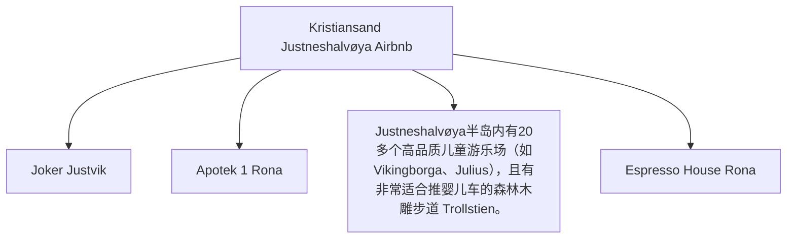
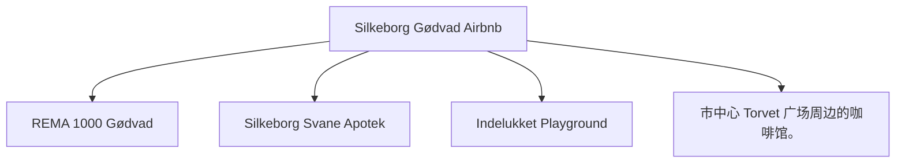
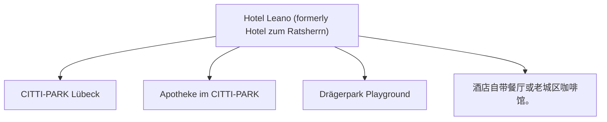
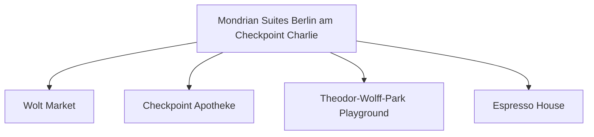
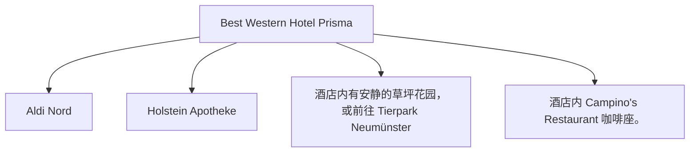
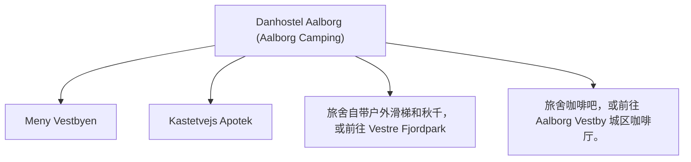
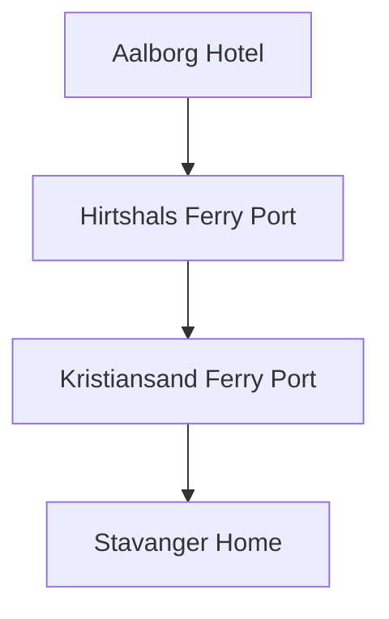

<!-- START OF 00_Cover.md -->
# 2026 欧洲家庭自驾旅行手册（Family Roadbook V4.0）
<!-- END OF 00_Cover.md -->

---

<!-- START OF 01_Version_History.md -->
# 版本历史（Version History）

- **版本**：V4.0 Working Draft（中文整合版）
- **定位**：作为后续 Agent 的唯一输入文档（Single Source of Truth）
- **说明**：本版本尽可能整合目前所有已确认的信息；所有尚未完成的数据统一使用 `TODO` 标记，方便后续自动补全。
<!-- END OF 01_Version_History.md -->

---

<!-- START OF 02_TOC.md -->
# 目录（Table of Contents）

- [00. 封面（Cover）](00_Cover.md)
- [01. 版本历史（Version History）](01_Version_History.md)
- [02. 目录（Table of Contents）](02_TOC.md)
- [03. 旅行概述（Trip Overview）](03_Trip_Overview.md)
- [04. 家庭成员（Family）](04_Family.md)
- [05. 车辆设置（Vehicle）](05_Vehicle.md)
- [06. 轮渡信息（Ferries）](06_Ferries.md)
- [07. 住宿信息（Hotels）](07_Hotels.md)
- [08. 每日计划（Daily Plans）](days/Day01.md)
- [09. 柏林会议与活动（Berlin）](08_Berlin.md)
- [10. 德国行车规则（Driving Rules Germany）](09_Driving_Rules_DE.md)
- [11. 丹麦行车规则（Driving Rules Denmark）](10_Driving_Rules_DK.md)
- [12. 行李清单（Packing List）](11_Packing_List.md)
- [13. 应急联络（Emergency）](12_Emergency.md)
- [14. 旅行日志（Journal）](13_Journal.md)
- [15. 预算记录（Budget）](14_Budget.md)
- [16. 附录（Appendix）](15_Appendix.md)
<!-- END OF 02_TOC.md -->

---

<!-- START OF 03_Trip_Overview.md -->
# 旅行概述（Trip Overview）

## 旅行时间

- 2026-07-22 ～ 2026-08-03（13天）

## 出发地点

- Stavanger, Norway

## 本次旅行目标

- 家庭暑假旅行
- 参加 **ICMCF Berlin** 会议
- 尽量保证 Noora 作息稳定
- 旅行节奏轻松，不赶路

## 总体路线（Route Overview）

Stavanger
↓
Kristiansand
↓
Color Line Ferry
↓
Hirtshals
↓
Silkeborg
↓
Lübeck
↓
Berlin
↓
Neumünster
↓
Aalborg
↓
Fjord Line Ferry
↓
Kristiansand
↓
Stavanger
<!-- END OF 03_Trip_Overview.md -->

---

<!-- START OF 04_Family.md -->
# 家庭成员与作息（Family）

## 家庭成员

- 成人 ×2
- Noora（约21个月）

## Noora 作息目标

- 08:00 起床
- 12:30 午睡
- 18:00 晚餐
- 20:00 睡觉

## 随车日常物品清单

- [ ] 纸尿裤（Diapers）
- [ ] 湿巾（Wipes）
- [ ] 奶粉/奶盒（Milk）
- [ ] 零食（Snacks）
- [ ] 水（Water）
- [ ] 备用衣服（Clothes）
- [ ] 常用药品（Medicines）
- [ ] 玩具（Toys）
<!-- END OF 04_Family.md -->

---

<!-- START OF 05_Vehicle.md -->
# 车辆与充电策略（Vehicle）

## 车型信息

- **2024 Hyundai Kona Electric Long Range**

## 品牌充电优先级

Tesla Supercharger → IONITY → Circle K Charge → Recharge

## SOC 电量建议

- 酒店出发（Departure SOC）：90%+
- 午餐充电：40%左右
- 充至（Charge target）：80%
- 抵达酒店（Arrival SOC）：20%~30%

## Kona EV 充电与电量概览

| 天数（Day） | 路线（Route） | 推荐充电站（Recommended Charger） | 预计电量变化（Expected SOC） |
|---|---|---|---|
| **Day 01** | Stavanger → Kristiansand | Rona 8-10 Recharge | 出发 95% → 抵达 30% |
| **Day 02** | Kristiansand local | Dyreparken Parking EV Charger | 出发 80% → 抵达 60% |
| **Day 03** | Kristiansand → Silkeborg | Norlys Silkeborg (Søtorvet) | 出发 95% → 抵达 40% |
| **Day 04** | Silkeborg → Lübeck | IONITY Hüttener Berge, Allego Lübeck | 出发 90% → 抵达 30% |
| **Day 05** | Lübeck → Berlin | IONITY Prignitz Ost, Mondrian Garage | 出发 90% → 抵达 30% |
| **Day 06-10** | Berlin local | Mondrian Garage Wallbox | 电量维持 50% - 80% |
| **Day 11** | Berlin → Neumünster | Tesla Supercharger Wittenburg, Hotel Prisma | 出发 90% → 抵达 30% |
| **Day 12** | Neumünster → Aalborg | IONITY Horsens, Danhostel/Marina | 出发 90% → 抵达 25% |
| **Day 13** | Aalborg → Stavanger | Fjord Line On-board charging, Rona Recharge | 出发 90% → 抵达 30% |
<!-- END OF 05_Vehicle.md -->

---

<!-- START OF 06_Ferries.md -->
# 轮渡信息（Ferries）

## 去程（Color Line）

- **航线**：Kristiansand → Hirtshals
- **起航时间（Departure）**：2026-07-24 08:00
- **抵达时间（Arrival）**：11:15
- **开始检票（Check-in）**：07:00
- **乘员**：2 Adults + 1 Child
- **车型配置**：Passenger Car（≤5m）
- **车牌号码（Registration）**：EH79780
- **预订编号（Booking Reference）**：WXM7982
- **PDF门票**：[点击查看 Color Line 预订确认 PDF 门票](assets/WXM7982-Travel Confirmation_1781638264199.pdf)

### 去程准备与注意事项
- [ ] **登船流程**：提前60分钟（07:00前）抵达 Kristiansand 码头进行 Check-in。顺着指示牌排队安检，扫描条形码换取登船牌。将车停入指定的汽车甲板层，熄火、拉紧手刹、挂入档位。随身携带随行婴儿用品，进入乘客区。
- [ ] **船上早餐建议**：预订了自助早餐可在 SuperSpeed 1 餐厅享用，或者在甲板上的 Catch Me If You Can 咖啡厅购买三明治与咖啡。
- [ ] **儿童活动区位置**：船上有专门的儿童活动室（Playroom），配有玩具和播放卡通片的电视，适合Noora玩耍。
- [ ] **最佳观景位置**：7层和8层的船尾观景甲板，或前侧全景沙龙。

---

## 回程（Fjord Line）

- **航线**：Hirtshals → Kristiansand
- **起航时间（Departure）**：2026-08-03 09:45
- **抵达时间（Arrival）**：12:10
- **开始检票（Check-in）**：08:45
- **特殊服务**：已预订船上 EV 充电（EV Charging Booked）
- **车牌号码（Registration）**：EH79780
- **预订编号（Booking Reference）**：13080265
- **PDF门票**：[点击查看 Fjord Line 预订确认 PDF 门票](assets/13080265.pdf)

### 回程准备与注意事项
- [ ] **船上充电具体流程**：回程乘坐 HSC Fjord FSTR（双体快速轮渡），已预订船上 EV 充电。登船时主动向工作人员出示“Ladepunkt el-bil”预订凭证，车辆将被引导至有充电插座的甲板车位。自备 Type2 充电线连接充电桩，船员会统一通电进行充电。
- [ ] **下船路线及注意事项**：抵达 Kristiansand 后，听从广播指示返回汽车甲板。解开充电线并收纳好，等待前方车辆驶出后顺次下船。下船后直接进入 E39 高速返回 Stavanger。
<!-- END OF 06_Ferries.md -->

---

<!-- START OF 07_Hotels.md -->
# 住宿信息（Hotels）

## 预订概览

| 日期 | 酒店/住宿名称 | 地址 |
|---|---|---|
|22–24 Jul|Kristiansand Airbnb|[Marikåpeveien 47, Kristiansand, Agder 4634](https://www.google.com/maps/search/?api=1&query=Marik%C3%A5peveien+47%2C+Kristiansand%2C+Agder+4634) ([Apple Map](https://maps.apple.com/?q=Marik%C3%A5peveien+47%2C+Kristiansand%2C+Agder+4634))|
|24–25 Jul|Silkeborg Airbnb|[Slienvej 51, Silkeborg 8600](https://www.google.com/maps/search/?api=1&query=Slienvej+51%2C+Silkeborg+8600) ([Apple Map](https://maps.apple.com/?q=Slienvej+51%2C+Silkeborg+8600))|
|25–26 Jul|Lübeck Hotel|[Herrendamm 2-4, Lübeck, SH 23556](https://www.google.com/maps/search/?api=1&query=Herrendamm+2-4%2C+L%C3%BCbeck%2C+SH+23556) ([Apple Map](https://maps.apple.com/?q=Herrendamm+2-4%2C+L%C3%BCbeck%2C+SH+23556))|
|26 Jul–1 Aug|Berlin Hotel|[Markgrafenstrasse 16-16a, Berlin 10969](https://www.google.com/maps/search/?api=1&query=Markgrafenstrasse+16-16a%2C+Berlin+10969) ([Apple Map](https://maps.apple.com/?q=Markgrafenstrasse+16-16a%2C+Berlin+10969))|
|1–2 Aug|Neumünster Hotel|[Max-Johannsen-Brücke 1, Neumünster 24537](https://www.google.com/maps/search/?api=1&query=Max-Johannsen-Br%C3%BCcke+1%2C+Neum%C3%BCnster+24537) ([Apple Map](https://maps.apple.com/?q=Max-Johannsen-Br%C3%BCcke+1%2C+Neum%C3%BCnster+24537))|
|2–3 Aug|Aalborg Hotel|[50 Skydebanevej, Aalborg 9000](https://www.google.com/maps/search/?api=1&query=50+Skydebanevej%2C+Aalborg+9000) ([Apple Map](https://maps.apple.com/?q=50+Skydebanevej%2C+Aalborg+9000))|

---

## 住宿详细卡片（Hotel Details）

### 1. Kristiansand Airbnb (22-24 Jul)
- **地址**：[Marikåpeveien 47, Kristiansand, Agder 4634](https://www.google.com/maps/search/?api=1&query=Marik%C3%A5peveien+47%2C+Kristiansand%2C+Agder+4634) ([Apple Map](https://maps.apple.com/?q=Marik%C3%A5peveien+47%2C+Kristiansand%2C+Agder+4634))
- **概述（Overview）**：位于Justneshalvøya半岛的现代住宅，环境优美安静，非常适合家庭入住。靠近湖泊与森林步道。
- **停车（Parking）**：房屋自带专用免费停车位（Private driveway parking）。
- **EV充电（EV Charging）**：房屋未配备或尚未确认专属充电桩，但附近 Rona 和 Sørlandsparken 有大量超级充电桩。
- **周边超市（Nearby Supermarket）**：Joker Justvik (Grostølveien 4D, 距离约 1.2 km，步行15分钟)。
- **周边药店（Nearby Pharmacy）**：Apotek 1 Rona (Rona 8-10, 距离约 2.8 km，车程5分钟)。
- **周边医院（Nearby Hospital）**：Sørlandet Sykehus Kristiansand (Egsveien 100, 距离约 6.5 km，车程10分钟)。
- **周边游乐场（Nearby Playground）**：Justneshalvøya半岛内有20多个高品质儿童游乐场（如Vikingborga、Julius），且有非常适合推婴儿车的森林木雕步道 Trollstien。
- **周边咖啡馆（Nearby Coffee）**：Espresso House Rona (Rona 8)。
- **周边餐馆（Nearby Restaurant）**：Søm Pizza (Sømveien 80, 距离约 3 km) 或前往市中心餐饮区。
- **步行地图（Walking Map）**：[OpenStreetMap Link](https://www.openstreetmap.org/#map=17/58.1963/8.0165)
- **街景占位符（Street View placeholder）**：[Google StreetView](https://www.google.com/maps/@?api=1&map_action=pano&viewpoint=58.1963,8.0165)

### 2. Silkeborg Airbnb (24-25 Jul)
- **地址**：[Slienvej 51, Silkeborg 8600](https://www.google.com/maps/search/?api=1&query=Slienvej+51%2C+Silkeborg+8600) ([Apple Map](https://maps.apple.com/?q=Slienvej+51%2C+Silkeborg+8600))
- **概述（Overview）**：位于Silkeborg Gødvad区的舒适住宅，绿树环绕，极具丹麦生活气息。
- **停车（Parking）**：房屋前私人专用免费停车位。
- **EV充电（EV Charging）**：房屋不带充电桩，可使用Gødvad或市区Clever/Norlys公共充电桩。
- **周边超市（Nearby Supermarket）**：REMA 1000 Gødvad (Arendalsvej 29, 距离约 1.0 km)。
- **周边药店（Nearby Pharmacy）**：Silkeborg Svane Apotek (Søtorvet 1, 距离约 2.5 km)。
- **周边医院（Nearby Hospital）**：Regionshospitalet Silkeborg (Falkevej 1-3, 距离约 2.3 km) - 紧急时拨打112。
- **周边游乐场（Nearby Playground）**：Indelukket Playground (Åhave Allé 9B, 距离约 3.5 km，拥有大型滑梯和自然探险乐园)。
- **周边咖啡馆（Nearby Coffee）**：市中心 Torvet 广场周边的咖啡馆。
- **周边餐馆（Nearby Restaurant）**：Silkeborg 市中心餐馆（如 Cafe Evald 或 Babas Pizza）。
- **步行地图（Walking Map）**：[OpenStreetMap Link](https://www.openstreetmap.org/#map=17/56.1834/9.6052)
- **街景占位符（Street View placeholder）**：[Google StreetView](https://www.google.com/maps/@?api=1&map_action=pano&viewpoint=56.1834,9.6052)

### 3. Lübeck Hotel (25-26 Jul)
- **地址**：[Herrendamm 2-4, Lübeck, SH 23556](https://www.google.com/maps/search/?api=1&query=Herrendamm+2-4%2C+L%C3%BCbeck%2C+SH+23556) ([Apple Map](https://maps.apple.com/?q=Herrendamm+2-4%2C+L%C3%BCbeck%2C+SH+23556))
- **概述（Overview）**：位于吕贝克市郊的舒适型酒店，靠近A1高速公路，前往历史老城区非常便利。
- **停车（Parking）**：酒店专属收费停车场（10 EUR/天）。
- **EV充电（EV Charging）**：酒店内配备EV充电站，或使用附近超充站（Bei der Lohmühle 11A）。
- **周边超市（Nearby Supermarket）**：CITTI-PARK Lübeck (Herrenholz 14, 距离约 3.0 km，大型购物中心内有Aldi和Rewe)。
- **周边药店（Nearby Pharmacy）**：Apotheke im CITTI-PARK (Herrenholz 14)。
- **周边医院（Nearby Hospital）**：UKSH Campus Lübeck (Ratzeburger Allee 160) 或 Sana Kliniken Lübeck。
- **周边游乐场（Nearby Playground）**：Drägerpark Playground (Drägerpark，靠近水边，适合散步和儿童玩耍)。
- **周边咖啡馆（Nearby Coffee）**：酒店自带餐厅或老城区咖啡馆。
- **周边餐馆（Nearby Restaurant）**：酒店自带餐厅，提供德式及意式菜肴。
- **步行地图（Walking Map）**：[OpenStreetMap Link](https://www.openstreetmap.org/#map=17/53.8821/10.6698)
- **街景占位符（Street View placeholder）**：[Google StreetView](https://www.google.com/maps/@?api=1&map_action=pano&viewpoint=53.8821,10.6698)

### 4. Berlin Hotel (26 Jul - 1 Aug)
- **地址**：[Markgrafenstrasse 16-16a, Berlin 10969](https://www.google.com/maps/search/?api=1&query=Markgrafenstrasse+16-16a%2C+Berlin+10969) ([Apple Map](https://maps.apple.com/?q=Markgrafenstrasse+16-16a%2C+Berlin+10969))
- **概述（Overview）**：临近查理检查哨的高端公寓式酒店，房间配备小厨房，非常适合带幼儿家庭长期居住。
- **停车（Parking）**：酒店专属地下车库（收费25 EUR/天）。
- **EV充电（EV Charging）**：地下车库内配备EV充电桩（Wallbox）。
- **周边超市（Nearby Supermarket）**：Wolt Market (Markgrafenstraße 58, 距离约 100米) 或 EDEKA Checkpoint Charlie (Friedrichstraße 207-208, 约400米)。
- **周边药店（Nearby Pharmacy）**：Checkpoint Apotheke (Friedrichstraße 207, 约400米)。
- **周边医院（Nearby Hospital）**：Vivantes Klinikum Am Urban (Dieffenbachstraße 1, 距离约 2.5 km)。
- **周边游乐场（Nearby Playground）**：Theodor-Wolff-Park Playground (步行2分钟，有沙坑 and 基础滑梯) 或 Gleisdreieck Park Playground (约1.8 km)。
- **周边咖啡馆（Nearby Coffee）**：Espresso House (Friedrichstraße 50)。
- **周边餐馆（Nearby Restaurant）**：酒店周边有大量简餐、意式和德式餐厅（如 Ristorante A Mano）。
- **步行地图（Walking Map）**：[OpenStreetMap Link](https://www.openstreetmap.org/#map=17/52.5056/13.3951)
- **街景占位符（Street View placeholder）**：[Google StreetView](https://www.google.com/maps/@?api=1&map_action=pano&viewpoint=52.5056,13.3951)

### 5. Neumünster Hotel (1-2 Aug)
- **地址**：[Max-Johannsen-Brücke 1, Neumünster 24537](https://www.google.com/maps/search/?api=1&query=Max-Johannsen-Br%C3%BCcke+1%2C+Neum%C3%BCnster+24537) ([Apple Map](https://maps.apple.com/?q=Max-Johannsen-Br%C3%BCcke+1%2C+Neum%C3%BCnster+24537))
- **概述（Overview）**：位于新明斯特北部的舒适酒店，临近Holstenhallen展览馆，提供桑拿和免费无线网。
- **停车（Parking）**：酒店专属免费停车场。
- **EV充电（EV Charging）**：酒店内部配备EV充电桩。
- **周边超市（Nearby Supermarket）**：Aldi Nord (Rendsburger Str. 90) 或 Lidl (Rendsburger Str. 84, 距离约 1.2 km)。
- **周边药店（Nearby Pharmacy）**：Holstein Apotheke (Rendsburger Str. 119, 距离约 1.5 km)。
- **周边医院（Nearby Hospital）**：Friedrich-Ebert-Krankenhaus (Friesenstraße 11, 距离约 2.5 km)。
- **周边游乐场（Nearby Playground）**：酒店内有安静的草坪花园，或前往 Tierpark Neumünster (Geerdtsstraße 100，有巨大的儿童探险游乐场)。
- **周边咖啡馆（Nearby Coffee）**：酒店内 Campino's Restaurant 咖啡座。
- **周边餐馆（Nearby Restaurant）**：酒店内 Campino's 餐厅，提供北德特色菜。
- **步行地图（Walking Map）**：[OpenStreetMap Link](https://www.openstreetmap.org/#map=17/54.0898/9.9812)
- **街景占位符（Street View placeholder）**：[Google StreetView](https://www.google.com/maps/@?api=1&map_action=pano&viewpoint=54.0898,9.9812)

### 6. Aalborg Hotel (2-3 Aug)
- **地址**：[50 Skydebanevej, Aalborg 9000](https://www.google.com/maps/search/?api=1&query=50+Skydebanevej%2C+Aalborg+9000) ([Apple Map](https://maps.apple.com/?q=50+Skydebanevej%2C+Aalborg+9000))
- **概述（Overview）**：靠近Limfjord湾和游艇码头的舒适青年旅舍，配有大型绿地和儿童户外活动空间。
- **停车（Parking）**：旅舍提供专属免费露天停车场。
- **EV充电（EV Charging）**：码头及露营区公共充电站（Clever/Norlys）。
- **周边超市（Nearby Supermarket）**：Meny Vestbyen (Otto Mønsteds Vej 1, 距离约 1.5 km)。
- **周边药店（Nearby Pharmacy）**：Kastetvejs Apotek (Kastetvej 43, 距离约 1.8 km)。
- **周边医院（Nearby Hospital）**：Aalborg Universitetshospital (Hobrovej 18-22, 距离约 4.5 km)。
- **周边游乐场（Nearby Playground）**：旅舍自带户外滑梯和秋千，或前往 Vestre Fjordpark (Skydebanevej 14, 距离约 800米，有大型水上乐园和沙坑)。
- **周边咖啡馆（Nearby Coffee）**：旅舍咖啡吧，或前往 Aalborg Vestby 城区咖啡厅。
- **周边餐馆（Nearby Restaurant）**：Aalborg Marina 游艇码头餐厅（如 Restaurant Marina）。
- **步行地图（Walking Map）**：[OpenStreetMap Link](https://www.openstreetmap.org/#map=17/57.0543/9.8863)
- **街景占位符（Street View placeholder）**：[Google StreetView](https://www.google.com/maps/@?api=1&map_action=pano&viewpoint=57.0543,9.8863)
<!-- END OF 07_Hotels.md -->

---

<!-- START OF Day01.md -->
# Day 01 (2026-07-22) - Stavanger → Kristiansand

## Summary
从 Stavanger 出发自驾前往 Kristiansand，入住 Kristiansand Airbnb。第一天旅程以安顿和熟悉环境为主，让孩子适应路途环境。

## Today's Goal
安全驾驶抵达 Kristiansand，顺利办理 Airbnb 入住，准备晚餐与休息，保证 Noora 顺利入睡。

## Dashboard
- **日期（Date）**: 2026-07-22
- **行驶距离（Driving Distance）**: 约 232 km
- **行驶时间（Driving Time）**: 约 3小时30分纯驾驶；含午餐、充电和幼儿休息，建议按4.5小时预留
- **预计剩余电量（Expected SOC）**: 建议 95% 出发 → 预计 25–40% 抵达
- **天气（Weather）**: 出发前 48 小时更新；当天早晨再次确认
- **步行距离（Walking Distance）**: 约 1-2 km
- **入住酒店（Hotel）**: Kristiansand Airbnb (Marikåpeveien 47, Kristiansand, Agder 4634)
- **停车场（Parking）**: Marikåpeveien 47 房屋前专用免费停车位
- **办理入住（Check-in）**: 15:00
- **办理退房（Check-out）**: N/A
- **今日亮点（Highlights）**: 沿途挪威南部峡湾/海岸线风光

---

## Timeline
08:00 | Noora 起床与早餐（Stavanger 家中）
09:00 | 整理行装，检查车辆，准备出发
09:30 | 出发自驾（Stavanger → Kristiansand）
12:30 | 途中停车午饭/喂奶/Noora车上午睡
13:30 | 继续行车
15:30 | 抵达 Kristiansand Airbnb，办理 Check-in
16:00 | 整理房间，Noora 玩耍时间
18:00 | 晚餐（自备餐食或周边餐馆）
20:00 | Noora 睡觉时间
21:00 | 整理今日手记，核对明日行程

---

## Route
驾车路线（Driving route）：Stavanger → E39 → Kristiansand (Marikåpeveien 47)
步行路线（Walking route）：约 1-2 km
停车（Parking）：Marikåpeveien 47 专用停车位 (Marikåpeveien 47 房屋前专用免费停车位)

---

## Map

*(已在网页版集成 Leaflet.js 交互式地图)*

---

## Charging

Departure SOC: 95%

Recommended charger:
Kristiansand Rona / Sørlandsparken 区域慢速/快速补电 (如 Rona 8-10 Recharge)

Backup charger:
Tesla Supercharger Kristiansand (Barstølveien 60) 或其他 CCS 快充

Arrival SOC:
25–40%

### Charging decision rule

- **切换条件**：若导航预测抵达住宿低于 20%，则在途中 Lyngdal 或 Mandal 提前补电。
- **充电目标**：途中通常充至 75–80%，避免高 SOC 阶段充电速度急剧下降。
- **实时确认**：出发前通过车辆导航或充电 App 确认开放状态、兼容性和占用情况。

---

## Hotel
Address: Marikåpeveien 47, Kristiansand, Agder 4634, Norway
Parking: 房屋自带专用免费停车位（Private driveway parking）。
EV: 房屋未配备或尚未确认专属充电桩，但附近 Rona 和 Sørlandsparken 有大量超级充电桩。
Supermarket: Joker Justvik (Grostølveien 4D, 距离约 1.2 km，步行15分钟)。
Pharmacy: Apotek 1 Rona (Rona 8-10, 距离约 2.8 km，车程5分钟)。
Hospital: Sørlandet Sykehus Kristiansand (Egsveien 100, 距离约 6.5 km，车程10分钟)。
Playground: Justneshalvøya半岛内有20多个高品质儿童游乐场（如Vikingborga、Julius），且有非常适合推婴儿车的森林木雕步道 Trollstien。
Nearby Coffee: Espresso House Rona (Rona 8)。
Nearby Restaurant: Søm Pizza (Sømveien 80, 距离约 3 km) 或前往市中心餐饮区。

---

## Meals

Breakfast: Stavanger 家中
Lunch: 途中服务区或自备便当
Dinner: 自备简餐或 Søm Pizza 披萨外带
Coffee: 途中自备或 Rona 8-10 充电站附近咖啡馆

### 推荐餐厅 (Recommended Restaurants)

- **首选 (First Choice)**: **Søm Pizza** (Sømveien 80, 距离住宿约3km，可外带或外送，最适合控制第一天抵达后的晚餐时间)。
- **备选 (Backup)**: Kristiansand 市中心家庭友好餐厅 (仅在抵达时间较早、孩子状态良好时考虑)。
- **最稳方案 (Safe Fallback)**: Airbnb 简餐 (如果旅途严重延误，直接在住宿做简易餐饮)。
- **执行原则**：餐厅预约不是硬性节点。如果抵达延误或 Noora 疲劳，立即改为外带、超市采购或住宿简餐。

---

## Baby Plan
Milk: 08:00, 12:30, 19:30
Snack: 随车备齐零食
Nap: 预计 12:30 - 14:30 在安全座椅上睡
Play: 抵达 Airbnb 后在游乐场或室内玩耍
Bath: 19:30 洗澡
Sleep: 20:00 准时入睡

---

## Conference
N/A

---

## Plan A (晴天)
正常行车，傍晚在 Airbnb 周边或市中心散步，Noora 户外玩耍。

---

## Plan B (雨天)
如遇暴雨，行车注意安全，缩短室外时间，抵达后在 Airbnb 室内玩耍与休息。

---

## Expense
- **住宿（Hotel）**: 已预订 (3387 NOK)
- **充电（Charging）**: 预算：预计 180 NOK；实际：旅行中填写
- **餐饮（Food）**: 预算：预计 300 NOK；实际：旅行中填写
- **停车（Parking）**: 预算：免费；实际：旅行中填写
- **购物（Shopping）**: 预算：预计 200 NOK；实际：旅行中填写

---

## Journal
- **精选照片（Best Photo）**: 旅行中填写
- **今日回忆（Today's Memory）**: 旅行中填写
- **趣味瞬间（Funny Moment）**: 旅行中填写
- **Noora的新发现（Noora Learned）**: 旅行中填写
<!-- END OF Day01.md -->

---

<!-- START OF Day02.md -->
# Day 02 (2026-07-23) - Kristiansand 游玩

## Summary
在 Kristiansand 本地进行一日游，放松调整，让 Noora 适应旅行节奏，体验本地公园或游乐设施。

## Today's Goal
保证 Noora 作息稳定的情况下，轻松游览 Kristiansand 标志性景点（如 Dyrepark 动物园/市中心公园）。

## Dashboard
- **日期（Date）**: 2026-07-23
- **行驶距离（Driving Distance）**: 约 40–50 km 本地往返
- **行驶时间（Driving Time）**: 累计驾驶约 50–70分钟
- **预计剩余电量（Expected SOC）**: 建议 80%+ 出发 → 预计 60–75% 抵达
- **天气（Weather）**: 出发前 48 小时更新；当天早晨再次确认
- **步行距离（Walking Distance）**: 约 5-8 km (动物园游玩)
- **入住酒店（Hotel）**: Kristiansand Airbnb (Marikåpeveien 47, Kristiansand, Agder 4634)
- **停车场（Parking）**: Dyreparken 专用停车场 (P-plass)
- **办理入住（Check-in）**: N/A
- **办理退房（Check-out）**: N/A
- **今日亮点（Highlights）**: Kristiansand 动物园或海滩游玩

---

## Timeline
08:00 | Noora 起床与早餐
09:30 | 出发前往当地公园或游玩点
12:00 | 午餐（Kristiansand 市区或景区内）
12:30 | Noora 午睡时间（婴儿车或回 Airbnb）
15:00 | 下午轻松游览/Playground 玩耍
17:30 | 返回 Airbnb，准备晚餐
18:00 | 晚餐
20:00 | Noora 睡觉时间
21:00 | 整理行装，为明日轮渡大清早出发做好万全准备

---

## Route
驾车路线（Driving route）：Airbnb → 当地景点 → Airbnb
步行路线（Walking route）：约 5-8 km (动物园游玩)
停车（Parking）：Dyreparken 专用停车场 (P-plass)

---

## Map

*(已在网页版集成 Leaflet.js 交互式地图)*

---

## Charging

Departure SOC: 80%+

Recommended charger:
Dyreparken 停车场公共交流充电桩 (11kW)

Backup charger:
Sørlandsparken 区域快充 / Tesla Supercharger Kristiansand (Barstølveien 60)

Arrival SOC:
60–75%

### Charging decision rule

- **切换条件**：Dyreparken 交流桩较多但较抢手，以实际空位为准；若无空位，则离园后直接前往备用快充站补电。
- **充电目标**：离园后建议将车辆补至 90–100%，避免 Day03 清晨临时充电影响行程。
- **实时确认**：可通过相关充电 App 实时查看 Dyreparken 充电桩的占用情况情况。

---

## Hotel
Address: Marikåpeveien 47, Kristiansand, Agder 4634, Norway
Parking: 房屋自带专用免费停车位（Private driveway parking）。
EV: 房屋未配备或尚未确认专属充电桩，但附近 Rona 和 Sørlandsparken 有大量超级充电桩。
Supermarket: Joker Justvik (Grostølveien 4D, 距离约 1.2 km，步行15分钟)。
Pharmacy: Apotek 1 Rona (Rona 8-10, 距离约 2.8 km，车程5分钟)。
Hospital: Sørlandet Sykehus Kristiansand (Egsveien 100, 距离约 6.5 km，车程10分钟)。
Playground: Justneshalvøya半岛内有20多个高品质儿童游乐场（如Vikingborga、Julius），且有非常适合推婴儿车的森林木雕步道 Trollstien。
Nearby Coffee: Espresso House Rona (Rona 8)。
Nearby Restaurant: Søm Pizza (Sømveien 80, 距离约 3 km) 或前往市中心餐饮区。

---

## Meals

Breakfast: Airbnb 内自制
Lunch: Dyreparken 园内餐馆
Dinner: Kristiansand 市区家庭友好餐厅
Coffee: 园内咖啡厅

### 推荐餐厅 (Recommended Restaurants)

- **首选 (First Choice)**: **Drivhuset** (Dyreparken 园内，适合快速午餐、三明治与饮料) 或 **Gorines Vertshus** (Dyreparken 园内，提供披萨等儿童更易接受的食物)。
- **备选 (Backup)**: **Setra** (Dyreparken 园内，如果需要坐下来吃较完整的挪威本地餐食) / **Rasmus Landspiseri** (市中心，晚餐首选)。
- **最稳方案 (Safe Fallback)**: Airbnb 自备简餐 (游玩后若 Noora 极度疲劳，直接回住所做饭或外卖)。
- **执行原则**：餐厅预约不是硬性节点。如果抵达延误或 Noora 疲劳，立即改为外带、超市采购或住宿简餐。

---

## Baby Plan
Milk: 正常喂奶
Snack: 携带小零食和水果
Nap: 12:30 午睡
Play: Playground/动物园互动
Bath: 19:30 洗澡
Sleep: 20:00 准时入睡

---

## Conference
N/A

---

## Plan A (晴天)
前往 Kristiansand Dyrepark 动物园游玩。

---

## Plan B (雨天)
如果下雨，前往室内亲子场所，或在 Airbnb 室内游玩。

---

## Expense
- **住宿（Hotel）**: 已预订 (0 NOK，已计入第一天)
- **充电（Charging）**: 预算：预计 50 NOK；实际：旅行中填写
- **餐饮（Food）**: 预算：预计 600 NOK；实际：旅行中填写
- **停车（Parking）**: 预算：80 NOK；实际：旅行中填写
- **购物（Shopping）**: 预算：预计 150 NOK；实际：旅行中填写

---

## Journal
- **精选照片（Best Photo）**: 旅行中填写
- **今日回忆（Today's Memory）**: 旅行中填写
- **趣味瞬间（Funny Moment）**: 旅行中填写
- **Noora的新发现（Noora Learned）**: 旅行中填写
<!-- END OF Day02.md -->

---

<!-- START OF Day03.md -->
# Day 03 (2026-07-24) - Kristiansand → 轮渡 → Hirtshals → Silkeborg

## Summary
清晨办理退房前往轮渡码头，乘 Color Line 轮渡前往丹麦 Hirtshals，随后驱车前往 Silkeborg Airbnb 入住。

## Today's Goal
明确定时清早 07:00 前抵达码头排队检票，确保 08:00 顺利登船。乘轮渡期间安排好早餐和孩子活动。下午驾车平稳抵达 Silkeborg。

## Dashboard
- **日期（Date）**: 2026-07-24
- **行驶距离（Driving Distance）**: 约 185 km 丹麦陆地驾驶 (轮渡航程单独计算，不计入陆地距离)
- **行驶时间（Driving Time）**: 约 2小时10分纯驾驶；含下船、午餐和幼儿休息，建议按3.5小时预留 (不含轮渡航行时间)
- **预计剩余电量（Expected SOC）**: 建议 95% 出发 → 预计 45–60% 抵达
- **天气（Weather）**: 出发前 48 小时更新；当天早晨再次确认
- **步行距离（Walking Distance）**: 约 2-3 km (Silkeborg市中心)
- **入住酒店（Hotel）**: Silkeborg Airbnb (Slienvej 51, Silkeborg 8600)
- **停车场（Parking）**: Slienvej 51 专属免费停车位
- **办理入住（Check-in）**: 15:00
- **办理退房（Check-out）**: 11:00
- **今日亮点（Highlights）**: Color Line 海上航行，丹麦田园风光

---

## Timeline
06:15 | 起床并快速退房，将行李搬上车
06:45 | 驱车抵达 Kristiansand 轮渡港口
07:00 | Color Line Ferry Check-in 截止前排队上船
08:00 | 轮渡准时开船（Kristiansand → Hirtshals）
08:15 | 在船上餐厅享用早餐，带 Noora 逛儿童区
11:15 | 抵达丹麦 Hirtshals，排队下船
11:45 | 下船后开始向 Silkeborg 驱车行驶
12:30 | 途中服务区充电 + 午餐 + Noora 车上午睡
14:00 | 继续前往 Silkeborg
15:00 | 抵达 Silkeborg Airbnb，办理 Check-in
16:00 | 湖区周边散步或 Playground 玩耍
18:00 | 晚餐
20:00 | Noora 睡觉时间

---

## Route
驾车路线（Driving route）：Kristiansand Airbnb → Ferry Terminal → (Ferry) → Hirtshals Port → E39 → Silkeborg (Slienvej 51)
步行路线（Walking route）：约 2-3 km (Silkeborg市中心)
停车（Parking）：Slienvej 51 专属免费停车位

---

## Map

*(已在网页版集成 Leaflet.js 交互式地图)*

---

## Charging

Departure SOC: 95%

Recommended charger:
Silkeborg 住宿周边 REMA 1000 Gødvad Clever 充电桩或快充桩

Backup charger:
Aalborg 或 Hobro 沿线充电区域

Arrival SOC:
45–60%

### Charging decision rule

- **切换条件**：如果下船后导航预测抵达 Silkeborg 住宿低于 25%，则在途中 Aalborg 或 Hobro 提前充电 10–15 分钟。
- **充电目标**：途中补电仅需充至能够安全抵达目的地的 SOC 即可，抵达 Silkeborg 后再慢充充满。
- **实时确认**：出发前通过 Clever / Norlys App 确认沿线及目的地充电桩的占用情况和可用状态。

---

## Hotel
Address: Slienvej 51, Silkeborg 8600, Denmark
Parking: 房屋前私人专用免费停车位。
EV: 房屋不带充电桩，可使用Gødvad或市区Clever/Norlys公共充电桩。
Supermarket: REMA 1000 Gødvad (Arendalsvej 29, 距离约 1.0 km)。
Pharmacy: Silkeborg Svane Apotek (Søtorvet 1, 距离约 2.5 km)。
Hospital: Regionshospitalet Silkeborg (Falkevej 1-3, 距离约 2.3 km) - 紧急时拨打112。
Playground: Indelukket Playground (Åhave Allé 9B, 距离约 3.5 km，拥有大型滑梯和自然探险乐园)。
Nearby Coffee: 市中心 Torvet 广场周边的咖啡馆。
Nearby Restaurant: Silkeborg 市中心餐馆（如 Cafe Evald 或 Babas Pizza）。

---

## Meals

Breakfast: Airbnb 内自制
Lunch: 轮渡上简餐
Dinner: Silkeborg 市区 Cafe Evald 德式/丹麦简餐
Coffee: 轮渡咖啡厅或 Silkeborg 咖啡馆

### 推荐餐厅 (Recommended Restaurants)

- **首选 (First Choice)**: **Cafe Evald** (Papirfabrikken 10, Silkeborg, 适合较早的晚餐，出餐快，环境对孩子友好)。
- **备选 (Backup)**: Silkeborg 市中心披萨店或外带餐厅。
- **最稳方案 (Safe Fallback)**: REMA 1000 Gødvad (距离住宿 1km) 采购食材，回 Airbnb 自制简餐。
- **执行原则**：餐厅预约不是硬性节点。如果抵达延误或 Noora 疲劳，立即改为外带、超市采购或住宿简餐。

---

## Baby Plan
Milk: 船上喂奶/午餐喂奶
Snack: 准备饼干等小零食
Nap: 12:30 车上午睡
Play: 轮渡儿童游乐区玩耍；抵达 Silkeborg 后户外游玩
Bath: 19:30 洗澡
Sleep: 20:00 准时入睡

---

## Conference
N/A

---

## Plan A (晴天)
在 Silkeborg 的湖区和林间平稳散步，呼吸丹麦自然空气。

---

## Plan B (雨天)
如果下雨，下轮渡后直接前往 Silkeborg 室内，在 Airbnb 享受北欧温馨环境。

---

## Expense
- **住宿（Hotel）**: 已预订 (810 DKK)
- **充电（Charging）**: 预算：预计 120 DKK；实际：旅行中填写
- **餐饮（Food）**: 预算：预计 400 DKK；实际：旅行中填写
- **停车（Parking）**: 预算：免费；实际：旅行中填写
- **购物（Shopping）**: 预算：预计 100 DKK；实际：旅行中填写

---

## Journal
- **精选照片（Best Photo）**: 旅行中填写
- **今日回忆（Today's Memory）**: 旅行中填写
- **趣味瞬间（Funny Moment）**: 旅行中填写
- **Noora的新发现（Noora Learned）**: 旅行中填写
<!-- END OF Day03.md -->

---

<!-- START OF Day04.md -->
# Day 04 (2026-07-25) - Silkeborg → Lübeck

## Summary
上午自驾穿过丹麦与德国边境，前往德国历史名城 Lübeck 吕贝克，入住 Lübeck Hotel。

## Today's Goal
顺利出丹麦进德国，注意高速规则转换，下午抵达 Lübeck 办理入住，傍晚漫步吕贝克老城。

## Dashboard
- **日期（Date）**: 2026-07-25
- **行驶距离（Driving Distance）**: 约 348 km
- **行驶时间（Driving Time）**: 约 3小时45分纯驾驶；含午餐、充电 and 幼儿休息，建议按5–5.5小时预留
- **预计剩余电量（Expected SOC）**: 建议 90–95% 出发 → 预计 25–40% 抵达 (中途充电一次)
- **天气（Weather）**: 出发前 48 小时更新；当天早晨再次确认
- **步行距离（Walking Distance）**: 约 2-4 km (吕贝克老城)
- **入住酒店（Hotel）**: Lübeck Hotel (Herrendamm 2-4, Lübeck, SH 23556)
- **停车场（Parking）**: Hotel Leano 专属收费停车场 (10 EUR/天)
- **办理入住（Check-in）**: 15:00
- **办理退房（Check-out）**: 10:00
- **今日亮点（Highlights）**: 跨国边境行车，Lübeck 汉萨同盟中世纪老城建筑

---

## Timeline
08:00 | Noora 起床与早餐
09:00 | 整理行装，办理 Airbnb 退房
09:30 | 出发自驾（Silkeborg → Lübeck）
12:30 | 边境充电站（如 IONITY/Tesla）充电 + 午餐 + Noora 车上午睡
14:00 | 跨境驶入德国，往 Lübeck 行驶
15:30 | 抵达 Lübeck Hotel，办理 Check-in 稍事休息
16:30 | 漫步吕贝克老城（如 Holstentor 荷尔斯登门、老市政厅）
18:00 | 晚餐（吕贝克当地家庭友好餐厅）
20:00 | Noora 睡觉时间

---

## Route
驾车路线（Driving route）：Silkeborg → E45 → 边境 → A7/A21/A1 → Lübeck (Herrendamm 2-4)
步行路线（Walking route）：约 2-4 km (吕贝克老城) 酒店至 Holstentor 步行路线
停车（Parking）：Hotel Leano 专属收费停车场 (10 EUR/天)

---

## Map

*(已在网页版集成 Leaflet.js 交互式地图)*

---

## Charging

Departure SOC: 90–95%

Recommended charger:
IONITY Hüttener Berge Ost 快充站 (目标充至 75–80%)

Backup charger:
Flensburg/Harrislee CCS 快充站 (途中备用) 及 Lübeck Bei der Lohmühle 快充站

Arrival SOC:
25–40%

### Charging decision rule

- **切换条件**：若导航预测抵达主充电站低于 12–15%，应在 Flensburg/Harrislee 提前补电。
- **充电目标**：途中通常充至 75–80%，避免高 SOC 阶段充电速度急剧下降。
- **实时确认**：出发前通过 IONITY App 确认充电桩状态，并检查吕贝克 Bei der Lohmühle 桩的空闲状态。

---

## Hotel
Address: Herrendamm 2-4, Lübeck, SH 23556, Germany
Parking: 酒店专属收费停车场（10 EUR/天）。
EV: 酒店内配备EV充电站，或使用附近超充站（Bei der Lohmühle 11A）。
Supermarket: CITTI-PARK Lübeck (Herrenholz 14, 距离约 3.0 km，大型购物中心内有Aldi和Rewe)。
Pharmacy: Apotheke im CITTI-PARK (Herrenholz 14)。
Hospital: UKSH Campus Lübeck (Ratzeburger Allee 160) 或 Sana Kliniken Lübeck。
Playground: Drägerpark Playground (Drägerpark，靠近水边，适合散步和儿童玩耍)。
Nearby Coffee: 酒店自带餐厅或老城区咖啡馆。
Nearby Restaurant: 酒店自带餐厅，提供德式及意式菜肴。

---

## Meals

Breakfast: Airbnb 内自制
Lunch: 途中充电服务区
Dinner: 酒店餐厅或附近外带
Coffee: Café Niederegger (吕贝克老城区，仅限时间宽裕时前往)

### 推荐餐厅 (Recommended Restaurants)

- **首选 (First Choice)**: **Café Niederegger** (Breite Str. 89, Lübeck, 如果 16:30 前顺利入住，可以去老城区品尝标志性杏仁糖蛋糕和咖啡)；若入住较晚，首选酒店内部餐厅或外带。
- **备选 (Backup)**: **Schiffergesellschaft** (吕贝克老城历史餐厅，适合体验古朴德式风情，需早抵达)。
- **最稳方案 (Safe Fallback)**: 酒店 Prisma 内 Campino's 德式特色餐厅或外带。如果入住时间晚于 17:00，则直接取消老城区晚餐行程。
- **执行原则**：餐厅预约不是硬性节点。如果抵达延误或 Noora 疲劳，立即改为外带、超市采购或住宿简餐。

---

## Baby Plan
Milk: 正常喂奶
Snack: 随车零食
Nap: 12:30 - 14:30 安全座椅上小憩
Play: 老城广场空地或草坪玩耍
Bath: 19:30
Sleep: 20:00 准时入睡

---

## Conference
N/A

---

## Plan A (晴天)
在老城中心宽阔街道漫步，游览 Holstentor 并在草坪玩耍。

---

## Plan B (雨天)
如果下雨，可参观老城室内咖啡馆或吕贝克木偶剧博物馆，随后回酒店休息。

---

## Expense
- **住宿（Hotel）**: 已预订 (1466 NOK)
- **充电（Charging）**: 预算：预计 35 EUR；实际：旅行中填写
- **餐饮（Food）**: 预算：预计 70 EUR；实际：旅行中填写
- **停车（Parking）**: 预算：10 EUR；实际：旅行中填写
- **购物（Shopping）**: 预算：预计 30 EUR；实际：旅行中填写

---

## Journal
- **精选照片（Best Photo）**: 旅行中填写
- **今日回忆（Today's Memory）**: 旅行中填写
- **趣味瞬间（Funny Moment）**: 旅行中填写
- **Noora的新发现（Noora Learned）**: 旅行中填写
<!-- END OF Day04.md -->

---

<!-- START OF Day05.md -->
# Day 05 (2026-07-26) - Lübeck → Berlin

## Summary
上午离开 Lübeck 前往德国首都 Berlin 柏林，入住 Berlin Hotel，开启为期一年的柏林会议与家庭生活行程。

## Today's Goal
顺利驱车抵达柏林，办理为期数日的酒店入住，安顿好房间，采购生活必需品，准备明天的会议。

## Dashboard
- **日期（Date）**: 2026-07-26
- **行驶距离（Driving Distance）**: 约 283 km
- **行驶时间（Driving Time）**: 约 3小时纯驾驶；含午餐、充电和幼儿休息，建议按4小时15分预留
- **预计剩余电量（Expected SOC）**: 建议 90% 出发 → 预计 25–40% 抵达
- **天气（Weather）**: 出发前 48 小时更新；当天早晨再次确认
- **步行距离（Walking Distance）**: 约 3-5 km (柏林初探索)
- **入住酒店（Hotel）**: Berlin Hotel (Markgrafenstrasse 16–16a, Berlin 10969)
- **停车场（Parking）**: Mondrian Suites 地下车库 (25 EUR/天)
- **办理入住（Check-in）**: 15:00
- **办理退房（Check-out）**: 11:00
- **今日亮点（Highlights）**: 柏林初印象

---

## Timeline
08:00 | Noora 起床与早餐
09:00 | 整理行装，办理退房
09:30 | 驱车前往 Berlin
12:30 | 途中高速服务区充电 + 午餐 + Noora 车上午睡
14:30 | 抵达 Berlin Hotel，办理 Check-in 入住
15:30 | 周边超市采购 Noora 接下来几天的食物、奶粉和水
17:00 | 周边散步，寻找最近的 Playground 踩点
18:00 | 晚餐
20:00 | Noora 睡觉时间

---

## Route
驾车路线（Driving route）：Lübeck → A20/A111 → Berlin (Markgrafenstrasse 16-16a)
步行路线（Walking route）：约 3-5 km (柏林初探索) 酒店周边步行踩点
停车（Parking）：Mondrian Suites 地下车库 (25 EUR/天)

---

## Map

*(已在网页版集成 Leaflet.js 交互式地图)*

---

## Charging

Departure SOC: 90%

Recommended charger:
A24 沿线 Prignitz 区域快充站 (途中充电)

Backup charger:
Wittenberge 或 Neuruppin 区域 CCS 快充站

Arrival SOC:
25–40%

### Charging decision rule

- **切换条件**：如果导航预测抵达柏林酒店低于 20%，必须在中途补电。
- **充电目标**：抵达酒店后使用地下车库 Wallbox 慢充补充电量。
- **实时确认**：在车机导航中监控电量，并实时查看 Prignitz 快充站的使用状态。

---

## Hotel
Address: Markgrafenstrasse 16-16a, Berlin 10969, Germany
Parking: 酒店专属地下车库（收费25 EUR/天）。
EV: 地下车库内配备EV充电桩（Wallbox）。
Supermarket: Wolt Market (Markgrafenstraße 58, 距离约 100米) 或 EDEKA Checkpoint Charlie (Friedrichstraße 207-208, 约400米)。
Pharmacy: Checkpoint Apotheke (Friedrichstraße 207, 约400米)。
Hospital: Vivantes Klinikum Am Urban (Dieffenbachstraße 1, 距离约 2.5 km)。
Playground: Theodor-Wolff-Park Playground (步行2分钟，有沙坑和基础滑梯) 或 Gleisdreieck Park Playground (约1.8 km)。
Nearby Coffee: Espresso House (Friedrichstraße 50)。
Nearby Restaurant: 酒店周边有大量简餐、意式和德式餐厅（如 Ristorante A Mano）。

---

## Meals

Breakfast: 酒店内早餐
Lunch: 途中服务区
Dinner: 酒店周边意式/德式餐厅
Coffee: Espresso House Friedrichstraße

### 推荐餐厅 (Recommended Restaurants)

- **首选 (First Choice)**: **Ristorante A Mano** (Mitte 意式餐厅，意面和披萨更易被幼儿接受，且出餐迅速)。
- **备选 (Backup)**: **LIU Chengdu Weidao (刘成都味道)** (Sichuan 担担面，为 Noora 单独安排不辣的面条/辅食)。
- **最稳方案 (Safe Fallback)**: 酒店小厨房自制温馨简餐 (由于当天傍晚包含会议报到注册/欢迎活动，自制或外卖时间最灵活)。
- **执行原则**：餐厅预约不是硬性节点。如果抵达延误或 Noora 疲劳，立即改为外带、超市采购或住宿简餐。

---

## Baby Plan
Milk: 正常喂食
Snack: 零食补给
Nap: 12:30 - 14:30 车上午睡
Play: 踩点周边的 Playground 玩滑梯
Bath: 19:30
Sleep: 20:00 准时入睡

---

## Conference
- **时间**: 17:30 - 20:30
- **内容**: 报到注册与欢迎宴会 (Registration and Welcome Reception)
- **地点**: Henry Ford Building - Entrance Hall (Freie Universität Berlin)
- **相关文档**: 📄 [ICMCF 2026 Preliminary Programme](assets/ICMCF2026-Preliminary-Programme_06-29.pdf)

---

## Plan A (晴天)
在 Markgrafenstrasse 酒店周边散步，去 Checkpoint Charlie（查理检查哨）周边感受氛围，买齐物资。

---

## Plan B (雨天)
如果下雨，去超市速战速决，在酒店房间内布置好 Noora 的睡床和游戏角。

---

## Expense
- **住宿（Hotel）**: 已预订 (7140 NOK，6晚总计)
- **充电（Charging）**: 预算：预计 28 EUR；实际：旅行中填写
- **餐饮（Food）**: 预算：预计 80 EUR；实际：旅行中填写
- **停车（Parking）**: 预算：25 EUR；实际：旅行中填写
- **购物（Shopping）**: 预算：预计 50 EUR；实际：旅行中填写

---

## Journal
- **精选照片（Best Photo）**: 旅行中填写
- **今日回忆（Today's Memory）**: 旅行中填写
- **趣味瞬间（Funny Moment）**: 旅行中填写
- **Noora的新发现（Noora Learned）**: 旅行中填写
<!-- END OF Day05.md -->

---

<!-- START OF Day06.md -->
# Day 06 (2026-07-27) - Berlin (Conference Day 1)

## Summary
ICMCF Berlin 会议第一天。一人参加会议，另一人带 Noora 游览柏林（如 Tiergarten 公园或 Playground）。下午或傍晚会合。

## Today's Goal
平衡好学术会议日程与家庭照顾。确保 Noora 处于熟悉舒适的作息中，寻找高质且距离会议室较近的婴儿休息/哺乳区。

## Dashboard
- **日期（Date）**: 2026-07-27
- **行驶距离（Driving Distance）**: 城市内建议不开车，以 U-Bahn、S-Bahn 和步行为主，车辆停放酒店地下车库。
- **行驶时间（Driving Time）**: 无 (车辆静置地下车库)
- **预计剩余电量（Expected SOC）**: 电量维持在 50–80% 即可
- **天气（Weather）**: 出发前 48 小时更新；当天早晨再次确认
- **步行距离（Walking Distance）**: 约 5-7 km (柏林市区)
- **入住酒店（Hotel）**: Berlin Hotel (Markgrafenstrasse 16–16a, Berlin 10969)
- **停车场（Parking）**: Mondrian Suites 地下车库
- **办理入住（Check-in）**: N/A
- **办理退房（Check-out）**: N/A
- **今日亮点（Highlights）**: ICMCF Berlin 学术交流，柏林城市公园亲子游

---

## Timeline
08:00 | Noora 起床与早餐
08:30 | 会议人员前往会场 / 另一方带 Noora 准备出门
09:00 | 游览 Tiergarten (蒂尔加滕公园) 呼吸新鲜空气，喂松鼠
12:00 | 与会议人员在会场周边或附近餐厅碰面享用午餐
12:30 | Noora 婴儿车午睡 / 回酒店午睡
15:00 | 下午游览周边 Playground 或儿童博物馆
17:30 | 会合，返回酒店稍事休息
18:00 | 晚餐
20:00 | Noora 睡觉时间

---

## Route
驾车路线（Driving route）：无
步行路线（Walking route）：Hotel → Tiergarten → Lunch Spot → Hotel
地铁路线（Metro）：从 Kochstraße (靠近酒店) 搭乘 U6 至 Stadtmitte，换乘 U2 直达 Zoologischer Garten (动物园)

---

## Map

*(已在网页版集成 Leaflet.js 交互式地图)*

---

## Charging

Departure SOC: 50–80%

Recommended charger:
Mondrian 酒店地下车库 Wallbox (夜间慢充)

Backup charger:
附近 U-Bahn 站点周边公共充电桩

Arrival SOC:
50-80%

### Charging decision rule

- **切换条件**：日常出行车辆静置酒店车库，不安排任何快充。仅在 SOC 偏低时利用夜间闲暇在酒店地下车库慢充补电。
- **充电目标**：仅在低于约 45–50% 时在酒店 Wallbox 充电，充至 80% 即可。
- **实时确认**：在酒店前台确认车位 Wallbox 激活方式 和 收费标准。

---

## Hotel
Address: Markgrafenstrasse 16-16a, Berlin 10969, Germany
Parking: 酒店专属地下车库（收费25 EUR/天）。
EV: 地下车库内配备EV充电桩（Wallbox）。
Supermarket: Wolt Market (Markgrafenstraße 58, 距离约 100米) 或 EDEKA Checkpoint Charlie (Friedrichstraße 207-208, 约400米)。
Pharmacy: Checkpoint Apotheke (Friedrichstraße 207, 约400米)。
Hospital: Vivantes Klinikum Am Urban (Dieffenbachstraße 1, 距离约 2.5 km)。
Playground: Theodor-Wolff-Park Playground (步行2分钟，有沙坑和基础滑梯) 或 Gleisdreieck Park Playground (约1.8 km)。
Nearby Coffee: Espresso House (Friedrichstraße 50)。
Nearby Restaurant: 酒店周边有大量简餐、意式和德式餐厅（如 Ristorante A Mano）。

---

## Meals

Breakfast: 酒店内
Lunch: 景点周边就近简餐
Dinner: 酒店附近特色餐厅 / 小厨房自制
Coffee: 柏林动物园内咖啡厅

### 推荐餐厅 (Recommended Restaurants)

- **首选 (First Choice)**: **Mondrian 酒店小厨房自制** / 附近高品质意面披萨店 (最符合带幼儿作息，晚餐灵活度极高)。
- **备选 (Backup)**: **LIU Chengdu Weidao (刘成都味道)** / **Peking Ente Berlin (北京烤鸭店)** (中餐备选)；**Max und Moritz** (德餐备选)。
- **最稳方案 (Safe Fallback)**: 外卖或 Wolt Market 超市采购后在酒店房间用餐，保障 Noora 20:00 准时入睡。
- **执行原则**：餐厅预约不是硬性节点。如果抵达延误或 Noora 疲劳，立即改为外带、超市采购或住宿简餐。

---

## Baby Plan
Milk: 定时冲奶/保温杯热水准备
Snack: 水果杯和磨牙饼干
Nap: 12:30 午睡
Play: Tiergarten 绿地散步和 Playground 玩沙
Bath: 19:30
Sleep: 20:00 准时入睡

---

## Conference
- **时间**: 08:50 - 17:00 (学术日程) & 18:00 - 21:00 (学生之夜)
- **今日日程**:
  - **08:50 - 09:00**: 大会开幕式 (Opening Ceremony)
  - **09:00 - 10:20**: 全体大会 (Plenary Session - Sophie Leterme / Flinders University) & 口头报告 (Oral Session)
  - **10:30 - 11:00**: 茶歇 (Coffee-Break)
  - **11:00 - 12:20**: 主旨演讲 (Keynote) & 口头报告 (Oral Session)
  - **12:20 - 13:50**: 午餐与交流 (Lunch Break)
  - **13:50 - 15:30**: 主旨演讲 (Keynote) & 口头报告 (Oral Session)
  - **15:40 - 16:10**: 茶歇 (Coffee-Break)
  - **16:10 - 17:00**: 口头报告 (Oral Session)
  - **18:00 - 21:00**: 学生之夜 (Student Night)
- **相关文档**: 📄 [ICMCF 2026 Preliminary Programme](assets/ICMCF2026-Preliminary-Programme_06-29.pdf)

---

## Plan A (晴天)
天晴时在 Tiergarten 草坪野餐和散步，前往附近的游乐场。

---

## Plan B (雨天)
如果下雨，可带孩子前往柏林自然历史博物馆（Museum für Naturkunde）看恐龙骨架，室内避雨。

---

## Expense
- **住宿（Hotel）**: 已预订 (0 NOK，已计入第五天)
- **充电（Charging）**: 预算：预计 15 EUR；实际：旅行中填写
- **餐饮（Food）**: 预算：预计 90 EUR；实际：旅行中填写
- **停车（Parking）**: 预算：25 EUR；实际：旅行中填写
- **购物（Shopping）**: 预算：预计 20 EUR；实际：旅行中填写

---

## Journal
- **精选照片（Best Photo）**: 旅行中填写
- **今日回忆（Today's Memory）**: 旅行中填写
- **趣味瞬间（Funny Moment）**: 旅行中填写
- **Noora的新发现（Noora Learned）**: 旅行中填写
<!-- END OF Day06.md -->

---

<!-- START OF Day07.md -->
# Day 07 (2026-07-28) - Berlin (Conference Day 2)

## Summary
会议第二天。学术活动继续，家庭成员今日可前往柏林动物园（Berlin Zoo），享受欢乐亲子时光。

## Today's Goal
完成动物园高品质游览，安排好 Noora 的午餐与午睡，避免过度疲劳。

## Dashboard
- **日期（Date）**: 2026-07-28
- **行驶距离（Driving Distance）**: 城市内建议不开车，以 U-Bahn、S-Bahn 和步行为主，车辆停放酒店地下车库。
- **行驶时间（Driving Time）**: 无 (车辆静置地下车库)
- **预计剩余电量（Expected SOC）**: 电量维持在 50–80% 即可
- **天气（Weather）**: 出发前 48 小时更新；当天早晨再次确认
- **步行距离（Walking Distance）**: 约 4-6 km
- **入住酒店（Hotel）**: Berlin Hotel (Markgrafenstrasse 16–16a, Berlin 10969)
- **停车场（Parking）**: Mondrian Suites 地下车库
- **办理入住（Check-in）**: N/A
- **办理退房（Check-out）**: N/A
- **今日亮点（Highlights）**: 柏林动物园（Berlin Zoo）亲子半日游

---

## Timeline
08:00 | Noora 起床与早餐
09:00 | 购票进入 Berlin Zoo (建议提前网上购票)
09:30 | 观赏大熊猫、大象，漫步阴凉步道
12:00 | 在动物园内家庭友好餐厅享用午餐
12:30 | Noora 婴儿车上午睡
15:00 | 出动物园，在周边商场（如 Bikini Berlin）稍作休息
17:30 | 会合，返回酒店
18:00 | 晚餐
20:00 | Noora 睡觉时间

---

## Route
驾车路线（Driving route）：无
步行及公交路线：Hotel → Metro/Bus → Berlin Zoo (U-Bahn Zoologischer Garten) → Hotel
停车（Parking）：无

---

## Map

*(已在网页版集成 Leaflet.js 交互式地图)*

---

## Charging

Departure SOC: 50–80%

Recommended charger:
Mondrian 酒店地下车库 Wallbox (慢充)

Backup charger:
Mitte区公共充电站点

Arrival SOC:
50-80%

### Charging decision rule

- **切换条件**：日常出行车辆静置酒店车库，不安排任何快充。仅在 SOC 偏低时利用夜间闲暇在酒店地下车库慢充补电。
- **充电目标**：在酒店 Wallbox 夜间慢充至 70–80% 即可。
- **实时确认**：日常无需特别确认快充桩。

---

## Hotel
Address: Markgrafenstrasse 16-16a, Berlin 10969, Germany
Parking: 酒店专属地下车库（收费25 EUR/天）。
EV: 地下车库内配备EV充电桩（Wallbox）。
Supermarket: Wolt Market (Markgrafenstraße 58, 距离约 100米) 或 EDEKA Checkpoint Charlie (Friedrichstraße 207-208, 约400米)。
Pharmacy: Checkpoint Apotheke (Friedrichstraße 207, 约400米)。
Hospital: Vivantes Klinikum Am Urban (Dieffenbachstraße 1, 距离约 2.5 km)。
Playground: Theodor-Wolff-Park Playground (步行2分钟，有沙坑和基础滑梯) 或 Gleisdreieck Park Playground (约1.8 km)。
Nearby Coffee: Espresso House (Friedrichstraße 50)。
Nearby Restaurant: 酒店周边有大量简餐、意式和德式餐厅（如 Ristorante A Mano）。

---

## Meals

Breakfast: 酒店内
Lunch: 柏林动物园内餐馆
Dinner: 博物馆岛附近特色融合菜餐厅
Coffee: The Barn Cafe (精品咖啡)

### 推荐餐厅 (Recommended Restaurants)

- **首选 (First Choice)**: **Mondrian 酒店小厨房自制** / 附近高品质意面披萨店 (最符合带幼儿作息，晚餐灵活度极高)。
- **备选 (Backup)**: **LIU Chengdu Weidao (刘成都味道)** / **Peking Ente Berlin (北京烤鸭店)** (中餐备选)；**Max und Moritz** (德餐备选)。
- **最稳方案 (Safe Fallback)**: 外卖或 Wolt Market 超市采购后在酒店房间用餐，保障 Noora 20:00 准时入睡。
- **执行原则**：餐厅预约不是硬性节点。如果抵达延误或 Noora 疲劳，立即改为外带、超市采购或住宿简餐。

---

## Baby Plan
Milk: 定时冲奶
Snack: 奶酪棒、饼干
Nap: 12:30 动物园内婴儿车上睡
Play: 动物园内的巨大儿童木制滑梯游乐区 (极其推荐)
Bath: 19:30
Sleep: 20:00 准时入睡

---

## Conference
- **时间**: 08:50 - 17:00 (学术日程) & 17:00 - 19:00 (海报交流)
- **今日日程**:
  - **08:50 - 10:50**: 全体大会 (Plenary Session - Roberta Amendola & Iwona Beech / Montana State University) & 口头报告 (Oral Session)
  - **10:50 - 11:20**: 茶歇 (Coffee-Break)
  - **11:20 - 12:20**: 口头报告 (Oral Session)
  - **12:20 - 13:50**: 午餐与交流 (Lunch Break)
  - **13:50 - 15:40**: 主旨演讲 (Keynote) & 口头报告 (Oral Session)
  - **15:40 - 16:10**: 茶歇 (Coffee-Break)
  - **16:10 - 17:00**: 口头报告 (Oral Session)
  - **17:00 - 19:00**: 海报交流与展览之夜 (Poster Night & Exhibition)
- **相关文档**: 📄 [ICMCF 2026 Preliminary Programme](assets/ICMCF2026-Preliminary-Programme_06-29.pdf)

---

## Plan A (晴天)
天晴时全户外游览动物园和户外 Playground。

---

## Plan B (雨天)
如果下雨，转至动物园的水族馆（Aquarium Berlin）室内区域，游览安全不受天气影响。

---

## Expense
- **住宿（Hotel）**: 已预订 (0 NOK，已计入第五天)
- **充电（Charging）**: 预算：免费/未充电；实际：旅行中填写
- **餐饮（Food）**: 预算：预计 80 EUR；实际：旅行中填写
- **停车（Parking）**: 预算：25 EUR；实际：旅行中填写
- **购物（Shopping）**: 预算：预计 10 EUR；实际：旅行中填写

---

## Journal
- **精选照片（Best Photo）**: 旅行中填写
- **今日回忆（Today's Memory）**: 旅行中填写
- **趣味瞬间（Funny Moment）**: 旅行中填写
- **Noora的新发现（Noora Learned）**: 旅行中填写
<!-- END OF Day07.md -->

---

<!-- START OF Day08.md -->
# Day 08 (2026-07-29) - Berlin (Conference Day 3)

## Summary
会议第三天。下午是学术休会期/自由社交，家庭可选择中午会合，一同游览博物馆岛周边及斯普雷河畔。

## Today's Goal
半天全家共同出游，拍摄一些温馨的合影，享受休闲的柏林斯普雷河畔午后时光。

## Dashboard
- **日期（Date）**: 2026-07-29
- **行驶距离（Driving Distance）**: 城市内建议不开车，以 U-Bahn、S-Bahn 和步行为主，车辆停放酒店地下车库。
- **行驶时间（Driving Time）**: 无 (车辆静置地下车库)
- **预计剩余电量（Expected SOC）**: 电量维持在 50–80% 即可
- **天气（Weather）**: 出发前 48 小时更新；当天早晨再次确认
- **步行距离（Walking Distance）**: 约 5-8 km
- **入住酒店（Hotel）**: Berlin Hotel (Markgrafenstrasse 16–16a, Berlin 10969)
- **停车场（Parking）**: Mondrian Suites 地下车库
- **办理入住（Check-in）**: N/A
- **办理退房（Check-out）**: N/A
- **今日亮点（Highlights）**: 全家会合，斯普雷河散步，博物馆岛外观

---

## Timeline
08:00 | Noora 起床与早餐
09:00 | 妈妈带 Noora 游览酒店周边小巷，或者附近的儿童图书馆；爸爸参加会议学术报告
12:10 | 学术会议半天结束，全家在博物馆岛附近会合午餐
12:30 | Noora 婴儿车上午睡，爸妈散步喝咖啡
14:00 | 参加大会组织的社交游览活动 (ICMCF Social Excursion, 约 14:00 - 17:00)
17:30 | 结束出游，返回酒店稍作休息，为晚宴准备
18:30 | 出门前往大会晚宴会场
19:00 | 大会正式晚宴开始 (Congress Dinner, 19:00 - 23:00)；Noora 备用静音耳罩，预计在晚宴中婴儿车上入睡

---

## Route
驾车路线（Driving route）：无
步行路线（Walking route）：Hotel → Museum Island → Lustgarten → Hotel
地铁/轻轨（Metro/S-Bahn）：搭乘 U-Bahn/S-Bahn 往返博物馆岛与晚宴会场

---

## Map

*(已在网页版集成 Leaflet.js 交互式地图)*

---

## Charging

Departure SOC: 50–80%

Recommended charger:
Mondrian 酒店地下车库 Wallbox (慢充)

Backup charger:
Mitte区公共充电站点

Arrival SOC:
50-80%

### Charging decision rule

- **切换条件**：日常出行车辆静置酒店车库，不安排任何快充。仅在 SOC 偏低时利用夜间闲暇在酒店地下车库慢充补电。
- **充电目标**：在酒店 Wallbox 夜间慢充至 70–80% 即可。
- **实时确认**：日常无需特别确认快充桩。

---

## Hotel
Address: Markgrafenstrasse 16-16a, Berlin 10969, Germany
Parking: 酒店专属地下车库（收费25 EUR/天）。
EV: 地下车库内配备EV充电桩（Wallbox）。
Supermarket: Wolt Market (Markgrafenstraße 58, 距离约 100米) 或 EDEKA Checkpoint Charlie (Friedrichstraße 207-208, 约400米)。
Pharmacy: Checkpoint Apotheke (Friedrichstraße 207, 约400米)。
Hospital: Vivantes Klinikum Am Urban (Dieffenbachstraße 1, 距离约 2.5 km)。
Playground: Theodor-Wolff-Park Playground (步行2分钟，有沙坑和基础滑梯) 或 Gleisdreieck Park Playground (约1.8 km)。
Nearby Coffee: Espresso House (Friedrichstraße 50)。
Nearby Restaurant: 酒店周边有大量简餐、意式和德式餐厅（如 Ristorante A Mano）。

---

## Meals

Breakfast: 酒店早餐
Lunch: 博物馆岛附近德餐或个人面食
Dinner: 大会晚宴 (ICMCF Congress Dinner)
Coffee: Five Elephant Mitte 咖啡与芝士蛋糕

### 推荐餐厅 (Recommended Restaurants)

- **首选 (First Choice)**: **大会正式晚宴 (Congress Dinner)** (Noora 备用静音耳罩，预计在晚宴中婴儿车上入睡)。
- **备选 (Backup)**: **LIU Chengdu Weidao (刘成都味道)** / 附近中餐馆 (如大明酒家，仅在不参加晚宴时考虑)。
- **最稳方案 (Safe Fallback)**: 外卖或 Wolt Market 超市采购后在酒店房间用餐，保障 Noora 20:00 准时入睡。
- **执行原则**：餐厅预约不是硬性节点。如果抵达延误或 Noora 疲劳，立即改为外带、超市采购或住宿简餐。

---

## Baby Plan
Milk: 定时喂奶
Snack: 零食水果
Nap: 12:30 婴儿车上熟睡
Play: Lustgarten 大草坪爬行/奔跑，吹泡泡
Bath: 19:30
Sleep: 20:00 准时入睡

---

## Conference
- **时间**: 08:50 - 12:10 (半天学术日程) & 14:00 - 17:00 (出游) & 19:00 - 23:00 (晚宴)
- **今日日程**:
  - **08:50 - 10:50**: 全体大会 (Plenary Session - Ralitsa Mihailova / Safinah Group) & 主旨演讲 (Keynote) & 口头报告 (Oral Session)
  - **10:50 - 11:20**: 茶歇 (Coffee-Break)
  - **11:20 - 12:10**: 口头报告 (Oral Session)
  - **12:10 onwards**: 下午社交活动与出游活动 (Social Events & Afternoon Excursion)
  - **19:00 - 23:00**: 大会晚宴 (Congress Dinner 🥂)
- **相关文档**: 📄 [ICMCF 2026 Preliminary Programme](assets/ICMCF2026-Preliminary-Programme_06-29.pdf)

---

## Plan A (晴天)
在 Lustgarten 草坪和河畔步道漫步，享受午后阳光。

---

## Plan B (雨天)
如果下雨，可前往洪堡论坛（Humboldt Forum）室内，里面有电梯、母婴室和宽阔的无障碍大厅，非常适合推车避雨游览。

---

## Expense
- **住宿（Hotel）**: 已预订 (0 NOK，已计入第五天)
- **充电（Charging）**: 预算：预计 10 EUR；实际：旅行中填写
- **餐饮（Food）**: 预算：预计 100 EUR；实际：旅行中填写
- **停车（Parking）**: 预算：25 EUR；实际：旅行中填写
- **购物（Shopping）**: 预算：预计 30 EUR；实际：旅行中填写

---

## Journal
- **精选照片（Best Photo）**: 旅行中填写
- **今日回忆（Today's Memory）**: 旅行中填写
- **趣味瞬间（Funny Moment）**: 旅行中填写
- **Noora的新发现（Noora Learned）**: 旅行中填写
<!-- END OF Day08.md -->

---

<!-- START OF Day09.md -->
# Day 09 (2026-07-30) - Berlin (Conference Day 4)

## Summary
会议第四天。白天一人开会，另一人带 Noora 漫步至国会大厦（Bundestag）绿地及勃兰登堡门周边，傍晚全家碰面。

## Today's Goal
避开人潮，在勃兰登堡门周边平稳漫步，确保 Noora 在下午有充足且安静的睡眠时间。

> [!IMPORTANT]
> **国会大厦预约信息 (German Bundestag Booking)**
> - **预约编号 (Booking Number)**: `SYS-20260611-214020`
> - **活动时间 (Time)**: 2026-07-30 17:00 (请提前 30 分钟即 **16:30** 抵达西门接待中心 West Portal Welcome Centre)
> - **注意事项**: 所有 16 岁以上访客必须携带**带照片的有效身份证或护照 (Photo ID)**进行安检。
> - **相关确认文档 (Hyperlinks)**:
>   - 📄 [国会大厦预约确认单 (Booking Confirmation)](assets/German%20Bundestag/SYS-20260611-214020-Buchungsbestaetigung.pdf)
>   - 📄 [参会人员名单登记表 (List of Participants)](assets/German%20Bundestag/List%20of%20participants%20form%20filled.pdf)
>   - 📄 [国会大厦访客安全须知 (Information for Visitors)](assets/German%20Bundestag/Information%20for%20Visitors.pdf)

## Dashboard
- **日期（Date）**: 2026-07-30
- **行驶距离（Driving Distance）**: 城市内建议不开车，以 U-Bahn、S-Bahn 和步行为主，车辆停放酒店地下车库。
- **行驶时间（Driving Time）**: 无 (车辆静置地下车库)
- **预计剩余电量（Expected SOC）**: 电量维持在 50–80% 即可
- **天气（Weather）**: 出发前 48 小时更新；当天早晨再次确认
- **步行距离（Walking Distance）**: 约 6-9 km
- **入住酒店（Hotel）**: Berlin Hotel (Markgrafenstrasse 16–16a, Berlin 10969)
- **停车场（Parking）**: Mondrian Suites 地下车库
- **办理入住（Check-in）**: N/A
- **办理退房（Check-out）**: N/A
- **今日亮点（Highlights）**: 勃兰登堡门（Brandenburger Tor）、国会大厦参观（Bundestag Tour）

---

## Timeline
08:00 | Noora 起床与早餐
09:15 | 出门搭乘公交或步行前往 Brandenburger Tor
10:00 | 勃兰登堡门前拍照留念，随后漫步至国会大厦前草坪
11:30 | 找椅子给 Noora 吃辅食/午餐
12:30 | Noora 婴儿车上午睡（妈妈在此期间读书/喝咖啡）
15:00 | 前往周边的 Playground 游玩
16:15 | 与爸爸在国会大厦会合
16:30 | 抵达国会大厦西门接待中心 (West Portal Welcome Centre)，准备安检 (需携 Photo ID)
17:00 | 参加国会大厦英语导览游 (German Bundestag Guided Tour, 约 90 分钟)
18:30 | 导览结束，直接前往国会大厦楼顶 Käfer 餐厅晚餐 (已预约)
20:30 | 返回酒店，Noora 睡觉时间

---

## Route
驾车路线（Driving route）：无
步行及公交路线：Hotel → Bus 100/300 或 U-Bahn → Brandenburg Gate → Bundestag Grass Area
停车（Parking）：无

---

## Map

*(已在网页版集成 Leaflet.js 交互式地图)*

---

## Charging

Departure SOC: 50–80%

Recommended charger:
Mondrian 酒店地下车库 Wallbox (慢充)

Backup charger:
国会大厦附近公共充电桩

Arrival SOC:
50-80%

### Charging decision rule

- **切换条件**：日常出行车辆静置酒店车库，不安排任何快充。仅在 SOC 偏低时利用夜间闲暇在酒店地下车库慢充补电。
- **充电目标**：在酒店 Wallbox 夜间慢充至 70–80% 即可。
- **实时确认**：日常无需特别确认快充桩。

---

## Hotel
Address: Markgrafenstrasse 16-16a, Berlin 10969, Germany
Parking: 酒店专属地下车库（收费25 EUR/天）。
EV: 地下车库内配备EV充电桩（Wallbox）。
Supermarket: Wolt Market (Markgrafenstraße 58, 距离约 100米) 或 EDEKA Checkpoint Charlie (Friedrichstraße 207-208, 约400米)。
Pharmacy: Checkpoint Apotheke (Friedrichstraße 207, 约400米)。
Hospital: Vivantes Klinikum Am Urban (Dieffenbachstraße 1, 距离约 2.5 km)。
Playground: Theodor-Wolff-Park Playground (步行2分钟，有沙坑和基础滑梯) 或 Gleisdreieck Park Playground (约1.8 km)。
Nearby Coffee: Espresso House (Friedrichstraße 50)。
Nearby Restaurant: 酒店周边有大量简餐、意式和德式餐厅（如 Ristorante A Mano）。

---

## Meals

Breakfast: 酒店内
Lunch: 勃兰登堡门周边简餐/自备便当
Dinner: 国会大厦楼顶 Käfer 餐厅 (需提前预订)
Coffee: Einstein Kaffee (国会大厦周边)

### 推荐餐厅 (Recommended Restaurants)

- **首选 (First Choice)**: **Käfer Dachgarten-Restaurant** (Platz der Republik 1, Berlin, 位于国会大厦圆顶顶楼，提供精致的现代德餐，需提前预约及安检)。
- **备选 (Backup)**: **Peking Ente Berlin (北京烤鸭店)** (Voßstraße 1, Berlin Mitte, 靠近勃兰登堡门，主打烤鸭)。
- **最稳方案 (Safe Fallback)**: 外卖或 Wolt Market 超市采购后在酒店房间用餐，保障 Noora 20:00 准时入睡。
- **执行原则**：餐厅预约不是硬性节点。如果抵达延误或 Noora 疲劳，立即改为外带、超市采购或住宿简餐。

---

## Baby Plan
Milk: 定时冲奶
Snack: 面包干、苹果泥
Nap: 12:30 - 14:30 树荫下婴儿车内睡
Play: 国会大厦前大草皮奔跑
Bath: 19:30
Sleep: 20:00 准时入睡

---

## Conference
- **时间**: 08:50 - 17:00 (学术日程)
- **今日日程**:
  - **08:50 - 10:50**: Keynote & 口头报告 (Oral Sessions)
  - **10:50 - 11:20**: 茶歇 (Coffee-Break)
  - **11:20 - 12:20**: 全体大会 (Plenary Session - Environmental considerations, biosecurity and regulatory aspects) & 主旨演讲 (Keynote) & 口头报告 (Oral Session)
  - **12:20 - 13:50**: 午餐与交流 (Lunch Break)
  - **13:50 - 15:40**: 口头报告 (Oral Sessions)
  - **15:40 - 16:10**: 茶歇 (Coffee-Break)
  - **16:10**: 大会第一阶段结束 (Hui Cheng 提前离场，16:15 与家人在国会大厦会合，准备 17:00 的国会大厦导览游)
- **相关文档**: 📄 [ICMCF 2026 Preliminary Programme](assets/ICMCF2026-Preliminary-Programme_06-29.pdf)

---

## Plan A (晴天)
在勃兰登堡门和林荫道漫步，找一片阴凉的草坪玩耍。

---

## Plan B (雨天)
如果下雨，可前往附近的柏林购物中心（Mall of Berlin），室内空间巨大，包含儿童玩乐区域且配有极佳的母婴更衣室设施。

---

## Expense
- **住宿（Hotel）**: 已预订 (0 NOK，已计入第五天)
- **充电（Charging）**: 预算：预计 15 EUR；实际：旅行中填写
- **餐饮（Food）**: 预算：预计 150 EUR；实际：旅行中填写
- **停车（Parking）**: 预算：25 EUR；实际：旅行中填写
- **购物（Shopping）**: 预算：预计 20 EUR；实际：旅行中填写

---

## Journal
- **精选照片（Best Photo）**: 旅行中填写
- **今日回忆（Today's Memory）**: 旅行中填写
- **趣味瞬间（Funny Moment）**: 旅行中填写
- **Noora的新发现（Noora Learned）**: 旅行中填写
<!-- END OF Day09.md -->

---

<!-- START OF Day10.md -->
# Day 10 (2026-07-31) - Berlin (Conference Day 5)

## Summary
会议最后一天与闭幕式，中午会议正式结束。下午全家购买纪念品与整理行李，为明早启程离开柏林做准备。

## Today's Goal
保证全家人休息充分。如带 Noora 参加晚宴，需确认会场无障碍通道及是否有临时休息室；或者安排爸爸/妈妈交替参加。

## Dashboard
- **日期（Date）**: 2026-07-31
- **行驶距离（Driving Distance）**: 城市内建议不开车，以 U-Bahn、S-Bahn 和步行为主，车辆停放酒店地下车库。
- **行驶时间（Driving Time）**: 无 (车辆静置地下车库)
- **预计剩余电量（Expected SOC）**: 建议充电至 90–95% 准备明日长途行驶
- **天气（Weather）**: 出发前 48 小时更新；当天早晨再次确认
- **步行距离（Walking Distance）**: 约 4-6 km
- **入住酒店（Hotel）**: Berlin Hotel (Markgrafenstrasse 16–16a, Berlin 10969)
- **停车场（Parking）**: Mondrian Suites 地下车库
- **办理入住（Check-in）**: N/A
- **办理退房（Check-out）**: N/A
- **今日亮点（Highlights）**: 会议总结，Conference Dinner (大会晚宴)

---

## Timeline
08:00 | Noora 起床与早餐
08:50 | 爸爸去会议现场参加最后报告与闭幕式；妈妈带 Noora 在酒店周边散步
11:00 | 妈妈带 Noora 踩点附近的 Playground
12:20 | 爸爸参加闭幕与颁奖仪式，大会正式结束
12:50 | 全家在酒店附近会合，享用柏林风味午餐
14:00 | 回酒店让 Noora 在床上好好午睡，爸爸妈妈在房间整理打包行李
16:30 | 下午去波茨坦广场 (Potsdamer Platz) 与 Mall of Berlin 逛街，采购礼品并在 Go Asia (东方超市) 进行中式食材与零食大采购，为回程做储备
18:00 | 晚餐 (享受在柏林的最后一晚，推荐 Clärchens Ballhaus 德餐或 Long March Canteen)
20:00 | 返回酒店，Noora 睡觉时间

---

## Route
驾车路线（Driving route）：无
步行路线：步行路线：酒店周边或 Mall of Berlin 步行街
停车（Parking）：无

---

## Map

*(已在网页版集成 Leaflet.js 交互式地图)*

---

## Charging

Departure SOC: 50–80%

Recommended charger:
Mondrian 酒店地下车库 Wallbox (充满至 90%~95%)

Backup charger:
Tesla Supercharger Berlin-Mitte

Arrival SOC:
90–95%

### Charging decision rule

- **切换条件**：如果酒店 Wallbox 慢充不可用，应提前使用 Berlin 城区快充桩或 Tesla Supercharger 将电量充至 90% 以上。
- **充电目标**：今晚必须将电量充至 90–95%，为明日北上回程做好电量储备。
- **实时确认**：检查酒店充电桩运行状态，或者确认 Berlin-Mitte 超充站是否开放和空闲。

---

## Hotel
Address: Markgrafenstrasse 16-16a, Berlin 10969, Germany
Parking: 酒店专属地下车库（收费25 EUR/天）。
EV: 地下车库内配备EV充电桩（Wallbox）。
Supermarket: Wolt Market (Markgrafenstraße 58, 距离约 100米) 或 EDEKA Checkpoint Charlie (Friedrichstraße 207-208, 约400米)。
Pharmacy: Checkpoint Apotheke (Friedrichstraße 207, 约400米)。
Hospital: Vivantes Klinikum Am Urban (Dieffenbachstraße 1, 距离约 2.5 km)。
Playground: Theodor-Wolff-Park Playground (步行2分钟，有沙坑和基础滑梯) 或 Gleisdreieck Park Playground (约1.8 km)。
Nearby Coffee: Espresso House (Friedrichstraße 50)。
Nearby Restaurant: 酒店周边有大量简餐、意式和德式餐厅（如 Ristorante A Mano）。

---

## Meals

Breakfast: 酒店早餐
Lunch: Ristorante A Mano (意式面食，非常适合孩子)
Dinner: 酒店小厨房自制温馨晚餐 / 附近特色餐厅
Coffee: Einstein Kaffee (附近的精品咖啡馆)

### 推荐餐厅 (Recommended Restaurants)

- **首选 (First Choice)**: **酒店小厨房自制晚餐** (由于明天需要长途自驾，今晚最适合在房间自己做饭，同时能安心整理打包行李)。
- **备选 (Backup)**: 酒店附近意面披萨店外带，省时省力。
- **最稳方案 (Safe Fallback)**: Wolt Market 超市熟食或零食补给，不安排任何正式预约的晚餐，全家保持充足休息。
- **执行原则**：餐厅预约不是硬性节点。如果抵达延误或 Noora 疲劳，立即改为外带、超市采购或住宿简餐。

---

## Baby Plan
Milk: 定时喂奶
Snack: 晚宴备用婴儿小食
Nap: 12:30 在酒店大床上睡，下午睡眠质量更佳
Play: 晚宴前在房间内做益智互动游戏
Bath: 17:00 (晚宴前提前洗好澡)
Sleep: 20:00 在婴儿车里睡（配防噪耳罩）或者提前一人带回酒店睡

---

## Conference
- **时间**: 08:50 - 12:50 (会议半天，中午闭幕)
- **今日日程**:
  - **08:50 - 10:20**: 全体大会 (Plenary Session - end user shipping) & 口头报告 (Oral Session)
  - **10:20 - 10:50**: 茶歇 (Coffee-Break)
  - **10:50 - 12:20**: 主旨演讲 (Keynote) & 口头报告 (Oral Sessions)
  - **12:20 - 12:50**: 闭幕致辞与颁奖典礼 (Closing Remarks & Announcing Oral and Poster Winners)
  - **12:50**: ICMCF Berlin 大会正式结束！
- **相关文档**: 📄 [ICMCF 2026 Preliminary Programme](assets/ICMCF2026-Preliminary-Programme_06-29.pdf)

---

## Plan A (晴天)
如果 Noora 状态好，全家带静音耳罩一同参加晚宴前半段。

---

## Plan B (雨天)
如果下雨或 Noora 疲惫，一人代表出席晚宴，另一人在酒店陪伴 Noora 准时入睡。

---

## Expense
- **住宿（Hotel）**: 已预订 (0 NOK，已计入第五天)
- **充电（Charging）**: 预算：预计 30 EUR；实际：旅行中填写
- **餐饮（Food）**: 预算：预计 60 EUR；实际：旅行中填写
- **停车（Parking）**: 预算：25 EUR；实际：旅行中填写
- **购物（Shopping）**: 预算：预计 40 EUR；实际：旅行中填写

---

## Journal
- **精选照片（Best Photo）**: 旅行中填写
- **今日回忆（Today's Memory）**: 旅行中填写
- **趣味瞬间（Funny Moment）**: 旅行中填写
- **Noora的新发现（Noora Learned）**: 旅行中填写
<!-- END OF Day10.md -->

---

<!-- START OF Day11.md -->
# Day 11 (2026-08-01) - Berlin → Neumünster

## Summary
告别柏林，开始北上回程。第一站前往汉堡北部的 Neumünster 诺伊明斯特，入住 Neumünster Hotel。这里有著名的奥特莱斯，可以进行适当补给和购物。

## Today's Goal
顺利出柏林向北行驶，下午抵达 Neumünster 办理入住，逛奥特莱斯时安排好孩子的活动和休息。

## Dashboard
- **日期（Date）**: 2026-08-01
- **行驶距离（Driving Distance）**: 约 355 km
- **行驶时间（Driving Time）**: 约 3小时45分纯驾驶；含午餐、充电和幼儿休息，建议按5小时预留
- **预计剩余电量（Expected SOC）**: 建议 90–95% 出发 → 预计抵达 Neumünster SOC: 25–40% (在 Outlet 购物充电后约 70–80%)
- **天气（Weather）**: 出发前 48 小时更新；当天早晨再次确认
- **步行距离（Walking Distance）**: 约 2-3 km (Neumünster 城区/Outlet)
- **入住酒店（Hotel）**: Neumünster Hotel (Max-Johannsen-Brücke 1, Neumünster 24537)
- **停车场（Parking）**: Hotel Prisma 专属免费停车场
- **办理入住（Check-in）**: 15:00
- **办理退房（Check-out）**: 11:00
- **今日亮点（Highlights）**: Neumünster Designer Outlet 购物补给，田园风光

---

## Timeline
08:00 | Noora 起床与早餐
09:00 | 办理退房，装车
09:30 | 驱车北上（Berlin → Neumünster）
12:30 | 途中高速服务区充电 + 午餐 + Noora 车上午睡
14:30 | 抵达 Neumünster Hotel，办理 Check-in 稍作安顿
15:30 | 驱车前往 Designer Outlet Neumünster (Oderstraße 10)，接入 Tesla Supercharger 边充电边陪孩子推车购物
18:00 | 奥特莱斯内晚餐 (如 Outlet 内部的特色餐厅，或者自备便当)
19:30 | 充电完毕并结束购物，驱车返回酒店
20:00 | Noora 睡觉时间

---

## Route
驾车路线（Driving route）：Berlin → A24 → A1 → Hamburg → A7 → Neumünster (Max-Johannsen-Brücke 1)
自驾与停车路线：酒店至 Designer Outlet Neumünster (Oderstraße 10) 约 7.5 km，车程约 10 分钟。
停车（Parking）：Outlet 拥有超大型停车场，收费低廉，并设有 Tesla Supercharger 充电车位及残疾人/婴儿推车友好停车区。

---

## Map

*(已在网页版集成 Leaflet.js 交互式地图)*

---

## Charging

Departure SOC: 90–95%

Recommended charger:
Tesla Supercharger Wittenburg (途中超充) 及 Neumünster Designer Outlet 停车场内 Tesla 充电桩

Backup charger:
Wittenburg 沿线快充站 或 Neumünster 城区快充

Arrival SOC:
25–40% (Outlet充电前) / 70–80% (Outlet充电后)

### Charging decision rule

- **切换条件**：如果导航预测抵达 Neumünster Outlet 充电站低于 15%，应在途中 Wittenburg 提前补充 15 分钟。
- **充电目标**：在 Wittenburg 途中充至 75% 左右，到达 Outlet 后利用购物时间通过 Tesla 快充补电至 80% 左右。
- **实时确认**：出发前确认 Wittenburg 和 Neumünster Supercharger 的枪头占用和收费情况。

---

## Hotel
Address: Max-Johannsen-Brücke 1, Neumünster 24537, Germany
Parking: 酒店专属免费停车场。
EV: 酒店内部配备EV充电桩。
Supermarket: Aldi Nord (Rendsburger Str. 90) 或 Lidl (Rendsburger Str. 84, 距离约 1.2 km)。
Pharmacy: Holstein Apotheke (Rendsburger Str. 119, 距离约 1.5 km)。
Hospital: Friedrich-Ebert-Krankenhaus (Friesenstraße 11, 距离约 2.5 km)。
Playground: 酒店内有安静的草坪花园，或前往 Tierpark Neumünster (Geerdtsstraße 100，有巨大的儿童探险游乐场)。
Nearby Coffee: 酒店内 Campino's Restaurant 咖啡座。
Nearby Restaurant: 酒店内 Campino's 餐厅，提供北德特色菜。

---

## Meals

Breakfast: 酒店自理
Lunch: 途中服务区
Dinner: Hotel Prisma 内 Campino's 德式特色餐厅
Coffee: Designer Outlet 购物区内星巴克/咖啡厅

### 推荐餐厅 (Recommended Restaurants)

- **首选 (First Choice)**: **Hotel Prisma 内 Campino's 餐厅** (入住后直接在酒店餐厅享用丰盛的北德特色晚餐，省去抱疲劳孩子到处找餐厅的麻烦)。
- **备选 (Backup)**: **Designer Outlet 内部餐饮区** (仅在购物按计划顺利进行、全家状态极佳时使用，不安排市中心正式晚餐)。
- **最稳方案 (Safe Fallback)**: 酒店附近 Aldi Nord/Lidl 采购面包、生鲜及辅食回房间用晚餐。
- **执行原则**：餐厅预约不是硬性节点。如果抵达延误或 Noora 疲劳，立即改为外带、超市采购或住宿简餐。

---

## Baby Plan
Milk: 定时喂奶
Snack: 磨牙饼干、果泥
Nap: 12:30 - 14:30 车上午睡
Play: Designer Outlet Neumünster 内部配备有超棒的室外 Playground (带滑梯和爬网)，且服务中心提供婴儿车 (Buggy) 租借服务
Bath: 20:30 (回到酒店后洗澡)
Sleep: 21:00 准时入睡

---

## Conference
N/A

---

## Plan A (晴天)
在奥特莱斯宽敞的无障碍步行街推车闲逛，去游乐场玩耍。

---

## Plan B (雨天)
如果下雨，去奥特莱斯有顶棚遮蔽的区域，或者在酒店内休闲，去室内商场游玩。

---

## Expense
- **住宿（Hotel）**: 已预订 (1106 NOK)
- **充电（Charging）**: 预算：预计 35 EUR；实际：旅行中填写
- **餐饮（Food）**: 预算：预计 80 EUR；实际：旅行中填写
- **停车（Parking）**: 预算：免费；实际：旅行中填写
- **购物（Shopping）**: 预算：预计 200 EUR；实际：旅行中填写

---

## Journal
- **精选照片（Best Photo）**: 旅行中填写
- **今日回忆（Today's Memory）**: 旅行中填写
- **趣味瞬间（Funny Moment）**: 旅行中填写
- **Noora的新发现（Noora Learned）**: 旅行中填写
<!-- END OF Day11.md -->

---

<!-- START OF Day12.md -->
# Day 12 (2026-08-02) - Neumünster → Aalborg

## Summary
继续北上横穿丹麦半岛，抵达丹麦北部城市 Aalborg 奥尔堡，入住 Aalborg Hotel。这是回程轮渡港口前的最后一站。

## Today's Goal
跨越德丹边境，完成较长距离的安全驾驶，下午抵达 Aalborg 办理入住，为明早登船做好充足休整。

## Dashboard
- **日期（Date）**: 2026-08-02
- **行驶距离（Driving Distance）**: 约 379 km
- **行驶时间（Driving Time）**: 约 4小时纯驾驶；含午餐、充电和幼儿休息，建议按5.5小时预留
- **预计剩余电量（Expected SOC）**: 建议 90–95% 出发 → 预计 25–40% 抵达
- **天气（Weather）**: 出发前 48 小时更新；当天早晨再次确认
- **步行距离（Walking Distance）**: 约 3-4 km (Aalborg 港区/老城)
- **入住酒店（Hotel）**: Aalborg Hotel (50 Skydebanevej, Aalborg 9000)
- **停车场（Parking）**: Danhostel Aalborg 专属免费停车场
- **办理入住（Check-in）**: 16:00
- **办理退房（Check-out）**: 11:00
- **今日亮点（Highlights）**: 丹麦日德兰半岛风景，Aalborg 峡湾风光

---

## Timeline
08:00 | Noora 起床与早餐
09:00 | 整理行李，办理退房
09:30 | 出发自驾（Neumünster → Aalborg）
12:30 | 跨过边境后在丹麦超充站充电 + 午餐 + Noora 车上午睡
14:30 | 继续北上通过 Kolding, Aarhus
16:00 | 抵达 Aalborg Hotel，办理 Check-in 入住
16:30 | 沿 Limfjord 峡湾边散步，寻找 Playground 让 Noora 伸展肢体
18:00 | 晚餐
20:00 | Noora 睡觉时间
21:00 | 检查明日 Fjord Line 船票，理清登船流程，收拾好全部行李

---

## Route
驾车路线（Driving route）：Neumünster → A7 → 边境 → E45 → Aalborg (50 Skydebanevej)
步行路线：步行路线：酒店周边林荫道或 Limfjord 峡湾边散步步道
停车（Parking）：Danhostel Aalborg 专属免费停车场

---

## Map

*(已在网页版集成 Leaflet.js 交互式地图)*

---

## Charging

Departure SOC: 90–95%

Recommended charger:
IONITY Horsens Vest 快充站 (目标充至 75–80%)

Backup charger:
Circle K Kolding (途中备用) / Aarhus 沿线 CCS 快充

Arrival SOC:
25–40%

### Charging decision rule

- **切换条件**：如果到 Kolding 前导航预测抵达 Horsens 低于 12–15%，应在 Kolding 提前充电 15 分钟。
- **充电目标**：途中补电以 75–80% 为宜，抵达 Aalborg 酒店后再慢充或使用码头公共充电站。
- **实时确认**：出发前确认 IONITY Horsens 站和 Kolding 站的可用充电桩数量。

---

## Hotel
Address: 50 Skydebanevej, Aalborg 9000, Denmark
Parking: 旅舍提供专属免费露天停车场。
EV: 码头及露营区公共充电站（Clever/Norlys）。
Supermarket: Meny Vestbyen (Otto Mønsteds Vej 1, 距离约 1.5 km)。
Pharmacy: Kastetvejs Apotek (Kastetvej 43, 距离约 1.8 km)。
Hospital: Aalborg Universitetshospital (Hobrovej 18-22, 距离约 4.5 km)。
Playground: 旅舍自带户外滑梯和秋千，或前往 Vestre Fjordpark (Skydebanevej 14, 距离约 800米，有大型水上乐园和沙坑)。
Nearby Coffee: 旅舍咖啡吧，或前往 Aalborg Vestby 城区咖啡厅。
Nearby Restaurant: Aalborg Marina 游艇码头餐厅（如 Restaurant Marina）。

---

## Meals

Breakfast: 酒店早餐
Lunch: 途中充电服务区
Dinner: Aalborg 游艇码头简餐或住宿周边餐厅
Coffee: Vestre Fjordpark 湖畔咖啡座

### 推荐餐厅 (Recommended Restaurants)

- **首选 (First Choice)**: **Restaurant Marina** (Aalborg 游艇码头附近，提供优质海鲜和传统丹麦简餐，离青年旅舍极近，适合带娃步行前往)。
- **备选 (Backup)**: Aalborg 市中心家庭友好餐馆 (仅限抵达较早、天气良好且孩子状态极佳时选择)。
- **最稳方案 (Safe Fallback)**: Meny Vestbyen 超市 (距离旅舍 1.5km) 采购食材回旅舍厨房自制晚餐 (旅舍有完整厨房，很方便自制)。
- **执行原则**：餐厅预约不是硬性节点。如果抵达延误或 Noora 疲劳，立即改为外带、超市采购或住宿简餐。

---

## Baby Plan
Milk: 定时冲奶
Snack: 备齐路途水果、饼干
Nap: 12:30 - 14:30 车上午睡
Play: Limfjord 峡湾边的 Playground
Bath: 19:30
Sleep: 20:00 准时入睡

---

## Conference
N/A

---

## Plan A (晴天)
在 Aalborg 峡湾公园的草坪野餐，Noora 户外玩耍。

---

## Plan B (雨天)
如果下雨，直接回酒店房间，进行室内亲子阅读与玩具互动，保护体力。

---

## Expense
- **住宿（Hotel）**: 已预订 (777 DKK)
- **充电（Charging）**: 预算：预计 280 DKK；实际：旅行中填写
- **餐饮（Food）**: 预算：预计 500 DKK；实际：旅行中填写
- **停车（Parking）**: 预算：免费；实际：旅行中填写
- **购物（Shopping）**: 预算：预计 80 DKK；实际：旅行中填写

---

## Journal
- **精选照片（Best Photo）**: 旅行中填写
- **今日回忆（Today's Memory）**: 旅行中填写
- **趣味瞬间（Funny Moment）**: 旅行中填写
- **Noora的新发现（Noora Learned）**: 旅行中填写
<!-- END OF Day12.md -->

---

<!-- START OF Day13.md -->
# Day 13 (2026-08-03) - Aalborg → Hirtshals → 轮渡 → Kristiansand → Stavanger

## Summary
最后一天。大清早退房赶往 Hirtshals 港口，乘坐 Fjord Line 轮渡返回 Kristiansand（已订船上充电）。下船后驱车返回 Stavanger 温馨的家，结束 13 天精彩的欧洲家庭公路之旅。

## Today's Goal
08:45 前必须抵达 Hirtshals 码头办理 Fjord Line 检票手续。在船上完成 Kona 电力补给。下午安全平稳驱车返回 Stavanger。

## Dashboard
- **日期（Date）**: 2026-08-03
- **行驶距离（Driving Distance）**: 约 50 km (丹麦) + 235 km (挪威) = 285 km
- **行驶时间（Driving Time）**: 约 4小时10分纯驾驶 (丹麦约40分，挪威约3.5小时)；另需计算轮渡时间与上下船等待，建议按 8-9小时预留总行程
- **预计剩余电量（Expected SOC）**: 建议 80–90% 从 Aalborg 出发 (下船预计 65%+) → 预计抵达 Stavanger SOC: 30%+
- **天气（Weather）**: 出发前 48 小时更新；当天早晨再次确认
- **步行距离（Walking Distance）**: 约 1-2 km
- **入住酒店（Hotel）**: Return Home (Stavanger)
- **停车场（Parking）**: Stavanger 自家车库/车位
- **办理入住（Check-in）**: N/A
- **办理退房（Check-out）**: 08:00 前退房 (Aalborg Hotel)
- **今日亮点（Highlights）**: Fjord Line 船上充电体验，凯旋回家

---

## Timeline
07:15 | 快速退房并打包车辆行李
07:45 | 驱车自驾（Aalborg → Hirtshals Port）
08:30 | 抵达 Hirtshals 港口排队检票
08:45 | Fjord Line Check-in 截止
09:45 | Fjord Line 轮渡准时开船（Hirtshals → Kristiansand），车辆接入船上充电
10:15 | 享用船上午餐/早午餐，带 Noora 户外看海，在儿童角玩耍
12:10 | 抵达 Kristiansand 港口，排队下船
12:30 | 驶上 E39 高速，返回 Stavanger（Noora 车上午睡）
16:00 | 抵达 Stavanger 家中，将行李卸车，安顿 Noora
18:00 | 家中晚餐，记录旅程回忆
20:00 | Noora 睡在熟悉的婴儿床上，旅行圆满结束

---

## Route
驾车路线（Driving route）：Aalborg → E45 → Hirtshals Port → (Ferry) → Kristiansand Port → E39 → Stavanger Home
步行路线：无
停车（Parking）：Ferry 舱内充电车位，Stavanger 自家车位

---

## Map

*(已在网页版集成 Leaflet.js 交互式地图)*

---

## Charging

Departure SOC: 80–90%

Recommended charger:
Fjord Line HSC Fjord FSTR 轮渡车载充电桩 (已预订船上充电，但最终电量无法预先百分百保证)

Backup charger:
Kristiansand Rona 快速充电站 或 E39 沿线 Mandal / Lyngdal 快充站

Arrival SOC:
30%+

### Charging decision rule

- **切换条件**：下船时如果发现船上充电未成功或电量低于 65%，或者导航预测抵达 Stavanger 低于 15%，应在 Kristiansand 补电 15–20分钟再上路。
- **充电目标**：安全回家电量即可，通常在路途中充至 50% 左右即足够直达 Stavanger 家中。
- **实时确认**：登船时主动向工作人员出示“Ladepunkt el-bil”预订凭证，确保车辆在充电区域停放。

---

## Hotel
Address: Stavanger Home
Parking: 家中车库
EV: 家中充电桩
Supermarket: Stavanger 当地超市
Pharmacy: Stavanger 当地药店
Hospital: Stavanger 医院
Playground: 家附近游乐场
Nearby Coffee: 常用咖啡店
Nearby Restaurant: 常用餐厅

---

## Meals

Breakfast: 旅舍内自理或自备简餐
Lunch: HSC Fjord FSTR 轮渡上简餐 (无需在途中安排正式餐厅停留)
Dinner: Stavanger 家中温馨晚餐
Coffee: Fjord Line 轮渡咖啡厅

### 推荐餐厅 (Recommended Restaurants)

- **首选 (First Choice)**: **Stavanger 家中温馨晚餐** (回到温暖的家，自制晚餐或外卖，最适合结束长途跋涉的旅程)。
- **备选 (Backup)**: 途中 E39 快餐店 (如 McDonald's / Circle K，仅作紧急应急之用)。
- **最稳方案 (Safe Fallback)**: 轮渡简餐与自备零食 (把晚餐推迟到回家之后，不在路上作任何不必要的停留)。
- **执行原则**：餐厅预约不是硬性节点。如果抵达延误或 Noora 疲劳，立即改为外带、超市采购或住宿简餐。

---

## Baby Plan
Milk: 船上及途中冲奶
Snack: 水果零食
Nap: 12:30 - 15:30 挪威路段车上熟睡（长途睡眠）
Play: 船上儿童角游乐
Bath: 19:30 回家洗澡
Sleep: 20:00 在熟悉的家中床上顺利入睡

---

## Conference
N/A

---

## Plan A (晴天)
行车顺畅，轮渡无延误，傍晚平安到家。

---

## Plan B (雨天)
如遇到海上大风大浪轮渡延误，在港口或船上做好安抚，下船后减速慢行，视情况在途中增补一次充电。

---

## Expense
- **住宿（Hotel）**: N/A (回到温暖的家)
- **充电（Charging）**: 预算：99 NOK (轮渡充电预订已付) + 预计 100 NOK；实际：旅行中填写
- **餐饮（Food）**: 预算：预计 300 NOK；实际：旅行中填写
- **停车（Parking）**: 预算：免费；实际：旅行中填写
- **购物（Shopping）**: 预算：N/A；实际：旅行中填写

---

## Journal
- **精选照片（Best Photo）**: 旅行中填写
- **今日回忆（Today's Memory）**: 旅行中填写
- **趣味瞬间（Funny Moment）**: 旅行中填写
- **Noora的新发现（Noora Learned）**: 旅行中填写
<!-- END OF Day13.md -->

---

<!-- START OF 08_Berlin.md -->
# 柏林会议与活动（Berlin）

## 住宿酒店

- **Berlin Hotel**：Markgrafenstrasse 16–16a, Berlin 10969

## 会议详情

- **会议名称**：ICMCF Berlin 2026 (International Congress on Marine Corrosion and Biofouling)
- **时间**：2026-07-26 至 2026-07-31 (周日至周五)
- **地点**：Berlin, Germany (Henry Ford Building, Freie Universität Berlin)
- **官方日程表**: 📄 [ICMCF 2026 Preliminary Programme (PDF)](assets/ICMCF2026-Preliminary-Programme_06-29.pdf)

## 会议与家庭行程平衡计划

### 会议日程（Conference Schedule）

| 日期 | 时间 | 会议日程与主要活动 (ICMCF 2026) | 家庭/亲子活动安排 |
| :--- | :--- | :--- | :--- |
| **7月26日 (周日)** | 17:30 - 20:30 | 报到注册与欢迎宴会 (Welcome Reception @ Henry Ford Building) | 酒店办理入住，踩点周边超市与游乐场 |
| **7月27日 (周一)** | 08:50 - 17:00 18:00 - 21:00 | 开幕式、Plenary、分会报告 (Oral Sessions) 学生之夜 (Student Night) | 蒂尔加滕公园 (Tiergarten) 漫步，儿童推车散步 |
| **7月28日 (周二)** | 08:50 - 17:00 17:00 - 19:00 | 分会报告 (Oral Sessions) 海报与展览之夜 (Poster Night & Exhibition) | 柏林动物园 (Zoo Berlin) 与水族馆全天亲子游 |
| **7月29日 (周三)** | 08:50 - 12:10 14:00 - 17:00 19:00 - 23:00 | 半天学术报告 (Oral Sessions) 大会出游 (Social Excursion) 大会晚宴 (Congress Dinner 🥂) | 博物馆岛 (Museum Island) 漫步，傍晚全家会合参加晚宴 |
| **7月30日 (周四)** | 08:50 - 17:00 | 分会报告 (Oral Sessions) *(Hui Cheng 16:15 提前离场会合)* | 勃兰登堡门，下午 **16:30** 国会大厦安检，**17:00** 参加导览 |
| **7月31日 (周五)** | 08:50 - 12:50 | 闭幕式与颁奖典礼 (Closing Ceremony & Awards) *(中午会议正式结束)* | 整理行李，购买伴手礼，享受在柏林的最后一晚 |

Hui Cheng 参会，杨倩带 Noora 在周边进行亲子游玩，傍晚或半天会议时全家共同活动。

### 家庭亲子游玩推荐（Family Friendly Activities）
- **柏林动物园（Zoo Berlin）**：德国历史最悠久的动物园，拥有熊猫馆和大型水族馆，非常适合低龄幼儿。从酒店搭乘 U6 至 Stadtmitte，换乘 U2 直达 Zoologischer Garten 站。
- **蒂尔加滕公园（Tiergarten）**：柏林市中心的超大绿地，有大量的林荫道、小溪和儿童游乐场，适合 Noora 午后散步推车。
- **博物馆岛（Museum Island）**：人文景观，可以在草坪上野餐和散步。
- **国会大厦（Bundestag）**：已预订 **7月30日 17:00** 登顶玻璃穹顶（需携带护照和预约单）。
- **MACHmit! Museum for Children**：位于 Senefelderstraße 5 的儿童体验博物馆，有木质攀爬架和适合幼儿探索的迷宫，下雨天首选。
- **Theodor-Wolff-Park 游乐场**：距离酒店仅200米，有优质沙坑、滑梯和秋千，方便每天傍晚饭后消遣。

### 柏林公共交通建议 (U-Bahn / S-Bahn)
- **购票建议**：建议购买柏林 AB 区的 24小时票（24-Hour Ticket）或 4-Day WelcomeCard，幼儿（6岁以下）免费乘车。
- **无障碍通道**：柏林绝大多数地铁站配备升降电梯（Fahrstuhl），推婴儿车出行非常友好。可在 App "VBB Bus & Bahn" 或 "BVG" 中开启“无障碍（Barrier-free）”路线搜索。

## 购物与生活补给 (Shopping & Supplies)

- **Go Asia (东方超市 - Mall of Berlin店)**：Leipziger Pl. 12, 10117 Berlin. 位于 Mall of Berlin 地下一层，是柏林市区内非常大的亚洲超市。非常适合在离开柏林前采购中式调料、零食、方便食品及 Noora 所需的中式食材，为北上回程做好充分储备。
- **Mall of Berlin 购物中心**：Leipziger Pl. 12, 10117 Berlin. 包含海量时尚品牌，配备极其舒适和干净的母婴室（Wickelraum），是雨天推车逛街的最佳去处。
- **Wolt Market (Markgrafenstraße 58)**：距离酒店仅 100 米，可直接通过 Wolt App 下单配送或步行采购日常食物、牛奶和婴儿尿不湿。
<!-- END OF 08_Berlin.md -->

---

<!-- START OF 09_Driving_Rules_DE.md -->
# 德国自驾注意事项（Driving Rules Germany）

- **Umweltplakette（环保贴）**：德国城市低排放区（Umweltzone）强制要求。Kona 作为纯电动车，需要绿色4等环保贴。可以在德国莱茵集团（TÜV）官网提前购买邮寄，或在德国境内的任意 TÜV 监测站凭车辆登记证现场购买（约6-10 EUR）。贴在副驾驶侧挡风玻璃内侧。
- **停车规则（Parking）**：蓝线通常为付费或限时停车，白线或无标记区域通常免费。EV在部分城市有免费停车优惠（需挂E牌或展示停车盘）。在咪表（Parkscheinautomat）缴费并将小票置于挡风玻璃前。
- **高速限速（Autobahn Speed Limits）**：部分高速无限制，但建议巡航 120-130 km/h 以保证续航。有限速标识时必须严格遵守。
- **城市限速（City Speed Limits）**：市区限速一般为 50 km/h，住宅区 and 学校周边通常限速 30 km/h。
<!-- END OF 09_Driving_Rules_DE.md -->

---

<!-- START OF 10_Driving_Rules_DK.md -->
# 丹麦自驾注意事项（Driving Rules Denmark）

- **EV Charging（充电网络与App）**：丹麦主流充电网络为 Clever 和 Norlys。建议下载 Clever App 和 Norlys App，或使用 Plugshare、ChargeFinder 寻找充电桩。支持使用主流充电卡（如 Shell Recharge, Elton, Plugsurfing）或直接扫码信用卡支付。
- **Parking（停车与蓝表盘）**：丹麦许多免费停车场有时间限制。必须使用停车盘（P-skive/Blue Dial），将其粘贴在挡风玻璃右下角，并将时间拨至抵达时刻。
- **Bridge Information（大桥过路费）**：从 Hirtshals 到 Silkeborg 路线不经过大桥。如果后续路线改变需要通过大贝尔特桥（Storebælt Bridge）或厄勒海峡大桥（Øresund Bridge），可通过车牌自动识别或提前购买 Brobizz 通行。
<!-- END OF 10_Driving_Rules_DK.md -->

---

<!-- START OF 11_Packing_List.md -->
# 行李清单（Packing List）

## 证件及重要材料（Documents）

- [ ] 护照（Passport）
- [ ] 驾照/翻译件（Driver License）
- [ ] 会议入场材料（Conference Materials）

## Kona EV 充电装备

- [ ] Type2 充电线（Type2 Cable）
- [ ] 充电实体卡/App准备（Charging Card）

## Noora 婴童用品（Baby Items）

- [ ] 奶瓶/奶粉/辅食（Baby Bottle / Baby Items）
- [ ] 随身药包（Baby Medicines）
- [ ] 纸尿裤/湿巾
- [ ] 安全座椅

## 生活与食品类（Household & Food）

- [ ] 大米（Rice）
- [ ] 电饭煲（Rice Cooker）
- [ ] 新鲜水果（Fruit）

## 电子设备（Electronics）

- [ ] 笔记本电脑（Laptop）
- [ ] 各种充电器及插头转换器
<!-- END OF 11_Packing_List.md -->

---

<!-- START OF 12_Emergency.md -->
# 应急信息（Emergency Contacts）

## 医疗协助（Hospital）
- **[x] 途中及各城市主要儿童急诊医院**：
  - **Kristiansand**: Sørlandet Sykehus Kristiansand (Egsveien 100, 电话: +47 38 07 30 00)
  - **Silkeborg**: Regionshospitalet Silkeborg (Falkevej 1-3) - 急救拨打 112，非紧急非门诊时间医疗咨询拨打 +45 70 11 31 31 (Lægevagt)
  - **Lübeck**: UKSH Campus Lübeck - Kinderklinik (Ratzeburger Allee 160, 电话: +49 451 5000)
  - **Berlin**: Vivantes Klinikum Am Urban (Dieffenbachstraße 1, 电话: +49 30 130140) 或 Charité Campus Virchow-Klinikum Kinderrettungsstelle (Augustenburger Platz 1, 13353 Berlin, 电话: +49 30 45050)
  - **Neumünster**: Friedrich-Ebert-Krankenhaus Kinderklinik (Friesenstraße 11, 电话: +49 4321 4050)
  - **Aalborg**: Aalborg Universitetshospital - Børnemodtagelse (Hobrovej 18-22, 电话: +45 97 66 00 00)

## 官方联络（Embassy）
- **[x] 中国驻挪威/丹麦/德国大使馆领事保护热线**：
  - **中国驻挪威大使馆 (奥斯陆)**：+47 22 49 20 52，领事保护电话：+47 93 06 96 22
  - **中国驻丹麦大使馆 (哥本哈根)**：+45 39 60 37 99，领事保护电话：+45 39 46 08 89
  - **中国驻德国大使馆 (柏林)**：+49 30 275880，领事保护电话：+49 30 27588115

## 车辆保险与救援
- **[x] 保险公司电话（Insurance）**：+47 22 07 43 00 (Hyundai Assistanse Norway)
- **[x] 道路救援热线（Roadside Assistance）**：
  - 挪威境内/欧洲境外拨打：+47 22 07 43 00
  - 挪威当地道路救援：Viking (+47 06000), Falck (+47 02222)
  - 欧洲通用紧急救援电话：112
<!-- END OF 12_Emergency.md -->

---

<!-- START OF 13_Journal.md -->
# 旅行日志（Journal）

## 每日记录

- 每天结束后在这里记录最精彩的照片、回忆和孩子的成长瞬间。
<!-- END OF 13_Journal.md -->

---

<!-- START OF 14_Budget.md -->
# 每日预算（Budget）

| 日期 | 住宿费（Hotel） | 充电费（Charging） | 餐饮（Food） | 停车（Parking） | 购物与其他（Shopping） | 每日小计（Total） |
|---|---|---|---|---|---|---|
| 22 Jul | 1693 NOK | 180 NOK | 300 NOK | 免费 | 200 NOK | 2373 NOK |
| 23 Jul | 0 NOK | 50 NOK | 600 NOK | 80 NOK | 150 NOK | 880 NOK |
| 24 Jul | 810 DKK (~1260 NOK) | 120 DKK | 400 DKK | 免费 | 100 DKK | 1430 DKK (~2220 NOK) |
| 25 Jul | 1466 NOK | 35 EUR | 70 EUR | 10 EUR | 30 EUR | 1466 NOK + 115 EUR |
| 26 Jul | 1190 NOK | 28 EUR | 80 EUR | 25 EUR | 50 EUR | 1190 NOK + 183 EUR |
| 27 Jul | 1190 NOK | 15 EUR | 90 EUR | 25 EUR | 20 EUR | 1190 NOK + 150 EUR |
| 28 Jul | 1190 NOK | 免费 | 80 EUR | 25 EUR | 10 EUR | 1190 NOK + 115 EUR |
| 29 Jul | 1190 NOK | 10 EUR | 100 EUR | 25 EUR | 30 EUR | 1190 NOK + 165 EUR |
| 30 Jul | 1190 NOK | 15 EUR | 150 EUR | 25 EUR | 20 EUR | 1190 NOK + 210 EUR |
| 31 Jul | 1190 NOK | 30 EUR | 60 EUR | 25 EUR | 40 EUR | 1190 NOK + 155 EUR |
| 01 Aug | 1106 NOK | 35 EUR | 80 EUR | 免费 | 200 EUR | 1106 NOK + 315 EUR |
| 02 Aug | 777 DKK (~1210 NOK) | 280 DKK | 500 DKK | 免费 | 80 DKK | 857 DKK (~1330 NOK) |
| 03 Aug | 0 NOK | 99 NOK + 100 NOK | 300 NOK | 免费 | N/A | 499 NOK |
| **总计** | **约 16500 NOK** | **约 1500 NOK** | **约 7000 NOK** | **约 1200 NOK** | **约 3500 NOK** | **约 29700 NOK** |
<!-- END OF 14_Budget.md -->

---

<!-- START OF 15_Appendix.md -->
# 附录（Appendix）

## 相关链接与参考资料

- **Color Line 官网**: [Color Line](https://www.colorline.com/)
- **Fjord Line 官网**: [Fjord Line](https://www.fjordline.com/)
- **ICMCF 2026 大会官网**: Freie Universität Berlin
- **A Better Routeplanner (ABRP)**: [ABRP 官网](https://abetterrouteplanner.com/)
- **Tesla Supercharger 欧洲分布地图**: [Tesla Supercharger](https://www.tesla.com/supercharger)
<!-- END OF 15_Appendix.md -