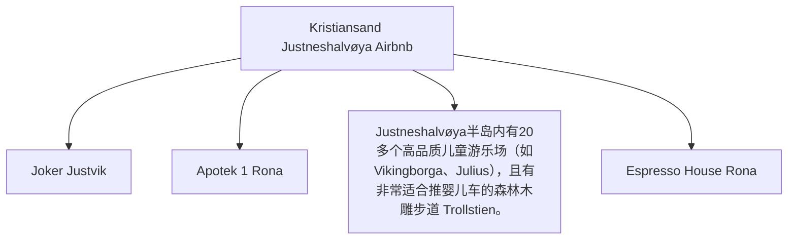

# Day 01 (2026-07-22) - Stavanger → Kristiansand

## Summary
从 Stavanger 出发自驾前往 Kristiansand，入住 Kristiansand Airbnb。第一天旅程以安顿和熟悉环境为主，让孩子适应路途环境。

## Today's Goal
安全驾驶抵达 Kristiansand，顺利办理 Airbnb 入住，准备晚餐与休息，保证 Noora 顺利入睡。

## Dashboard
- **日期（Date）**: 2026-07-22
- **行驶距离（Driving Distance）**: 约 232 km
- **行驶时间（Driving Time）**: 约 3小时30分纯驾驶；含午餐、充电和幼儿休息，建议按4.5小时预留
- **预计剩余电量（Expected SOC）**: 建议 95% 出发 → 预计 25–40% 抵达
- **天气（Weather）**: 出发前 48 小时更新；当天早晨再次确认
- **步行距离（Walking Distance）**: 约 1-2 km
- **入住酒店（Hotel）**: Kristiansand Airbnb (Marikåpeveien 47, Kristiansand, Agder 4634)
- **停车场（Parking）**: Marikåpeveien 47 房屋前专用免费停车位
- **办理入住（Check-in）**: 15:00
- **办理退房（Check-out）**: N/A
- **今日亮点（Highlights）**: 沿途挪威南部峡湾/海岸线风光

---

## Timeline
08:00 | Noora 起床与早餐（Stavanger 家中）
09:00 | 整理行装，检查车辆，准备出发
09:30 | 出发自驾（Stavanger → Kristiansand）
12:30 | 途中停车午饭/喂奶/Noora车上午睡
13:30 | 继续行车
15:30 | 抵达 Kristiansand Airbnb，办理 Check-in
16:00 | 整理房间，Noora 玩耍时间
18:00 | 晚餐（自备餐食或周边餐馆）
20:00 | Noora 睡觉时间
21:00 | 整理今日手记，核对明日行程

---

## Route
驾车路线（Driving route）：Stavanger → E39 → Kristiansand (Marikåpeveien 47)
步行路线（Walking route）：约 1-2 km
停车（Parking）：Marikåpeveien 47 专用停车位 (Marikåpeveien 47 房屋前专用免费停车位)

---

## Map

*(已在网页版集成 Leaflet.js 交互式地图)*

---

## Charging

Departure SOC: 95%

Recommended charger:
Kristiansand Rona / Sørlandsparken 区域慢速/快速补电 (如 Rona 8-10 Recharge)

Backup charger:
Tesla Supercharger Kristiansand (Barstølveien 60) 或其他 CCS 快充

Arrival SOC:
25–40%

### Charging decision rule

- **切换条件**：若导航预测抵达住宿低于 20%，则在途中 Lyngdal 或 Mandal 提前补电。
- **充电目标**：途中通常充至 75–80%，避免高 SOC 阶段充电速度急剧下降。
- **实时确认**：出发前通过车辆导航或充电 App 确认开放状态、兼容性和占用情况。

---

## Hotel
Address: Marikåpeveien 47, Kristiansand, Agder 4634, Norway
Parking: 房屋自带专用免费停车位（Private driveway parking）。
EV: 房屋未配备或尚未确认专属充电桩，但附近 Rona 和 Sørlandsparken 有大量超级充电桩。
Supermarket: Joker Justvik (Grostølveien 4D, 距离约 1.2 km，步行15分钟)。
Pharmacy: Apotek 1 Rona (Rona 8-10, 距离约 2.8 km，车程5分钟)。
Hospital: Sørlandet Sykehus Kristiansand (Egsveien 100, 距离约 6.5 km，车程10分钟)。
Playground: Justneshalvøya半岛内有20多个高品质儿童游乐场（如Vikingborga、Julius），且有非常适合推婴儿车的森林木雕步道 Trollstien。
Nearby Coffee: Espresso House Rona (Rona 8)。
Nearby Restaurant: Søm Pizza (Sømveien 80, 距离约 3 km) 或前往市中心餐饮区。

---

## Meals

Breakfast: Stavanger 家中
Lunch: 途中服务区或自备便当
Dinner: 自备简餐或 Søm Pizza 披萨外带
Coffee: 途中自备或 Rona 8-10 充电站附近咖啡馆

### 推荐餐厅 (Recommended Restaurants)

- **首选 (First Choice)**: **Søm Pizza** (Sømveien 80, 距离住宿约3km，可外带或外送，最适合控制第一天抵达后的晚餐时间)。
- **备选 (Backup)**: Kristiansand 市中心家庭友好餐厅 (仅在抵达时间较早、孩子状态良好时考虑)。
- **最稳方案 (Safe Fallback)**: Airbnb 简餐 (如果旅途严重延误，直接在住宿做简易餐饮)。
- **执行原则**：餐厅预约不是硬性节点。如果抵达延误或 Noora 疲劳，立即改为外带、超市采购或住宿简餐。

---

## Baby Plan
Milk: 08:00, 12:30, 19:30
Snack: 随车备齐零食
Nap: 预计 12:30 - 14:30 在安全座椅上睡
Play: 抵达 Airbnb 后在游乐场或室内玩耍
Bath: 19:30 洗澡
Sleep: 20:00 准时入睡

---

## Conference
N/A

---

## Plan A (晴天)
正常行车，傍晚在 Airbnb 周边或市中心散步，Noora 户外玩耍。

---

## Plan B (雨天)
如遇暴雨，行车注意安全，缩短室外时间，抵达后在 Airbnb 室内玩耍与休息。

---

## Expense
- **住宿（Hotel）**: 已预订 (3387 NOK)
- **充电（Charging）**: 预算：预计 180 NOK；实际：旅行中填写
- **餐饮（Food）**: 预算：预计 300 NOK；实际：旅行中填写
- **停车（Parking）**: 预算：免费；实际：旅行中填写
- **购物（Shopping）**: 预算：预计 200 NOK；实际：旅行中填写

---

## Journal
- **精选照片（Best Photo）**: 旅行中填写
- **今日回忆（Today's Memory）**: 旅行中填写
- **趣味瞬间（Funny Moment）**: 旅行中填写
- **Noora的新发现（Noora Learned）**: 旅行中填写
