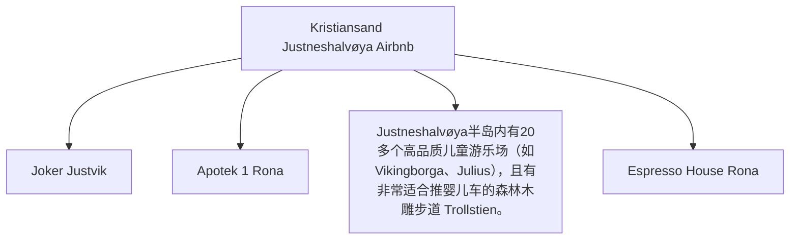

# Day 02 (2026-07-23) - Kristiansand 游玩

## Summary
在 Kristiansand 本地进行一日游，放松调整，让 Noora 适应旅行节奏，体验本地公园或游乐设施。

## Today's Goal
保证 Noora 作息稳定的情况下，轻松游览 Kristiansand 标志性景点（如 Dyrepark 动物园/市中心公园）。

## Dashboard
- **日期（Date）**: 2026-07-23
- **行驶距离（Driving Distance）**: 本地驾驶 (TODO)
- **行驶时间（Driving Time）**: 本地驾驶 (TODO)
- **预计剩余电量（Expected SOC）**: 出发 80% -> 抵达 60%
- **天气（Weather）**: 晴朗 (预计 20-24°C)
- **步行距离（Walking Distance）**: 约 5-8 km (动物园游玩)
- **入住酒店（Hotel）**: Kristiansand Airbnb (Marikåpeveien 47, Kristiansand, Agder 4634)
- **停车场（Parking）**: Marikåpeveien 47 专用停车位
- **办理入住（Check-in）**: N/A
- **办理退房（Check-out）**: N/A
- **今日亮点（Highlights）**: Kristiansand 动物园或海滩游玩 (TODO)

---

## Timeline
08:00 | Noora 起床与早餐
09:30 | 出发前往当地公园或游玩点
12:00 | 午餐（Kristiansand 市区或景区内）
12:30 | Noora 午睡时间（婴儿车或回 Airbnb）
15:00 | 下午轻松游览/Playground 玩耍
17:30 | 返回 Airbnb，准备晚餐
18:00 | 晚餐
20:00 | Noora 睡觉时间
21:00 | 整理行装，为明日轮渡大清早出发做好万全准备

---

## Route
驾车路线（Driving route）：Airbnb → 当地景点 → Airbnb
步行路线（Walking route）：约 5-8 km (动物园游玩)
停车（Parking）：景区分散停车场 (TODO)

---

## Map

*(已在网页版集成 Leaflet.js 交互式地图)*

---

## Charging
Departure SOC: TODO
Recommended charger: Dyreparken 停车场公共交流充电桩 (11kW)
Backup charger: Tesla Supercharger Kristiansand (Barstølveien 60)
Arrival SOC: 65% (建议今晚充至 90% 以上，为明早长途和轮渡准备)

---

## Hotel
Address: Marikåpeveien 47, Kristiansand, Agder 4634
Parking: 专用停车位
EV: 房屋未确认充电桩（TODO），但附近Rona和Sørlandsparken有大量超级充电桩。 (周边充电桩)
Supermarket: Joker Justvik (Grostølveien 4D, 距离约 1.2 km，步行15分钟)。
Pharmacy: Apotek 1 Rona (Rona 8-10, 距离约 2.8 km，车程5分钟)。
Hospital: Sørlandet Sykehus Kristiansand (Egsveien 100, 距离约 6.5 km，车程10分钟)。
Playground: Justneshalvøya半岛内有20多个高品质儿童游乐场（如Vikingborga、Julius），且有非常适合推婴儿车的森林木雕步道 Trollstien。
Nearby Coffee: Espresso House Rona (Rona 8)。
Nearby Restaurant: Søm Pizza (Sømveien 80, 距离约 3 km) 或前往市中心餐饮区。

---

## Meals
Breakfast: Airbnb 自备自做
Lunch: TODO
Dinner: Kristiansand 市中心餐馆 Rasmus 晚餐
Coffee: 动物园内咖啡厅
### 推荐餐厅 (Recommended Restaurants)
- **Local Food**:
  - **Sjøhuset** (Østre Strandgate 12a, Kristiansand): 位于 Fiskebrygga（鱼码头）附近，提供绝佳的海边景观以及当地新鲜捕捞的海鲜（如鳕鱼、青口贝和野生虾）。
- **Chinese/Asian Food**:
  - **Le’s Kitchen** (Kristian IVs gate 15, Kristiansand): 靠近市中心的中式/亚洲菜馆，家庭式温馨氛围，提供高性价比的中式炒面和炒饭。

---

## Baby Plan
Milk: 正常喂奶
Snack: 携带小零食和水果
Nap: 12:30 午睡
Play: Playground/动物园互动
Bath: 19:30 洗澡
Sleep: 20:00 准时入睡

---

## Conference
N/A

---

## Plan A (晴天)
前往 Kristiansand Dyrepark 动物园游玩。

---

## Plan B (雨天)
如果下雨，前往室内亲子场所，或在 Airbnb 室内游玩。

---

## Expense
- **住宿（Hotel）**: 已预订 (TODO 填写金额)
- **充电（Charging）**: TODO
- **餐饮（Food）**: TODO
- **停车（Parking）**: TODO
- **购物（Shopping）**: TODO

---

## Journal
- **精选照片（Best Photo）**: TODO
- **今日回忆（Today's Memory）**: TODO
- **趣味瞬间（Funny Moment）**: TODO
- **Noora的新发现（Noora Learned）**: TODO
