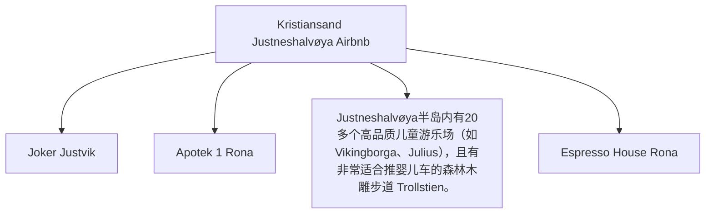

# Day 02 (2026-07-23) - Kristiansand 游玩

## Summary
在 Kristiansand 本地进行一日游，放松调整，让 Noora 适应旅行节奏，体验本地公园或游乐设施。

## Today's Goal
保证 Noora 作息稳定的情况下，轻松游览 Kristiansand 标志性景点（如 Dyrepark 动物园/市中心公园）。

## Dashboard
- **日期（Date）**: 2026-07-23
- **行驶距离（Driving Distance）**: 约 40–50 km 本地往返
- **行驶时间（Driving Time）**: 累计驾驶约 50–70分钟
- **预计剩余电量（Expected SOC）**: 建议 80%+ 出发 → 预计 60–75% 抵达
- **天气（Weather）**: 出发前 48 小时更新；当天早晨再次确认
- **步行距离（Walking Distance）**: 约 5-8 km (动物园游玩)
- **入住酒店（Hotel）**: Kristiansand Airbnb (Marikåpeveien 47, Kristiansand, Agder 4634)
- **停车场（Parking）**: Dyreparken 专用停车场 (P-plass)
- **办理入住（Check-in）**: N/A
- **办理退房（Check-out）**: N/A
- **今日亮点（Highlights）**: Kristiansand 动物园或海滩游玩

---

## Timeline
08:00 | Noora 起床与早餐
09:30 | 出发前往当地公园或游玩点
12:00 | 午餐（Kristiansand 市区或景区内）
12:30 | Noora 午睡时间（婴儿车或回 Airbnb）
15:00 | 下午轻松游览/Playground 玩耍
17:30 | 返回 Airbnb，准备晚餐
18:00 | 晚餐
20:00 | Noora 睡觉时间
21:00 | 整理行装，为明日轮渡大清早出发做好万全准备

---

## Route
驾车路线（Driving route）：Airbnb → 当地景点 → Airbnb
步行路线（Walking route）：约 5-8 km (动物园游玩)
停车（Parking）：Dyreparken 专用停车场 (P-plass)

---

## Map

*(已在网页版集成 Leaflet.js 交互式地图)*

---

## Charging

Departure SOC: 80%+

Recommended charger:
Dyreparken 停车场公共交流充电桩 (11kW)

Backup charger:
Sørlandsparken 区域快充 / Tesla Supercharger Kristiansand (Barstølveien 60)

Arrival SOC:
60–75%

### Charging decision rule

- **切换条件**：Dyreparken 交流桩较多但较抢手，以实际空位为准；若无空位，则离园后直接前往备用快充站补电。
- **充电目标**：离园后建议将车辆补至 90–100%，避免 Day03 清晨临时充电影响行程。
- **实时确认**：可通过相关充电 App 实时查看 Dyreparken 充电桩的占用情况情况。

---

## Hotel
Address: Marikåpeveien 47, Kristiansand, Agder 4634, Norway
Parking: 房屋自带专用免费停车位（Private driveway parking）。
EV: 房屋未配备或尚未确认专属充电桩，但附近 Rona 和 Sørlandsparken 有大量超级充电桩。
Supermarket: Joker Justvik (Grostølveien 4D, 距离约 1.2 km，步行15分钟)。
Pharmacy: Apotek 1 Rona (Rona 8-10, 距离约 2.8 km，车程5分钟)。
Hospital: Sørlandet Sykehus Kristiansand (Egsveien 100, 距离约 6.5 km，车程10分钟)。
Playground: Justneshalvøya半岛内有20多个高品质儿童游乐场（如Vikingborga、Julius），且有非常适合推婴儿车的森林木雕步道 Trollstien。
Nearby Coffee: Espresso House Rona (Rona 8)。
Nearby Restaurant: Søm Pizza (Sømveien 80, 距离约 3 km) 或前往市中心餐饮区。

---

## Meals

Breakfast: Airbnb 内自制
Lunch: Dyreparken 园内餐馆
Dinner: Kristiansand 市区家庭友好餐厅
Coffee: 园内咖啡厅

### 推荐餐厅 (Recommended Restaurants)

- **首选 (First Choice)**: **Drivhuset** (Dyreparken 园内，适合快速午餐、三明治与饮料) 或 **Gorines Vertshus** (Dyreparken 园内，提供披萨等儿童更易接受的食物)。
- **备选 (Backup)**: **Setra** (Dyreparken 园内，如果需要坐下来吃较完整的挪威本地餐食) / **Rasmus Landspiseri** (市中心，晚餐首选)。
- **最稳方案 (Safe Fallback)**: Airbnb 自备简餐 (游玩后若 Noora 极度疲劳，直接回住所做饭或外卖)。
- **执行原则**：餐厅预约不是硬性节点。如果抵达延误或 Noora 疲劳，立即改为外带、超市采购或住宿简餐。

---

## Baby Plan
Milk: 正常喂奶
Snack: 携带小零食和水果
Nap: 12:30 午睡
Play: Playground/动物园互动
Bath: 19:30 洗澡
Sleep: 20:00 准时入睡

---

## Conference
N/A

---

## Plan A (晴天)
前往 Kristiansand Dyrepark 动物园游玩。

---

## Plan B (雨天)
如果下雨，前往室内亲子场所，或在 Airbnb 室内游玩。

---

## Expense
- **住宿（Hotel）**: 已预订 (0 NOK，已计入第一天)
- **充电（Charging）**: 预算：预计 50 NOK；实际：旅行中填写
- **餐饮（Food）**: 预算：预计 600 NOK；实际：旅行中填写
- **停车（Parking）**: 预算：80 NOK；实际：旅行中填写
- **购物（Shopping）**: 预算：预计 150 NOK；实际：旅行中填写

---

## Journal
- **精选照片（Best Photo）**: 旅行中填写
- **今日回忆（Today's Memory）**: 旅行中填写
- **趣味瞬间（Funny Moment）**: 旅行中填写
- **Noora的新发现（Noora Learned）**: 旅行中填写
