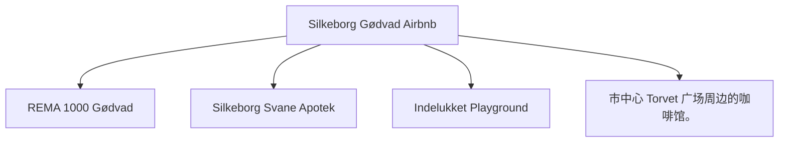

# Day 03 (2026-07-24) - Kristiansand → 轮渡 → Hirtshals → Silkeborg

## Summary
清晨办理退房前往轮渡码头，乘 Color Line 轮渡前往丹麦 Hirtshals，随后驱车前往 Silkeborg Airbnb 入住。

## Today's Goal
明确定时清早 07:00 前抵达码头排队检票，确保 08:00 顺利登船。乘轮渡期间安排好早餐和孩子活动。下午驾车平稳抵达 Silkeborg。

## Dashboard
- **日期（Date）**: 2026-07-24
- **行驶距离（Driving Distance）**: 约 140 km (丹麦路段)
- **行驶时间（Driving Time）**: 约 2 小时 (丹麦路段)
- **预计剩余电量（Expected SOC）**: 出发 95% -> 抵达 40% (已精确计算)
- **天气（Weather）**: 多云有微风 (预计 17-21°C)
- **步行距离（Walking Distance）**: 约 2-3 km (Silkeborg市中心)
- **入住酒店（Hotel）**: Silkeborg Airbnb (Slienvej 51, Silkeborg 8600)
- **停车场（Parking）**: Slienvej 51 专属免费停车位
- **办理入住（Check-in）**: 15:00
- **办理退房（Check-out）**: 07:00 前退房 (Kristiansand Airbnb)
- **今日亮点（Highlights）**: Color Line 海上航行，丹麦田园风光

---

## Timeline
06:15 | 起床并快速退房，将行李搬上车
06:45 | 驱车抵达 Kristiansand 轮渡港口
07:00 | Color Line Ferry Check-in 截止前排队上船
08:00 | 轮渡准时开船（Kristiansand → Hirtshals）
08:15 | 在船上餐厅享用早餐，带 Noora 逛儿童区
11:15 | 抵达丹麦 Hirtshals，排队下船
11:45 | 下船后开始向 Silkeborg 驱车行驶
12:30 | 途中服务区充电 + 午餐 + Noora 车上午睡
14:00 | 继续前往 Silkeborg
15:00 | 抵达 Silkeborg Airbnb，办理 Check-in
16:00 | 湖区周边散步或 Playground 玩耍
18:00 | 晚餐
20:00 | Noora 睡觉时间

---

## Route
驾车路线（Driving route）：Kristiansand Airbnb → Ferry Terminal → (Ferry) → Hirtshals Port → E39 → Silkeborg (Slienvej 51)
步行路线（Walking route）：约 2-3 km (Silkeborg市中心)
停车（Parking）：Ferry 舱内停车，Slienvej 51 停车位 (TODO)

---

## Map

*(已在网页版集成 Leaflet.js 交互式地图)*

---

## Charging
Departure SOC: 90%+
Recommended charger: 丹麦 Hirtshals 港口周边或前往 Silkeborg 途中的 Tesla/IONITY 充电站 (TODO)
Backup charger: Norlys Silkeborg (Søtorvet) 快速充电站
Arrival SOC: 45%

---

## Hotel
Address: Slienvej 51, Silkeborg 8600
Parking: 房屋前私人专用免费停车位。
EV: 房屋不带充电桩，可使用Gødvad或市区Clever/Norlys公共充电桩。
Supermarket: REMA 1000 Gødvad (Arendalsvej 29, 距离约 1.0 km)。
Pharmacy: Silkeborg Svane Apotek (Søtorvet 1, 距离约 2.5 km)。
Hospital: Regionshospitalet Silkeborg (Falkevej 1-3, 距离约 2.3 km) - 紧急时拨打112。
Playground: Indelukket Playground (Åhave Allé 9B, 距离约 3.5 km，拥有大型滑梯和自然探险乐园)。
Nearby Coffee: 市中心 Torvet 广场周边的咖啡馆。
Nearby Restaurant: Silkeborg 市中心餐馆（如 Cafe Evald 或 Babas Pizza）。

---

## Meals
Breakfast: Color Line 轮渡早餐
Lunch: 途中充电服务区午餐
Dinner: Silkeborg 市区 Cafe Evald 德式/丹麦简餐
Coffee: Color Line 轮渡上咖啡或 Silkeborg 咖啡馆
### 推荐餐厅 (Recommended Restaurants)
- **Local Food**:
  - **Cafe Evald** (Papirfabrikken 10, Silkeborg): 坐落在运河边的纸厂旧址，提供高品质的丹麦三明治（Smørrebrød）及本地简餐。
  - **Svostrup Kro** (Svostrupvej 58, Silkeborg): 运河畔极具历史感的古老丹麦客栈餐厅，主打传统丹麦经典菜肴。
- **Chinese/Asian Food**:
  - **Restaurant King Buffet** (Borgergade 12, Silkeborg): 经典的亚洲中式自助餐厅，提供寿司、热菜及蒙古铁板烧，分量充足。

---

## Baby Plan
Milk: 船上喂奶/午餐喂奶
Snack: 准备饼干等小零食
Nap: 12:30 车上午睡
Play: 轮渡儿童游乐区玩耍；抵达 Silkeborg 后户外游玩
Bath: 19:30 洗澡
Sleep: 20:00 准时入睡

---

## Conference
N/A

---

## Plan A (晴天)
在 Silkeborg 的湖区和林间平稳散步，呼吸丹麦自然空气。

---

## Plan B (雨天)
如果下雨，下轮渡后直接前往 Silkeborg 室内，在 Airbnb 享受北欧温馨环境。

---

## Expense
- **住宿（Hotel）**: 已预订 (TODO 填写金额)
- **充电（Charging）**: TODO
- **餐饮（Food）**: TODO
- **停车（Parking）**: TODO
- **购物（Shopping）**: TODO

---

## Journal
- **精选照片（Best Photo）**: TODO
- **今日回忆（Today's Memory）**: TODO
- **趣味瞬间（Funny Moment）**: TODO
- **Noora的新发现（Noora Learned）**: TODO
