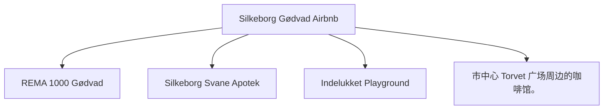

# Day 03 (2026-07-24) - Kristiansand → 轮渡 → Hirtshals → Silkeborg

## Summary
清晨办理退房前往轮渡码头，乘 Color Line 轮渡前往丹麦 Hirtshals，随后驱车前往 Silkeborg Airbnb 入住。

## Today's Goal
明确定时清早 07:00 前抵达码头排队检票，确保 08:00 顺利登船。乘轮渡期间安排好早餐和孩子活动。下午驾车平稳抵达 Silkeborg。

## Dashboard
- **日期（Date）**: 2026-07-24
- **行驶距离（Driving Distance）**: 约 185 km 丹麦陆地驾驶 (轮渡航程单独计算，不计入陆地距离)
- **行驶时间（Driving Time）**: 约 2小时10分纯驾驶；含下船、午餐和幼儿休息，建议按3.5小时预留 (不含轮渡航行时间)
- **预计剩余电量（Expected SOC）**: 建议 95% 出发 → 预计 45–60% 抵达
- **天气（Weather）**: 出发前 48 小时更新；当天早晨再次确认
- **步行距离（Walking Distance）**: 约 2-3 km (Silkeborg市中心)
- **入住酒店（Hotel）**: Silkeborg Airbnb (Slienvej 51, Silkeborg 8600)
- **停车场（Parking）**: Slienvej 51 专属免费停车位
- **办理入住（Check-in）**: 15:00
- **办理退房（Check-out）**: 11:00
- **今日亮点（Highlights）**: Color Line 海上航行，丹麦田园风光

---

## Timeline
06:15 | 起床并快速退房，将行李搬上车
06:45 | 驱车抵达 Kristiansand 轮渡港口
07:00 | Color Line Ferry Check-in 截止前排队上船
08:00 | 轮渡准时开船（Kristiansand → Hirtshals）
08:15 | 在船上餐厅享用早餐，带 Noora 逛儿童区
11:15 | 抵达丹麦 Hirtshals，排队下船
11:45 | 下船后开始向 Silkeborg 驱车行驶
12:30 | 途中服务区充电 + 午餐 + Noora 车上午睡
14:00 | 继续前往 Silkeborg
15:00 | 抵达 Silkeborg Airbnb，办理 Check-in
16:00 | 湖区周边散步或 Playground 玩耍
18:00 | 晚餐
20:00 | Noora 睡觉时间

---

## Route
驾车路线（Driving route）：Kristiansand Airbnb → Ferry Terminal → (Ferry) → Hirtshals Port → E39 → Silkeborg (Slienvej 51)
步行路线（Walking route）：约 2-3 km (Silkeborg市中心)
停车（Parking）：Slienvej 51 专属免费停车位

---

## Map

*(已在网页版集成 Leaflet.js 交互式地图)*

---

## Charging

Departure SOC: 95%

Recommended charger:
Silkeborg 住宿周边 REMA 1000 Gødvad Clever 充电桩或快充桩

Backup charger:
Aalborg 或 Hobro 沿线充电区域

Arrival SOC:
45–60%

### Charging decision rule

- **切换条件**：如果下船后导航预测抵达 Silkeborg 住宿低于 25%，则在途中 Aalborg 或 Hobro 提前充电 10–15 分钟。
- **充电目标**：途中补电仅需充至能够安全抵达目的地的 SOC 即可，抵达 Silkeborg 后再慢充充满。
- **实时确认**：出发前通过 Clever / Norlys App 确认沿线及目的地充电桩的占用情况和可用状态。

---

## Hotel
Address: Slienvej 51, Silkeborg 8600, Denmark
Parking: 房屋前私人专用免费停车位。
EV: 房屋不带充电桩，可使用Gødvad或市区Clever/Norlys公共充电桩。
Supermarket: REMA 1000 Gødvad (Arendalsvej 29, 距离约 1.0 km)。
Pharmacy: Silkeborg Svane Apotek (Søtorvet 1, 距离约 2.5 km)。
Hospital: Regionshospitalet Silkeborg (Falkevej 1-3, 距离约 2.3 km) - 紧急时拨打112。
Playground: Indelukket Playground (Åhave Allé 9B, 距离约 3.5 km，拥有大型滑梯和自然探险乐园)。
Nearby Coffee: 市中心 Torvet 广场周边的咖啡馆。
Nearby Restaurant: Silkeborg 市中心餐馆（如 Cafe Evald 或 Babas Pizza）。

---

## Meals

Breakfast: Airbnb 内自制
Lunch: 轮渡上简餐
Dinner: Silkeborg 市区 Cafe Evald 德式/丹麦简餐
Coffee: 轮渡咖啡厅或 Silkeborg 咖啡馆

### 推荐餐厅 (Recommended Restaurants)

- **首选 (First Choice)**: **Cafe Evald** (Papirfabrikken 10, Silkeborg, 适合较早的晚餐，出餐快，环境对孩子友好)。
- **备选 (Backup)**: Silkeborg 市中心披萨店或外带餐厅。
- **最稳方案 (Safe Fallback)**: REMA 1000 Gødvad (距离住宿 1km) 采购食材，回 Airbnb 自制简餐。
- **执行原则**：餐厅预约不是硬性节点。如果抵达延误或 Noora 疲劳，立即改为外带、超市采购或住宿简餐。

---

## Baby Plan
Milk: 船上喂奶/午餐喂奶
Snack: 准备饼干等小零食
Nap: 12:30 车上午睡
Play: 轮渡儿童游乐区玩耍；抵达 Silkeborg 后户外游玩
Bath: 19:30 洗澡
Sleep: 20:00 准时入睡

---

## Conference
N/A

---

## Plan A (晴天)
在 Silkeborg 的湖区和林间平稳散步，呼吸丹麦自然空气。

---

## Plan B (雨天)
如果下雨，下轮渡后直接前往 Silkeborg 室内，在 Airbnb 享受北欧温馨环境。

---

## Expense
- **住宿（Hotel）**: 已预订 (810 DKK)
- **充电（Charging）**: 预算：预计 120 DKK；实际：旅行中填写
- **餐饮（Food）**: 预算：预计 400 DKK；实际：旅行中填写
- **停车（Parking）**: 预算：免费；实际：旅行中填写
- **购物（Shopping）**: 预算：预计 100 DKK；实际：旅行中填写

---

## Journal
- **精选照片（Best Photo）**: 旅行中填写
- **今日回忆（Today's Memory）**: 旅行中填写
- **趣味瞬间（Funny Moment）**: 旅行中填写
- **Noora的新发现（Noora Learned）**: 旅行中填写
