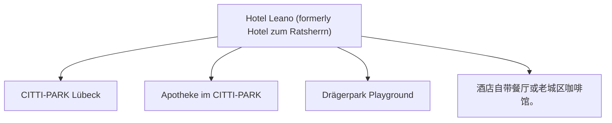

# Day 04 (2026-07-25) - Silkeborg → Lübeck

## Summary
上午自驾穿过丹麦与德国边境，前往德国历史名城 Lübeck 吕贝克，入住 Lübeck Hotel。

## Today's Goal
顺利出丹麦进德国，注意高速规则转换，下午抵达 Lübeck 办理入住，傍晚漫步吕贝克老城。

## Dashboard
- **日期（Date）**: 2026-07-25
- **行驶距离（Driving Distance）**: 约 348 km
- **行驶时间（Driving Time）**: 约 3小时45分纯驾驶；含午餐、充电 and 幼儿休息，建议按5–5.5小时预留
- **预计剩余电量（Expected SOC）**: 建议 90–95% 出发 → 预计 25–40% 抵达 (中途充电一次)
- **天气（Weather）**: 出发前 48 小时更新；当天早晨再次确认
- **步行距离（Walking Distance）**: 约 2-4 km (吕贝克老城)
- **入住酒店（Hotel）**: Lübeck Hotel (Herrendamm 2-4, Lübeck, SH 23556)
- **停车场（Parking）**: Hotel Leano 专属收费停车场 (10 EUR/天)
- **办理入住（Check-in）**: 15:00
- **办理退房（Check-out）**: 10:00
- **今日亮点（Highlights）**: 跨国边境行车，Lübeck 汉萨同盟中世纪老城建筑

---

## Timeline
08:00 | Noora 起床与早餐
09:00 | 整理行装，办理 Airbnb 退房
09:30 | 出发自驾（Silkeborg → Lübeck）
12:30 | 边境充电站（如 IONITY/Tesla）充电 + 午餐 + Noora 车上午睡
14:00 | 跨境驶入德国，往 Lübeck 行驶
15:30 | 抵达 Lübeck Hotel，办理 Check-in 稍事休息
16:30 | 漫步吕贝克老城（如 Holstentor 荷尔斯登门、老市政厅）
18:00 | 晚餐（吕贝克当地家庭友好餐厅）
20:00 | Noora 睡觉时间

---

## Route
驾车路线（Driving route）：Silkeborg → E45 → 边境 → A7/A21/A1 → Lübeck (Herrendamm 2-4)
步行路线（Walking route）：约 2-4 km (吕贝克老城) 酒店至 Holstentor 步行路线
停车（Parking）：Hotel Leano 专属收费停车场 (10 EUR/天)

---

## Map

*(已在网页版集成 Leaflet.js 交互式地图)*

---

## Charging

Departure SOC: 90–95%

Recommended charger:
IONITY Hüttener Berge Ost 快充站 (目标充至 75–80%)

Backup charger:
Flensburg/Harrislee CCS 快充站 (途中备用) 及 Lübeck Bei der Lohmühle 快充站

Arrival SOC:
25–40%

### Charging decision rule

- **切换条件**：若导航预测抵达主充电站低于 12–15%，应在 Flensburg/Harrislee 提前补电。
- **充电目标**：途中通常充至 75–80%，避免高 SOC 阶段充电速度急剧下降。
- **实时确认**：出发前通过 IONITY App 确认充电桩状态，并检查吕贝克 Bei der Lohmühle 桩的空闲状态。

---

## Hotel
Address: Herrendamm 2-4, Lübeck, SH 23556, Germany
Parking: 酒店专属收费停车场（10 EUR/天）。
EV: 酒店内配备EV充电站，或使用附近超充站（Bei der Lohmühle 11A）。
Supermarket: CITTI-PARK Lübeck (Herrenholz 14, 距离约 3.0 km，大型购物中心内有Aldi和Rewe)。
Pharmacy: Apotheke im CITTI-PARK (Herrenholz 14)。
Hospital: UKSH Campus Lübeck (Ratzeburger Allee 160) 或 Sana Kliniken Lübeck。
Playground: Drägerpark Playground (Drägerpark，靠近水边，适合散步和儿童玩耍)。
Nearby Coffee: 酒店自带餐厅或老城区咖啡馆。
Nearby Restaurant: 酒店自带餐厅，提供德式及意式菜肴。

---

## Meals

Breakfast: Airbnb 内自制
Lunch: 途中充电服务区
Dinner: 酒店餐厅或附近外带
Coffee: Café Niederegger (吕贝克老城区，仅限时间宽裕时前往)

### 推荐餐厅 (Recommended Restaurants)

- **首选 (First Choice)**: **Café Niederegger** (Breite Str. 89, Lübeck, 如果 16:30 前顺利入住，可以去老城区品尝标志性杏仁糖蛋糕和咖啡)；若入住较晚，首选酒店内部餐厅或外带。
- **备选 (Backup)**: **Schiffergesellschaft** (吕贝克老城历史餐厅，适合体验古朴德式风情，需早抵达)。
- **最稳方案 (Safe Fallback)**: 酒店 Prisma 内 Campino's 德式特色餐厅或外带。如果入住时间晚于 17:00，则直接取消老城区晚餐行程。
- **执行原则**：餐厅预约不是硬性节点。如果抵达延误或 Noora 疲劳，立即改为外带、超市采购或住宿简餐。

---

## Baby Plan
Milk: 正常喂奶
Snack: 随车零食
Nap: 12:30 - 14:30 安全座椅上小憩
Play: 老城广场空地或草坪玩耍
Bath: 19:30
Sleep: 20:00 准时入睡

---

## Conference
N/A

---

## Plan A (晴天)
在老城中心宽阔街道漫步，游览 Holstentor 并在草坪玩耍。

---

## Plan B (雨天)
如果下雨，可参观老城室内咖啡馆或吕贝克木偶剧博物馆，随后回酒店休息。

---

## Expense
- **住宿（Hotel）**: 已预订 (1466 NOK)
- **充电（Charging）**: 预算：预计 35 EUR；实际：旅行中填写
- **餐饮（Food）**: 预算：预计 70 EUR；实际：旅行中填写
- **停车（Parking）**: 预算：10 EUR；实际：旅行中填写
- **购物（Shopping）**: 预算：预计 30 EUR；实际：旅行中填写

---

## Journal
- **精选照片（Best Photo）**: 旅行中填写
- **今日回忆（Today's Memory）**: 旅行中填写
- **趣味瞬间（Funny Moment）**: 旅行中填写
- **Noora的新发现（Noora Learned）**: 旅行中填写
