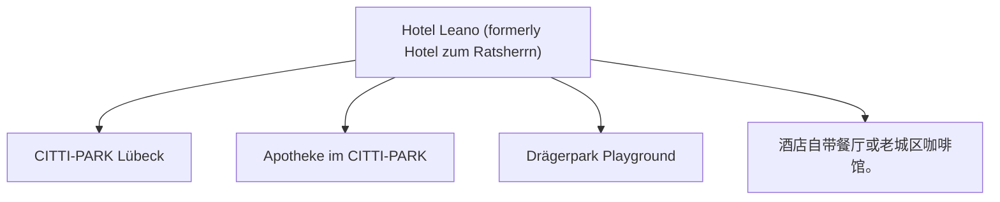

# Day 04 (2026-07-25) - Silkeborg → Lübeck

## Summary
上午自驾穿过丹麦与德国边境，前往德国历史名城 Lübeck 吕贝克，入住 Lübeck Hotel。

## Today's Goal
顺利出丹麦进德国，注意高速规则转换，下午抵达 Lübeck 办理入住，傍晚漫步吕贝克老城。

## Dashboard
- **日期（Date）**: 2026-07-25
- **行驶距离（Driving Distance）**: 约 340 km (TODO 确认实际行驶里程)
- **行驶时间（Driving Time）**: 3.5 小时
- **预计剩余电量（Expected SOC）**: 出发 SOC: 90% -> 抵达 SOC: TODO
- **天气（Weather）**: 晴转多云 (预计 19-23°C)
- **步行距离（Walking Distance）**: 约 2-4 km (吕贝克老城)
- **入住酒店（Hotel）**: Lübeck Hotel (Herrendamm 2-4, Lübeck, SH 23556)
- **停车场（Parking）**: Hotel Leano 专属收费停车场 (10 EUR/天)
- **办理入住（Check-in）**: 15:00
- **办理退房（Check-out）**: 09:30 前退房 (Silkeborg Airbnb)
- **今日亮点（Highlights）**: 跨国边境行车，Lübeck 汉萨同盟中世纪老城建筑

---

## Timeline
08:00 | Noora 起床与早餐
09:00 | 整理行装，办理 Airbnb 退房
09:30 | 出发自驾（Silkeborg → Lübeck）
12:30 | 边境充电站（如 IONITY/Tesla）充电 + 午餐 + Noora 车上午睡
14:00 | 跨境驶入德国，往 Lübeck 行驶
15:30 | 抵达 Lübeck Hotel，办理 Check-in 稍事休息
16:30 | 漫步吕贝克老城（如 Holstentor 荷尔斯登门、老市政厅）
18:00 | 晚餐（吕贝克当地家庭友好餐厅）
20:00 | Noora 睡觉时间

---

## Route
驾车路线（Driving route）：Silkeborg → E45 → 边境 → A7/A21/A1 → Lübeck (Herrendamm 2-4)
步行路线（Walking route）：约 2-4 km (吕贝克老城) 酒店至 Holstentor 步行路线
停车（Parking）：Herrendamm 2-4 酒店停车场 (TODO)

---

## Map

*(已在网页版集成 Leaflet.js 交互式地图)*

---

## Charging
Departure SOC: 90%+
Recommended charger: 丹德边境 Flensburg 充电站 (TODO)
Backup charger: Allego Lübeck Bei der Lohmühle 11A (150kW)
Arrival SOC: 30%

---

## Hotel
Address: Herrendamm 2-4, Lübeck, SH 23556
Parking: 酒店专属收费停车场（10 EUR/天）。
EV: 酒店内配备EV充电站，或使用附近超充站（Bei der Lohmühle 11A）。
Supermarket: CITTI-PARK Lübeck (Herrenholz 14, 距离约 3.0 km，大型购物中心内有Aldi和Rewe)。
Pharmacy: Apotheke im CITTI-PARK (Herrenholz 14)。
Hospital: UKSH Campus Lübeck (Ratzeburger Allee 160) 或 Sana Kliniken Lübeck。
Playground: Drägerpark Playground (Drägerpark，靠近水边，适合散步和儿童玩耍)。
Nearby Coffee: 酒店自带餐厅或老城区咖啡馆。
Nearby Restaurant: 酒店自带餐厅，提供德式及意式菜肴。

---

## Meals
Breakfast: Airbnb 自制早餐
Lunch: 边境充电服务区
Dinner: 酒店 Campino's 餐厅或吕贝克老城区地道餐馆
Coffee: 老城区 Niederegger Cafe 咖啡与杏仁糖甜点
### 推荐餐厅 (Recommended Restaurants)
- **Local Food**:
  - **Schiffergesellschaft** (Breite Str. 2, Lübeck): 吕贝克最著名的历史地标级餐厅，始于16世纪，提供正宗北德水手风味（如鲱鱼、煎鱼和北德炖肉）。
  - **Fangfrisch** (An der Untertrave 51, Lübeck): 运河旁的现代鱼类小馆，食材非常新鲜，主打各类本地煎鱼和海鲜三明治。
- **Chinese/Asian Food**:
  - **Shanghai-Restaurant** (Koberg 6, Lübeck): 开业于 1966 年，是吕贝克历史最悠久的中餐厅，口味正宗，环境雅致。

---

## Baby Plan
Milk: 正常喂奶
Snack: 随车零食
Nap: 12:30 - 14:30 安全座椅上小憩
Play: 老城广场空地或草坪玩耍
Bath: 19:30
Sleep: 20:00 准时入睡

---

## Conference
N/A

---

## Plan A (晴天)
在老城中心宽阔街道漫步，游览 Holstentor 并在草坪玩耍。

---

## Plan B (雨天)
如果下雨，可参观老城室内咖啡馆或吕贝克木偶剧博物馆，随后回酒店休息。

---

## Expense
- **住宿（Hotel）**: 已预订 (TODO 填写金额)
- **充电（Charging）**: TODO
- **餐饮（Food）**: TODO
- **停车（Parking）**: TODO
- **购物（Shopping）**: TODO

---

## Journal
- **精选照片（Best Photo）**: TODO
- **今日回忆（Today's Memory）**: TODO
- **趣味瞬间（Funny Moment）**: TODO
- **Noora的新发现（Noora Learned）**: TODO
