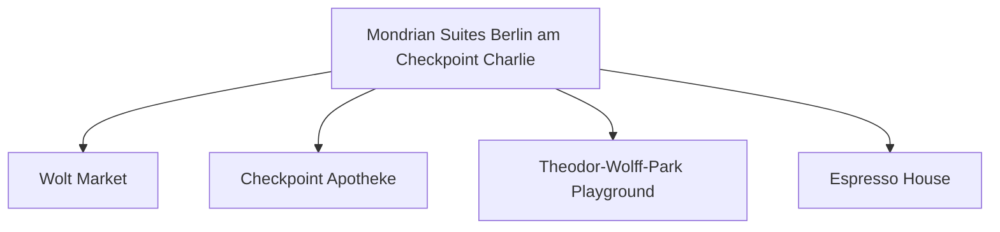

# Day 05 (2026-07-26) - Lübeck → Berlin

## Summary
上午离开 Lübeck 前往德国首都 Berlin 柏林，入住 Berlin Hotel，开启为期一年的柏林会议与家庭生活行程。

## Today's Goal
顺利驱车抵达柏林，办理为期数日的酒店入住，安顿好房间，采购生活必需品，准备明天的会议。

## Dashboard
- **日期（Date）**: 2026-07-26
- **行驶距离（Driving Distance）**: 约 290 km
- **行驶时间（Driving Time）**: 约 3 小时
- **预计剩余电量（Expected SOC）**: 出发 SOC: 90% -> 抵达 SOC: TODO
- **天气（Weather）**: 多云转晴 (预计 20-25°C)
- **步行距离（Walking Distance）**: 约 3-5 km (柏林初探索)
- **入住酒店（Hotel）**: Berlin Hotel (Markgrafenstrasse 16–16a, Berlin 10969)
- **停车场（Parking）**: Mondrian Suites 地下车库 (25 EUR/天)
- **办理入住（Check-in）**: 15:00
- **办理退房（Check-out）**: 09:30 前退房 (Lübeck Hotel)
- **今日亮点（Highlights）**: 柏林初印象

---

## Timeline
08:00 | Noora 起床与早餐
09:00 | 整理行装，办理退房
09:30 | 驱车前往 Berlin
12:30 | 途中高速服务区充电 + 午餐 + Noora 车上午睡
14:30 | 抵达 Berlin Hotel，办理 Check-in 入住
15:30 | 周边超市采购 Noora 接下来几天的食物、奶粉和水
17:00 | 周边散步，寻找最近的 Playground 踩点
18:00 | 晚餐
20:00 | Noora 睡觉时间

---

## Route
驾车路线（Driving route）：Lübeck → A20/A111 → Berlin (Markgrafenstrasse 16-16a)
步行路线（Walking route）：约 3-5 km (柏林初探索) 酒店周边步行踩点
停车（Parking）：酒店地下停车场 (TODO 确认收费与预订情况)

---

## Map

*(已在网页版集成 Leaflet.js 交互式地图)*

---

## Charging
Departure SOC: 90%+
Recommended charger: 途中 A19/A24 沿线超充站 (TODO)
Backup charger: Tesla Supercharger Berlin-Mitte (Kopenhagener Str.)
Arrival SOC: 30%

---

## Hotel
Address: Markgrafenstrasse 16–16a, Berlin 10969
Parking: 酒店专属地下车库（收费25 EUR/天）。
EV: 地下车库内配备EV充电桩（Wallbox）。 (酒店内或周边慢充)
Supermarket: Wolt Market (Markgrafenstraße 58, 距离约 100米) 或 EDEKA Checkpoint Charlie (Friedrichstraße 207-208, 约400米)。
Pharmacy: Checkpoint Apotheke (Friedrichstraße 207, 约400米)。
Hospital: Vivantes Klinikum Am Urban (Dieffenbachstraße 1, 距离约 2.5 km)。
Playground: Theodor-Wolff-Park Playground (步行2分钟，有沙坑和基础滑梯) 或 Gleisdreieck Park Playground (约1.8 km)。
Nearby Coffee: Espresso House (Friedrichstraße 50)。
Nearby Restaurant: 酒店周边有大量简餐、意式和德式餐厅（如 Ristorante A Mano）。

---

## Meals
Breakfast: 酒店早餐
Lunch: 途中服务区
Dinner: 酒店周边 Ristorante A Mano 意式餐厅 柏林中餐厅或西餐厅
Coffee: Espresso House Friedrichstraße
### 推荐餐厅 (Recommended Restaurants)
- **Local Food**:
  - **Schnitzelei Mitte** (Chausseestraße 8, Berlin Mitte): 提供高品质的德式大炸猪排（Wiener Schnitzel）以及德式传统冷盘小吃，环境现代舒适。
- **Chinese/Asian Food**:
  - **LIU Chengdu Weidao (刘成都味道)** (Kronenstraße 72, Berlin Mitte): 距离入住酒店很近，主打正宗四川担担面、红油抄手及小吃，味道惊艳。

---

## Baby Plan
Milk: 正常喂食
Snack: 零食补给
Nap: 12:30 - 14:30 车上午睡
Play: 踩点周边的 Playground 玩滑梯
Bath: 19:30
Sleep: 20:00 准时入睡

---

## Conference
N/A (ICMCF Berlin 会议前夕注册/踩点)

---

## Plan A (晴天)
在 Markgrafenstrasse 酒店周边散步，去 Checkpoint Charlie（查理检查哨）周边感受氛围，买齐物资。

---

## Plan B (雨天)
如果下雨，去超市速战速决，在酒店房间内布置好 Noora 的睡床和游戏角。

---

## Expense
- **住宿（Hotel）**: 已预订 (TODO 填写金额)
- **充电（Charging）**: TODO
- **餐饮（Food）**: TODO
- **停车（Parking）**: TODO
- **购物（Shopping）**: TODO

---

## Journal
- **精选照片（Best Photo）**: TODO
- **今日回忆（Today's Memory）**: TODO
- **趣味瞬间（Funny Moment）**: TODO
- **Noora的新发现（Noora Learned）**: TODO
