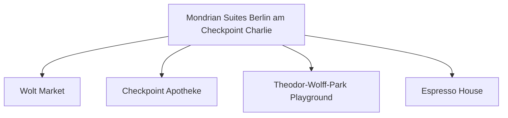

# Day 05 (2026-07-26) - Lübeck → Berlin

## Summary
上午离开 Lübeck 前往德国首都 Berlin 柏林，入住 Berlin Hotel，开启为期一年的柏林会议与家庭生活行程。

## Today's Goal
顺利驱车抵达柏林，办理为期数日的酒店入住，安顿好房间，采购生活必需品，准备明天的会议。

## Dashboard
- **日期（Date）**: 2026-07-26
- **行驶距离（Driving Distance）**: 约 283 km
- **行驶时间（Driving Time）**: 约 3小时纯驾驶；含午餐、充电和幼儿休息，建议按4小时15分预留
- **预计剩余电量（Expected SOC）**: 建议 90% 出发 → 预计 25–40% 抵达
- **天气（Weather）**: 出发前 48 小时更新；当天早晨再次确认
- **步行距离（Walking Distance）**: 约 3-5 km (柏林初探索)
- **入住酒店（Hotel）**: Berlin Hotel (Markgrafenstrasse 16–16a, Berlin 10969)
- **停车场（Parking）**: Mondrian Suites 地下车库 (25 EUR/天)
- **办理入住（Check-in）**: 15:00
- **办理退房（Check-out）**: 11:00
- **今日亮点（Highlights）**: 柏林初印象

---

## Timeline
08:00 | Noora 起床与早餐
09:00 | 整理行装，办理退房
09:30 | 驱车前往 Berlin
12:30 | 途中高速服务区充电 + 午餐 + Noora 车上午睡
14:30 | 抵达 Berlin Hotel，办理 Check-in 入住
15:30 | 周边超市采购 Noora 接下来几天的食物、奶粉和水
17:00 | 周边散步，寻找最近的 Playground 踩点
18:00 | 晚餐
20:00 | Noora 睡觉时间

---

## Route
驾车路线（Driving route）：Lübeck → A20/A111 → Berlin (Markgrafenstrasse 16-16a)
步行路线（Walking route）：约 3-5 km (柏林初探索) 酒店周边步行踩点
停车（Parking）：Mondrian Suites 地下车库 (25 EUR/天)

---

## Map

*(已在网页版集成 Leaflet.js 交互式地图)*

---

## Charging

Departure SOC: 90%

Recommended charger:
A24 沿线 Prignitz 区域快充站 (途中充电)

Backup charger:
Wittenberge 或 Neuruppin 区域 CCS 快充站

Arrival SOC:
25–40%

### Charging decision rule

- **切换条件**：如果导航预测抵达柏林酒店低于 20%，必须在中途补电。
- **充电目标**：抵达酒店后使用地下车库 Wallbox 慢充补充电量。
- **实时确认**：在车机导航中监控电量，并实时查看 Prignitz 快充站的使用状态。

---

## Hotel
Address: Markgrafenstrasse 16-16a, Berlin 10969, Germany
Parking: 酒店专属地下车库（收费25 EUR/天）。
EV: 地下车库内配备EV充电桩（Wallbox）。
Supermarket: Wolt Market (Markgrafenstraße 58, 距离约 100米) 或 EDEKA Checkpoint Charlie (Friedrichstraße 207-208, 约400米)。
Pharmacy: Checkpoint Apotheke (Friedrichstraße 207, 约400米)。
Hospital: Vivantes Klinikum Am Urban (Dieffenbachstraße 1, 距离约 2.5 km)。
Playground: Theodor-Wolff-Park Playground (步行2分钟，有沙坑和基础滑梯) 或 Gleisdreieck Park Playground (约1.8 km)。
Nearby Coffee: Espresso House (Friedrichstraße 50)。
Nearby Restaurant: 酒店周边有大量简餐、意式和德式餐厅（如 Ristorante A Mano）。

---

## Meals

Breakfast: 酒店内早餐
Lunch: 途中服务区
Dinner: 酒店周边意式/德式餐厅
Coffee: Espresso House Friedrichstraße

### 推荐餐厅 (Recommended Restaurants)

- **首选 (First Choice)**: **Ristorante A Mano** (Mitte 意式餐厅，意面和披萨更易被幼儿接受，且出餐迅速)。
- **备选 (Backup)**: **LIU Chengdu Weidao (刘成都味道)** (Sichuan 担担面，为 Noora 单独安排不辣的面条/辅食)。
- **最稳方案 (Safe Fallback)**: 酒店小厨房自制温馨简餐 (由于当天傍晚包含会议报到注册/欢迎活动，自制或外卖时间最灵活)。
- **执行原则**：餐厅预约不是硬性节点。如果抵达延误或 Noora 疲劳，立即改为外带、超市采购或住宿简餐。

---

## Baby Plan
Milk: 正常喂食
Snack: 零食补给
Nap: 12:30 - 14:30 车上午睡
Play: 踩点周边的 Playground 玩滑梯
Bath: 19:30
Sleep: 20:00 准时入睡

---

## Conference
- **时间**: 17:30 - 20:30
- **内容**: 报到注册与欢迎宴会 (Registration and Welcome Reception)
- **地点**: Henry Ford Building - Entrance Hall (Freie Universität Berlin)
- **相关文档**: 📄 [ICMCF 2026 Preliminary Programme](assets/ICMCF2026-Preliminary-Programme_06-29.pdf)

---

## Plan A (晴天)
在 Markgrafenstrasse 酒店周边散步，去 Checkpoint Charlie（查理检查哨）周边感受氛围，买齐物资。

---

## Plan B (雨天)
如果下雨，去超市速战速决，在酒店房间内布置好 Noora 的睡床和游戏角。

---

## Expense
- **住宿（Hotel）**: 已预订 (7140 NOK，6晚总计)
- **充电（Charging）**: 预算：预计 28 EUR；实际：旅行中填写
- **餐饮（Food）**: 预算：预计 80 EUR；实际：旅行中填写
- **停车（Parking）**: 预算：25 EUR；实际：旅行中填写
- **购物（Shopping）**: 预算：预计 50 EUR；实际：旅行中填写

---

## Journal
- **精选照片（Best Photo）**: 旅行中填写
- **今日回忆（Today's Memory）**: 旅行中填写
- **趣味瞬间（Funny Moment）**: 旅行中填写
- **Noora的新发现（Noora Learned）**: 旅行中填写
