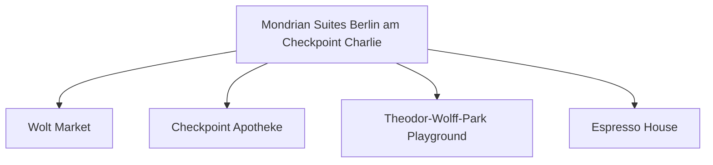

# Day 06 (2026-07-27) - Berlin (Conference Day 1)

## Summary
ICMCF Berlin 会议第一天。一人参加会议，另一人带 Noora 游览柏林（如 Tiergarten 公园或 Playground）。下午或傍晚会合。

## Today's Goal
平衡好学术会议日程与家庭照顾。确保 Noora 处于熟悉舒适的作息中，寻找高质且距离会议室较近的婴儿休息/哺乳区。

## Dashboard
- **日期（Date）**: 2026-07-27
- **行驶距离（Driving Distance）**: 0 km (柏林市内公交/步行为主)
- **行驶时间（Driving Time）**: 0 小时
- **预计剩余电量（Expected SOC）**: 预计车辆处于停放充电/待机状态
- **天气（Weather）**: 晴朗 (预计 22-26°C)
- **步行距离（Walking Distance）**: 约 5-7 km (柏林市区)
- **入住酒店（Hotel）**: Berlin Hotel (Markgrafenstrasse 16–16a, Berlin 10969)
- **停车场（Parking）**: 酒店停车场
- **办理入住（Check-in）**: N/A
- **办理退房（Check-out）**: N/A
- **今日亮点（Highlights）**: ICMCF Berlin 学术交流，柏林城市公园亲子游

---

## Timeline
08:00 | Noora 起床与早餐
08:30 | 会议人员前往会场 / 另一方带 Noora 准备出门
09:00 | 游览 Tiergarten (蒂尔加滕公园) 呼吸新鲜空气，喂松鼠
12:00 | 与会议人员在会场周边或附近餐厅碰面享用午餐
12:30 | Noora 婴儿车午睡 / 回酒店午睡
15:00 | 下午游览周边 Playground 或儿童博物馆
17:30 | 会合，返回酒店稍事休息
18:00 | 晚餐
20:00 | Noora 睡觉时间

---

## Route
驾车路线（Driving route）：无
步行路线（Walking route）：Hotel → Tiergarten → Lunch Spot → Hotel
地铁路线（Metro）：U-Bahn (TODO)

---

## Map

*(已在网页版集成 Leaflet.js 交互式地图)*

---

## Charging
Recommended charger: 酒店慢充或周边目的地充电桩 (TODO)
Backup charger: N/A
Arrival SOC: 75%

---

## Hotel
Address: Markgrafenstrasse 16–16a, Berlin 10969
Parking: 酒店停车场
EV: 地下车库内配备EV充电桩（Wallbox）。
Supermarket: Wolt Market (Markgrafenstraße 58, 距离约 100米) 或 EDEKA Checkpoint Charlie (Friedrichstraße 207-208, 约400米)。
Pharmacy: Checkpoint Apotheke (Friedrichstraße 207, 约400米)。
Hospital: Vivantes Klinikum Am Urban (Dieffenbachstraße 1, 距离约 2.5 km)。
Playground: Theodor-Wolff-Park Playground (步行2分钟，有沙坑和基础滑梯) 或 Gleisdreieck Park Playground (约1.8 km)。
Nearby Coffee: Espresso House (Friedrichstraße 50)。
Nearby Restaurant: 酒店周边有大量简餐、意式和德式餐厅（如 Ristorante A Mano）。

---

## Meals
Breakfast: 酒店早餐
Lunch: TODO
Dinner: Checkpoint Charlie 附近德式猪肘餐馆
Coffee: 柏林动物园内咖啡厅
### 推荐餐厅 (Recommended Restaurants)
- **Local Food**:
  - **Max und Moritz** (Oranienstraße 162, Berlin Kreuzberg): 始于 1902 年的百年老店，原汁原味的旧柏林酒馆风格，提供经典德式肉丸（Königsberger Klopse）和脆皮烤猪肘。
- **Chinese/Asian Food**:
  - **Wen Cheng Handpulled Noodles (温城大面)** (Tempelhofer Ufer 36, Berlin Kreuzberg): 柏林爆火的手拉裤带面，配以香辣泼油，非常适合带娃在 Kreuzberg 活动后前往。

---

## Baby Plan
Milk: 定时冲奶/保温杯热水准备
Snack: 水果杯和磨牙饼干
Nap: 12:30 午睡
Play: Tiergarten 绿地散步和 Playground 玩沙
Bath: 19:30
Sleep: 20:00 准时入睡

---

## Conference
- **时间**: 08:50 - 17:00 (学术日程) & 18:00 - 21:00 (学生之夜)
- **今日日程**:
  - **08:50 - 09:00**: 大会开幕式 (Opening Ceremony)
  - **09:00 - 10:20**: 全体大会 (Plenary Session - Sophie Leterme / Flinders University) & 口头报告 (Oral Session)
  - **10:30 - 11:00**: 茶歇 (Coffee-Break)
  - **11:00 - 12:20**: 主旨演讲 (Keynote) & 口头报告 (Oral Session)
  - **12:20 - 13:50**: 午餐与交流 (Lunch Break)
  - **13:50 - 15:30**: 主旨演讲 (Keynote) & 口头报告 (Oral Session)
  - **15:40 - 16:10**: 茶歇 (Coffee-Break)
  - **16:10 - 17:00**: 口头报告 (Oral Session)
  - **18:00 - 21:00**: 学生之夜 (Student Night)
- **相关文档**: 📄 [ICMCF 2026 Preliminary Programme](assets/ICMCF2026-Preliminary-Programme_06-29.pdf)

---

## Plan A (晴天)
天晴时在 Tiergarten 草坪野餐和散步，前往附近的游乐场。

---

## Plan B (雨天)
如果下雨，可带孩子前往柏林自然历史博物馆（Museum für Naturkunde）看恐龙骨架，室内避雨。

---

## Expense
- **住宿（Hotel）**: 已预订 (TODO 填写金额)
- **充电（Charging）**: TODO
- **餐饮（Food）**: TODO
- **停车（Parking）**: TODO
- **购物（Shopping）**: TODO

---

## Journal
- **精选照片（Best Photo）**: TODO
- **今日回忆（Today's Memory）**: TODO
- **趣味瞬间（Funny Moment）**: TODO
- **Noora的新发现（Noora Learned）**: TODO
