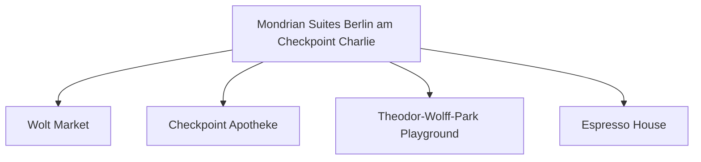

# Day 07 (2026-07-28) - Berlin (Conference Day 2)

## Summary
会议第二天。学术活动继续，家庭成员今日可前往柏林动物园（Berlin Zoo），享受欢乐亲子时光。

## Today's Goal
完成动物园高品质游览，安排好 Noora 的午餐与午睡，避免过度疲劳。

## Dashboard
- **日期（Date）**: 2026-07-28
- **行驶距离（Driving Distance）**: 城市内建议不开车，以 U-Bahn、S-Bahn 和步行为主，车辆停放酒店地下车库。
- **行驶时间（Driving Time）**: 无 (车辆静置地下车库)
- **预计剩余电量（Expected SOC）**: 电量维持在 50–80% 即可
- **天气（Weather）**: 出发前 48 小时更新；当天早晨再次确认
- **步行距离（Walking Distance）**: 约 4-6 km
- **入住酒店（Hotel）**: Berlin Hotel (Markgrafenstrasse 16–16a, Berlin 10969)
- **停车场（Parking）**: Mondrian Suites 地下车库
- **办理入住（Check-in）**: N/A
- **办理退房（Check-out）**: N/A
- **今日亮点（Highlights）**: 柏林动物园（Berlin Zoo）亲子半日游

---

## Timeline
08:00 | Noora 起床与早餐
09:00 | 购票进入 Berlin Zoo (建议提前网上购票)
09:30 | 观赏大熊猫、大象，漫步阴凉步道
12:00 | 在动物园内家庭友好餐厅享用午餐
12:30 | Noora 婴儿车上午睡
15:00 | 出动物园，在周边商场（如 Bikini Berlin）稍作休息
17:30 | 会合，返回酒店
18:00 | 晚餐
20:00 | Noora 睡觉时间

---

## Route
驾车路线（Driving route）：无
步行及公交路线：Hotel → Metro/Bus → Berlin Zoo (U-Bahn Zoologischer Garten) → Hotel
停车（Parking）：无

---

## Map

*(已在网页版集成 Leaflet.js 交互式地图)*

---

## Charging

Departure SOC: 50–80%

Recommended charger:
Mondrian 酒店地下车库 Wallbox (慢充)

Backup charger:
Mitte区公共充电站点

Arrival SOC:
50-80%

### Charging decision rule

- **切换条件**：日常出行车辆静置酒店车库，不安排任何快充。仅在 SOC 偏低时利用夜间闲暇在酒店地下车库慢充补电。
- **充电目标**：在酒店 Wallbox 夜间慢充至 70–80% 即可。
- **实时确认**：日常无需特别确认快充桩。

---

## Hotel
Address: Markgrafenstrasse 16-16a, Berlin 10969, Germany
Parking: 酒店专属地下车库（收费25 EUR/天）。
EV: 地下车库内配备EV充电桩（Wallbox）。
Supermarket: Wolt Market (Markgrafenstraße 58, 距离约 100米) 或 EDEKA Checkpoint Charlie (Friedrichstraße 207-208, 约400米)。
Pharmacy: Checkpoint Apotheke (Friedrichstraße 207, 约400米)。
Hospital: Vivantes Klinikum Am Urban (Dieffenbachstraße 1, 距离约 2.5 km)。
Playground: Theodor-Wolff-Park Playground (步行2分钟，有沙坑和基础滑梯) 或 Gleisdreieck Park Playground (约1.8 km)。
Nearby Coffee: Espresso House (Friedrichstraße 50)。
Nearby Restaurant: 酒店周边有大量简餐、意式和德式餐厅（如 Ristorante A Mano）。

---

## Meals

Breakfast: 酒店内
Lunch: 柏林动物园内餐馆
Dinner: 博物馆岛附近特色融合菜餐厅
Coffee: The Barn Cafe (精品咖啡)

### 推荐餐厅 (Recommended Restaurants)

- **首选 (First Choice)**: **Mondrian 酒店小厨房自制** / 附近高品质意面披萨店 (最符合带幼儿作息，晚餐灵活度极高)。
- **备选 (Backup)**: **LIU Chengdu Weidao (刘成都味道)** / **Peking Ente Berlin (北京烤鸭店)** (中餐备选)；**Max und Moritz** (德餐备选)。
- **最稳方案 (Safe Fallback)**: 外卖或 Wolt Market 超市采购后在酒店房间用餐，保障 Noora 20:00 准时入睡。
- **执行原则**：餐厅预约不是硬性节点。如果抵达延误或 Noora 疲劳，立即改为外带、超市采购或住宿简餐。

---

## Baby Plan
Milk: 定时冲奶
Snack: 奶酪棒、饼干
Nap: 12:30 动物园内婴儿车上睡
Play: 动物园内的巨大儿童木制滑梯游乐区 (极其推荐)
Bath: 19:30
Sleep: 20:00 准时入睡

---

## Conference
- **时间**: 08:50 - 17:00 (学术日程) & 17:00 - 19:00 (海报交流)
- **今日日程**:
  - **08:50 - 10:50**: 全体大会 (Plenary Session - Roberta Amendola & Iwona Beech / Montana State University) & 口头报告 (Oral Session)
  - **10:50 - 11:20**: 茶歇 (Coffee-Break)
  - **11:20 - 12:20**: 口头报告 (Oral Session)
  - **12:20 - 13:50**: 午餐与交流 (Lunch Break)
  - **13:50 - 15:40**: 主旨演讲 (Keynote) & 口头报告 (Oral Session)
  - **15:40 - 16:10**: 茶歇 (Coffee-Break)
  - **16:10 - 17:00**: 口头报告 (Oral Session)
  - **17:00 - 19:00**: 海报交流与展览之夜 (Poster Night & Exhibition)
- **相关文档**: 📄 [ICMCF 2026 Preliminary Programme](assets/ICMCF2026-Preliminary-Programme_06-29.pdf)

---

## Plan A (晴天)
天晴时全户外游览动物园和户外 Playground。

---

## Plan B (雨天)
如果下雨，转至动物园的水族馆（Aquarium Berlin）室内区域，游览安全不受天气影响。

---

## Expense
- **住宿（Hotel）**: 已预订 (0 NOK，已计入第五天)
- **充电（Charging）**: 预算：免费/未充电；实际：旅行中填写
- **餐饮（Food）**: 预算：预计 80 EUR；实际：旅行中填写
- **停车（Parking）**: 预算：25 EUR；实际：旅行中填写
- **购物（Shopping）**: 预算：预计 10 EUR；实际：旅行中填写

---

## Journal
- **精选照片（Best Photo）**: 旅行中填写
- **今日回忆（Today's Memory）**: 旅行中填写
- **趣味瞬间（Funny Moment）**: 旅行中填写
- **Noora的新发现（Noora Learned）**: 旅行中填写
