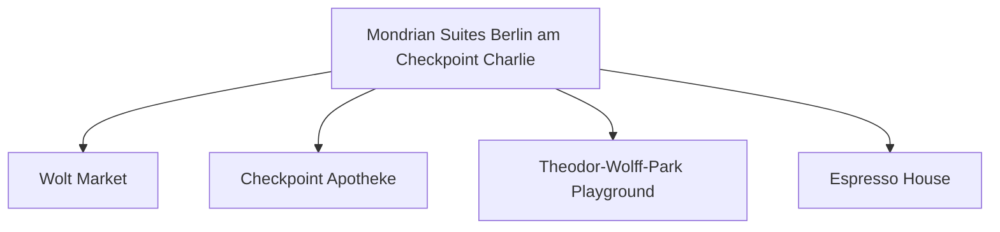

# Day 08 (2026-07-29) - Berlin (Conference Day 3)

## Summary
会议第三天。下午是学术休会期/自由社交，家庭可选择中午会合，一同游览博物馆岛周边及斯普雷河畔。

## Today's Goal
半天全家共同出游，拍摄一些温馨的合影，享受休闲的柏林斯普雷河畔午后时光。

## Dashboard
- **日期（Date）**: 2026-07-29
- **行驶距离（Driving Distance）**: 城市内建议不开车，以 U-Bahn、S-Bahn 和步行为主，车辆停放酒店地下车库。
- **行驶时间（Driving Time）**: 无 (车辆静置地下车库)
- **预计剩余电量（Expected SOC）**: 电量维持在 50–80% 即可
- **天气（Weather）**: 出发前 48 小时更新；当天早晨再次确认
- **步行距离（Walking Distance）**: 约 5-8 km
- **入住酒店（Hotel）**: Berlin Hotel (Markgrafenstrasse 16–16a, Berlin 10969)
- **停车场（Parking）**: Mondrian Suites 地下车库
- **办理入住（Check-in）**: N/A
- **办理退房（Check-out）**: N/A
- **今日亮点（Highlights）**: 全家会合，斯普雷河散步，博物馆岛外观

---

## Timeline
08:00 | Noora 起床与早餐
09:00 | 妈妈带 Noora 游览酒店周边小巷，或者附近的儿童图书馆；爸爸参加会议学术报告
12:10 | 学术会议半天结束，全家在博物馆岛附近会合午餐
12:30 | Noora 婴儿车上午睡，爸妈散步喝咖啡
14:00 | 参加大会组织的社交游览活动 (ICMCF Social Excursion, 约 14:00 - 17:00)
17:30 | 结束出游，返回酒店稍作休息，为晚宴准备
18:30 | 出门前往大会晚宴会场
19:00 | 大会正式晚宴开始 (Congress Dinner, 19:00 - 23:00)；Noora 备用静音耳罩，预计在晚宴中婴儿车上入睡

---

## Route
驾车路线（Driving route）：无
步行路线（Walking route）：Hotel → Museum Island → Lustgarten → Hotel
地铁/轻轨（Metro/S-Bahn）：搭乘 U-Bahn/S-Bahn 往返博物馆岛与晚宴会场

---

## Map

*(已在网页版集成 Leaflet.js 交互式地图)*

---

## Charging

Departure SOC: 50–80%

Recommended charger:
Mondrian 酒店地下车库 Wallbox (慢充)

Backup charger:
Mitte区公共充电站点

Arrival SOC:
50-80%

### Charging decision rule

- **切换条件**：日常出行车辆静置酒店车库，不安排任何快充。仅在 SOC 偏低时利用夜间闲暇在酒店地下车库慢充补电。
- **充电目标**：在酒店 Wallbox 夜间慢充至 70–80% 即可。
- **实时确认**：日常无需特别确认快充桩。

---

## Hotel
Address: Markgrafenstrasse 16-16a, Berlin 10969, Germany
Parking: 酒店专属地下车库（收费25 EUR/天）。
EV: 地下车库内配备EV充电桩（Wallbox）。
Supermarket: Wolt Market (Markgrafenstraße 58, 距离约 100米) 或 EDEKA Checkpoint Charlie (Friedrichstraße 207-208, 约400米)。
Pharmacy: Checkpoint Apotheke (Friedrichstraße 207, 约400米)。
Hospital: Vivantes Klinikum Am Urban (Dieffenbachstraße 1, 距离约 2.5 km)。
Playground: Theodor-Wolff-Park Playground (步行2分钟，有沙坑和基础滑梯) 或 Gleisdreieck Park Playground (约1.8 km)。
Nearby Coffee: Espresso House (Friedrichstraße 50)。
Nearby Restaurant: 酒店周边有大量简餐、意式和德式餐厅（如 Ristorante A Mano）。

---

## Meals

Breakfast: 酒店早餐
Lunch: 博物馆岛附近德餐或个人面食
Dinner: 大会晚宴 (ICMCF Congress Dinner)
Coffee: Five Elephant Mitte 咖啡与芝士蛋糕

### 推荐餐厅 (Recommended Restaurants)

- **首选 (First Choice)**: **大会正式晚宴 (Congress Dinner)** (Noora 备用静音耳罩，预计在晚宴中婴儿车上入睡)。
- **备选 (Backup)**: **LIU Chengdu Weidao (刘成都味道)** / 附近中餐馆 (如大明酒家，仅在不参加晚宴时考虑)。
- **最稳方案 (Safe Fallback)**: 外卖或 Wolt Market 超市采购后在酒店房间用餐，保障 Noora 20:00 准时入睡。
- **执行原则**：餐厅预约不是硬性节点。如果抵达延误或 Noora 疲劳，立即改为外带、超市采购或住宿简餐。

---

## Baby Plan
Milk: 定时喂奶
Snack: 零食水果
Nap: 12:30 婴儿车上熟睡
Play: Lustgarten 大草坪爬行/奔跑，吹泡泡
Bath: 19:30
Sleep: 20:00 准时入睡

---

## Conference
- **时间**: 08:50 - 12:10 (半天学术日程) & 14:00 - 17:00 (出游) & 19:00 - 23:00 (晚宴)
- **今日日程**:
  - **08:50 - 10:50**: 全体大会 (Plenary Session - Ralitsa Mihailova / Safinah Group) & 主旨演讲 (Keynote) & 口头报告 (Oral Session)
  - **10:50 - 11:20**: 茶歇 (Coffee-Break)
  - **11:20 - 12:10**: 口头报告 (Oral Session)
  - **12:10 onwards**: 下午社交活动与出游活动 (Social Events & Afternoon Excursion)
  - **19:00 - 23:00**: 大会晚宴 (Congress Dinner 🥂)
- **相关文档**: 📄 [ICMCF 2026 Preliminary Programme](assets/ICMCF2026-Preliminary-Programme_06-29.pdf)

---

## Plan A (晴天)
在 Lustgarten 草坪和河畔步道漫步，享受午后阳光。

---

## Plan B (雨天)
如果下雨，可前往洪堡论坛（Humboldt Forum）室内，里面有电梯、母婴室和宽阔的无障碍大厅，非常适合推车避雨游览。

---

## Expense
- **住宿（Hotel）**: 已预订 (0 NOK，已计入第五天)
- **充电（Charging）**: 预算：预计 10 EUR；实际：旅行中填写
- **餐饮（Food）**: 预算：预计 100 EUR；实际：旅行中填写
- **停车（Parking）**: 预算：25 EUR；实际：旅行中填写
- **购物（Shopping）**: 预算：预计 30 EUR；实际：旅行中填写

---

## Journal
- **精选照片（Best Photo）**: 旅行中填写
- **今日回忆（Today's Memory）**: 旅行中填写
- **趣味瞬间（Funny Moment）**: 旅行中填写
- **Noora的新发现（Noora Learned）**: 旅行中填写
