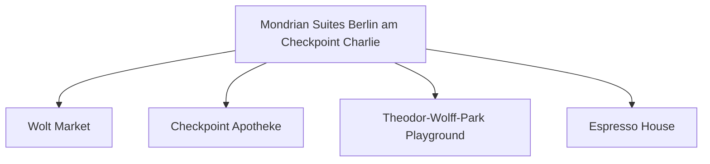

# Day 08 (2026-07-29) - Berlin (Conference Day 3)

## Summary
会议第三天。下午是学术休会期/自由社交，家庭可选择中午会合，一同游览博物馆岛周边及斯普雷河畔。

## Today's Goal
半天全家共同出游，拍摄一些温馨的合影，享受休闲的柏林斯普雷河畔午后时光。

## Dashboard
- **日期（Date）**: 2026-07-29
- **行驶距离（Driving Distance）**: 0 km
- **行驶时间（Driving Time）**: 0 小时
- **预计剩余电量（Expected SOC）**: 电量维持 50%-80%
- **天气（Weather）**: 晴间多云 (预计 23-27°C)
- **步行距离（Walking Distance）**: 约 5-8 km
- **入住酒店（Hotel）**: Berlin Hotel (Markgrafenstrasse 16–16a, Berlin 10969)
- **停车场（Parking）**: 酒店停车场
- **办理入住（Check-in）**: N/A
- **办理退房（Check-out）**: N/A
- **今日亮点（Highlights）**: 全家会合，斯普雷河散步，博物馆岛外观

---

## Timeline
08:00 | Noora 起床与早餐
09:00 | 妈妈带 Noora 游览酒店周边小巷，或者附近的儿童图书馆；爸爸参加会议学术报告
12:10 | 学术会议半天结束，全家在博物馆岛附近会合午餐
12:30 | Noora 婴儿车上午睡，爸妈散步喝咖啡
14:00 | 参加大会组织的社交游览活动 (ICMCF Social Excursion, 约 14:00 - 17:00)
17:30 | 结束出游，返回酒店稍作休息，为晚宴准备
18:30 | 出门前往大会晚宴会场
19:00 | 大会正式晚宴开始 (Congress Dinner, 19:00 - 23:00)；Noora 备用静音耳罩，预计在晚宴中婴儿车上入睡

---

## Route
驾车路线（Driving route）：无
步行路线（Walking route）：Hotel → Museum Island → Lustgarten → Hotel
地铁/轻轨（Metro/S-Bahn）：TODO

---

## Map

*(已在网页版集成 Leaflet.js 交互式地图)*

---

## Charging
Recommended charger: Mondrian 酒店地下车库 Wallbox
Backup charger: Mitte区公共充电站点
Arrival SOC: 65%

---

## Hotel
Address: Markgrafenstrasse 16–16a, Berlin 10969
Parking: 酒店停车场
EV: 地下车库内配备EV充电桩（Wallbox）。
Supermarket: Wolt Market (Markgrafenstraße 58, 距离约 100米) 或 EDEKA Checkpoint Charlie (Friedrichstraße 207-208, 约400米)。
Pharmacy: Checkpoint Apotheke (Friedrichstraße 207, 约400米)。
Hospital: Vivantes Klinikum Am Urban (Dieffenbachstraße 1, 距离约 2.5 km)。
Playground: Theodor-Wolff-Park Playground (步行2分钟，有沙坑和基础滑梯) 或 Gleisdreieck Park Playground (约1.8 km)。
Nearby Coffee: Espresso House (Friedrichstraße 50)。
Nearby Restaurant: 酒店周边有大量简餐、意式和德式餐厅（如 Ristorante A Mano）。

---

## Meals
Breakfast: 酒店早餐
Lunch: 博物馆岛附近德餐或意大利面
Dinner: 大会晚宴 (ICMCF Congress Dinner)
Coffee: Five Elephant Mitte 咖啡与芝士蛋糕
### 推荐餐厅 (Recommended Restaurants)
- **Local Food**:
  - **Trio** (Linienstraße 208, Berlin Mitte): 本地极高评分的现代德餐馆，提供精致的传统德式丸子和季节性北德菜，需要提前预订。
- **Chinese/Asian Food**:
  - **Sanku Maots’ai (三库冒菜)** (Mitte / 附近): 特色四川自选冒菜和手擀面，汤底香辣浓郁，适合自由度较高的学术休会日尝鲜。

---

## Baby Plan
Milk: 定时喂奶
Snack: 零食水果
Nap: 12:30 婴儿车上熟睡
Play: Lustgarten 大草坪爬行/奔跑，吹泡泡
Bath: 19:30
Sleep: 20:00 准时入睡

---

## Conference
- **时间**: 08:50 - 12:10 (半天学术日程) & 14:00 - 17:00 (出游) & 19:00 - 23:00 (晚宴)
- **今日日程**:
  - **08:50 - 10:50**: 全体大会 (Plenary Session - Ralitsa Mihailova / Safinah Group) & 主旨演讲 (Keynote) & 口头报告 (Oral Session)
  - **10:50 - 11:20**: 茶歇 (Coffee-Break)
  - **11:20 - 12:10**: 口头报告 (Oral Session)
  - **12:10 onwards**: 下午社交活动与出游活动 (Social Events & Afternoon Excursion)
  - **19:00 - 23:00**: 大会晚宴 (Congress Dinner 🥂)
- **相关文档**: 📄 [ICMCF 2026 Preliminary Programme](assets/ICMCF2026-Preliminary-Programme_06-29.pdf)

---

## Plan A (晴天)
在 Lustgarten 草坪和河畔步道漫步，享受午后阳光。

---

## Plan B (雨天)
如果下雨，可前往洪堡论坛（Humboldt Forum）室内，里面有电梯、母婴室和宽阔的无障碍大厅，非常适合推车避雨游览。

---

## Expense
- **住宿（Hotel）**: 已预订 (TODO 填写金额)
- **充电（Charging）**: TODO
- **餐饮（Food）**: TODO
- **停车（Parking）**: TODO
- **购物（Shopping）**: TODO

---

## Journal
- **精选照片（Best Photo）**: TODO
- **今日回忆（Today's Memory）**: TODO
- **趣味瞬间（Funny Moment）**: TODO
- **Noora的新发现（Noora Learned）**: TODO
