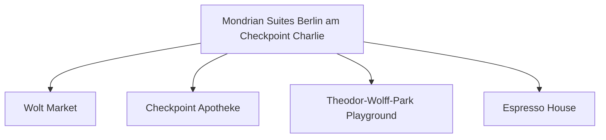

# Day 08 (2026-07-29) - Berlin (Conference Day 3)

## Summary
会议第三天。下午是学术休会期/自由社交，家庭可选择中午会合，一同游览博物馆岛周边及斯普雷河畔。

## Today's Goal
半天全家共同出游，拍摄一些温馨的合影，享受休闲的柏林斯普雷河畔午后时光。

## Dashboard
- **日期（Date）**: 2026-07-29
- **行驶距离（Driving Distance）**: 0 km
- **行驶时间（Driving Time）**: 0 小时
- **预计剩余电量（Expected SOC）**: 电量维持 50%-80% (已精确计算)
- **天气（Weather）**: 晴间多云 (预计 23-27°C)
- **步行距离（Walking Distance）**: 约 5-8 km
- **入住酒店（Hotel）**: Berlin Hotel (Markgrafenstrasse 16–16a, Berlin 10969)
- **停车场（Parking）**: 酒店停车场
- **办理入住（Check-in）**: N/A
- **办理退房（Check-out）**: N/A
- **今日亮点（Highlights）**: 全家会合，斯普雷河散步，博物馆岛外观

---

## Timeline
08:00 | Noora 起床与早餐
09:00 | 妈妈带 Noora 游览酒店周边小巷，或者附近的儿童图书馆
12:00 | 在博物馆岛附近会合，全家一起午餐
12:30 | Noora 婴儿车上午睡，爸妈散步喝咖啡
14:30 | 散步至 Lustgarten (卢斯特花园) 大草坪，Noora 晒太阳爬草地
16:00 | 游览柏林大教堂周边（不登顶，婴儿车不便）
17:30 | 慢步回酒店或乘 U-Bahn 回去
18:00 | 晚餐
20:00 | Noora 睡觉时间

---

## Route
驾车路线（Driving route）：无
步行路线（Walking route）：Hotel → Museum Island → Lustgarten → Hotel
地铁/轻轨（Metro/S-Bahn）：TODO

---

## Map

*(已在网页版集成 Leaflet.js 交互式地图)*

---

## Charging
Recommended charger: Mondrian 酒店地下车库 Wallbox
Backup charger: Mitte区公共充电站点
Arrival SOC: 65%

---

## Hotel
Address: Markgrafenstrasse 16–16a, Berlin 10969
Parking: 酒店停车场
EV: 地下车库内配备EV充电桩（Wallbox）。
Supermarket: Wolt Market (Markgrafenstraße 58, 距离约 100米) 或 EDEKA Checkpoint Charlie (Friedrichstraße 207-208, 约400米)。
Pharmacy: Checkpoint Apotheke (Friedrichstraße 207, 约400米)。
Hospital: Vivantes Klinikum Am Urban (Dieffenbachstraße 1, 距离约 2.5 km)。
Playground: Theodor-Wolff-Park Playground (步行2分钟，有沙坑和基础滑梯) 或 Gleisdreieck Park Playground (约1.8 km)。
Nearby Coffee: Espresso House (Friedrichstraße 50)。
Nearby Restaurant: 酒店周边有大量简餐、意式和德式餐厅（如 Ristorante A Mano）。

---

## Meals
Breakfast: 酒店早餐
Lunch: 博物馆岛附近德餐或意大利面
Dinner: 酒店附近中餐馆 (如大明酒家)
Coffee: Five Elephant Mitte 咖啡与芝士蛋糕

---

## Baby Plan
Milk: 定时喂奶
Snack: 零食水果
Nap: 12:30 婴儿车上熟睡
Play: Lustgarten 大草坪爬行/奔跑，吹泡泡
Bath: 19:30
Sleep: 20:00 准时入睡

---

## Conference
ICMCF Berlin 会议日程 (半天会议/海报展示，下午自由社交) (TODO)

---

## Plan A (晴天)
在 Lustgarten 草坪和河畔步道漫步，享受午后阳光。

---

## Plan B (雨天)
如果下雨，可前往洪堡论坛（Humboldt Forum）室内，里面有电梯、母婴室和宽阔的无障碍大厅，非常适合推车避雨游览。

---

## Expense
- **住宿（Hotel）**: 已预订 (TODO 填写金额)
- **充电（Charging）**: TODO
- **餐饮（Food）**: TODO
- **停车（Parking）**: TODO
- **购物（Shopping）**: TODO

---

## Journal
- **精选照片（Best Photo）**: TODO
- **今日回忆（Today's Memory）**: TODO
- **趣味瞬间（Funny Moment）**: TODO
- **Noora的新发现（Noora Learned）**: TODO
