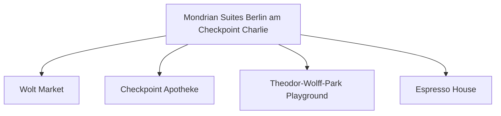

# Day 09 (2026-07-30) - Berlin (Conference Day 4)

## Summary
会议第四天。白天一人开会，另一人带 Noora 漫步至国会大厦（Bundestag）绿地及勃兰登堡门周边，傍晚全家碰面。

## Today's Goal
避开人潮，在勃兰登堡门周边平稳漫步，确保 Noora 在下午有充足且安静的睡眠时间。

## Dashboard
- **日期（Date）**: 2026-07-30
- **行驶距离（Driving Distance）**: 0 km
- **行驶时间（Driving Time）**: 0 小时
- **预计剩余电量（Expected SOC）**: 电量维持 50%-80% (已精确计算)
- **天气（Weather）**: 晴朗 (预计 24-28°C)
- **步行距离（Walking Distance）**: 约 6-9 km
- **入住酒店（Hotel）**: Berlin Hotel (Markgrafenstrasse 16–16a, Berlin 10969)
- **停车场（Parking）**: 酒店停车场
- **办理入住（Check-in）**: N/A
- **办理退房（Check-out）**: N/A
- **今日亮点（Highlights）**: 勃兰登堡门（Brandenburger Tor）、国会大厦前大草坪

---

## Timeline
08:00 | Noora 起床与早餐
09:15 | 出门搭乘公交或步行前往 Brandenburger Tor
10:00 | 勃兰登堡门前拍照留念，随后漫步至国会大厦前草坪
11:30 | 找椅子给 Noora 吃辅食/午餐
12:30 | Noora 婴儿车上午睡（妈妈在此期间读书/喝咖啡）
15:00 | 前往周边的 Playground 游玩
17:00 | 与爸爸碰面会合
18:00 | 晚餐
20:00 | Noora 睡觉时间

---

## Route
驾车路线（Driving route）：无
步行及公交路线：Hotel → Bus 100/300 或 U-Bahn → Brandenburg Gate → Bundestag Grass Area
停车（Parking）：无

---

## Map

*(已在网页版集成 Leaflet.js 交互式地图)*

---

## Charging
Recommended charger: Mondrian 酒店地下车库 Wallbox
Backup charger: 国会大厦附近公共充电桩
Arrival SOC: 80%

---

## Hotel
Address: Markgrafenstrasse 16–16a, Berlin 10969
Parking: 酒店停车场
EV: 地下车库内配备EV充电桩（Wallbox）。
Supermarket: Wolt Market (Markgrafenstraße 58, 距离约 100米) 或 EDEKA Checkpoint Charlie (Friedrichstraße 207-208, 约400米)。
Pharmacy: Checkpoint Apotheke (Friedrichstraße 207, 约400米)。
Hospital: Vivantes Klinikum Am Urban (Dieffenbachstraße 1, 距离约 2.5 km)。
Playground: Theodor-Wolff-Park Playground (步行2分钟，有沙坑和基础滑梯) 或 Gleisdreieck Park Playground (约1.8 km)。
Nearby Coffee: Espresso House (Friedrichstraße 50)。
Nearby Restaurant: 酒店周边有大量简餐、意式和德式餐厅（如 Ristorante A Mano）。

---

## Meals
Breakfast: 酒店内
Lunch: 勃兰登堡门周边简餐/自备便当
Dinner: 国会大厦楼顶 Käfer 餐厅 (需提前预订)
Coffee: Einstein Kaffee (国会大厦周边)

---

## Baby Plan
Milk: 定时冲奶
Snack: 面包干、苹果泥
Nap: 12:30 - 14:30 树荫下婴儿车内睡
Play: 国会大厦前大草皮奔跑
Bath: 19:30
Sleep: 20:00 准时入睡

---

## Conference
ICMCF Berlin 会议日程 (TODO)

---

## Plan A (晴天)
在勃兰登堡门和林荫道漫步，找一片阴凉的草坪玩耍。

---

## Plan B (雨天)
如果下雨，可前往附近的柏林购物中心（Mall of Berlin），室内空间巨大，包含儿童玩乐区域且配有极佳的母婴更衣室设施。

---

## Expense
- **住宿（Hotel）**: 已预订 (TODO 填写金额)
- **充电（Charging）**: TODO
- **餐饮（Food）**: TODO
- **停车（Parking）**: TODO
- **购物（Shopping）**: TODO

---

## Journal
- **精选照片（Best Photo）**: TODO
- **今日回忆（Today's Memory）**: TODO
- **趣味瞬间（Funny Moment）**: TODO
- **Noora的新发现（Noora Learned）**: TODO
