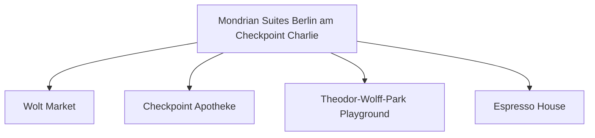

# Day 10 (2026-07-31) - Berlin (Conference Day 5)

## Summary
会议最后一天，晚间有 ICMCF Conference Dinner 晚宴。白天继续柏林本地游览，下午休息为晚宴留出精力。

## Today's Goal
保证全家人休息充分。如带 Noora 参加晚宴，需确认会场无障碍通道及是否有临时休息室；或者安排爸爸/妈妈交替参加。

## Dashboard
- **日期（Date）**: 2026-07-31
- **行驶距离（Driving Distance）**: 0 km
- **行驶时间（Driving Time）**: 0 小时
- **预计剩余电量（Expected SOC）**: 电量充电至 90%+ (准备明日出发) (已精确计算)
- **天气（Weather）**: 小雨转晴 (预计 20-24°C)
- **步行距离（Walking Distance）**: 约 4-6 km
- **入住酒店（Hotel）**: Berlin Hotel (Markgrafenstrasse 16–16a, Berlin 10969)
- **停车场（Parking）**: 酒店停车场
- **办理入住（Check-in）**: N/A
- **办理退房（Check-out）**: N/A
- **今日亮点（Highlights）**: 会议总结，Conference Dinner (大会晚宴)

---

## Timeline
08:00 | Noora 起床与早餐
09:30 | 在酒店周边的休闲街区漫步，去精品咖啡馆和面包房
11:30 | 简单午餐，随后回酒店让 Noora 在床上好好午睡
12:30 | Noora 房间上午睡（全家养精蓄锐）
15:00 | 下午在酒店内整理行李，给 Noora 室内游戏时间
18:00 | 前往 Conference Dinner 晚宴地点 (TODO 确认地点与无障碍条件)
20:00 | 晚宴期间 Noora 可能会在婴儿车上入睡（使用静音耳罩备用）
21:30 | 碰面完毕，全家回酒店休息

---

## Route
驾车路线（Driving route）：无
步行路线：Hotel → 晚宴会场 (TODO) → Hotel
停车（Parking）：无

---

## Map

*(已在网页版集成 Leaflet.js 交互式地图)*

---

## Charging
Recommended charger: 酒店慢充 (今晚充电至 90%+ 确保明早出发去 Neumünster 电量充足) (TODO)
Backup charger: Tesla Supercharger Berlin-Mitte
Arrival SOC: 90%

---

## Hotel
Address: Markgrafenstrasse 16–16a, Berlin 10969
Parking: 酒店停车场
EV: 地下车库内配备EV充电桩（Wallbox）。
Supermarket: Wolt Market (Markgrafenstraße 58, 距离约 100米) 或 EDEKA Checkpoint Charlie (Friedrichstraße 207-208, 约400米)。
Pharmacy: Checkpoint Apotheke (Friedrichstraße 207, 约400米)。
Hospital: Vivantes Klinikum Am Urban (Dieffenbachstraße 1, 距离约 2.5 km)。
Playground: Theodor-Wolff-Park Playground (步行2分钟，有沙坑和基础滑梯) 或 Gleisdreieck Park Playground (约1.8 km)。
Nearby Coffee: Espresso House (Friedrichstraße 50)。
Nearby Restaurant: 酒店周边有大量简餐、意式和德式餐厅（如 Ristorante A Mano）。

---

## Meals
Breakfast: 酒店早餐
Lunch: TODO
Dinner: Conference Dinner (大会晚宴/自备替代方案)
Coffee: 酒店周边咖啡馆

---

## Baby Plan
Milk: 定时喂奶
Snack: 晚宴备用婴儿小食
Nap: 12:30 在酒店大床上睡，下午睡眠质量更佳
Play: 晚宴前在房间内做益智互动游戏
Bath: 17:00 (晚宴前提前洗好澡)
Sleep: 20:00 在婴儿车里睡（配防噪耳罩）或者提前一人带回酒店睡

---

## Conference
ICMCF Berlin 会议最后一天 & Closing Ceremony & Conference Dinner (TODO 确认时间表)

---

## Plan A (晴天)
如果 Noora 状态好，全家带静音耳罩一同参加晚宴前半段。

---

## Plan B (雨天)
如果下雨或 Noora 疲惫，一人代表出席晚宴，另一人在酒店陪伴 Noora 准时入睡。

---

## Expense
- **住宿（Hotel）**: 已预订 (TODO 填写金额)
- **充电（Charging）**: TODO
- **餐饮（Food）**: TODO
- **停车（Parking）**: TODO
- **购物（Shopping）**: TODO

---

## Journal
- **精选照片（Best Photo）**: TODO
- **今日回忆（Today's Memory）**: TODO
- **趣味瞬间（Funny Moment）**: TODO
- **Noora的新发现（Noora Learned）**: TODO
