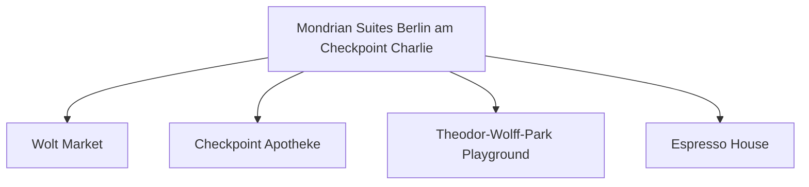

# Day 10 (2026-07-31) - Berlin (Conference Day 5)

## Summary
会议最后一天与闭幕式，中午会议正式结束。下午全家购买纪念品与整理行李，为明早启程离开柏林做准备。

## Today's Goal
保证全家人休息充分。如带 Noora 参加晚宴，需确认会场无障碍通道及是否有临时休息室；或者安排爸爸/妈妈交替参加。

## Dashboard
- **日期（Date）**: 2026-07-31
- **行驶距离（Driving Distance）**: 0 km
- **行驶时间（Driving Time）**: 0 小时
- **预计剩余电量（Expected SOC）**: 电量充电至 90%+ (准备明日出发)
- **天气（Weather）**: 小雨转晴 (预计 20-24°C)
- **步行距离（Walking Distance）**: 约 4-6 km
- **入住酒店（Hotel）**: Berlin Hotel (Markgrafenstrasse 16–16a, Berlin 10969)
- **停车场（Parking）**: 酒店停车场
- **办理入住（Check-in）**: N/A
- **办理退房（Check-out）**: N/A
- **今日亮点（Highlights）**: 会议总结，Conference Dinner (大会晚宴)

---

## Timeline
08:00 | Noora 起床与早餐
08:50 | 爸爸去会议现场参加最后报告与闭幕式；妈妈带 Noora 在酒店周边散步
11:00 | 妈妈带 Noora 踩点附近的 Playground
12:20 | 爸爸参加闭幕与颁奖仪式，大会正式结束
12:50 | 全家在酒店附近会合，享用柏林风味午餐
14:00 | 回酒店让 Noora 在床上好好午睡，爸爸妈妈在房间整理打包行李
16:30 | 下午去波茨坦广场 (Potsdamer Platz) 与 Mall of Berlin 逛街，采购礼品并在 Go Asia (东方超市) 进行中式食材与零食大采购，为回程做储备
18:00 | 晚餐 (享受在柏林的最后一晚，推荐 Clärchens Ballhaus 德餐或 Long March Canteen)
20:00 | 返回酒店，Noora 睡觉时间

---

## Route
驾车路线（Driving route）：无
步行路线：Hotel → 晚宴会场 (TODO) → Hotel
停车（Parking）：无

---

## Map

*(已在网页版集成 Leaflet.js 交互式地图)*

---

## Charging
Recommended charger: 酒店慢充 (今晚充电至 90%+ 确保明早出发去 Neumünster 电量充足) (TODO)
Backup charger: Tesla Supercharger Berlin-Mitte
Arrival SOC: 90%

---

## Hotel
Address: Markgrafenstrasse 16–16a, Berlin 10969
Parking: 酒店停车场
EV: 地下车库内配备EV充电桩（Wallbox）。
Supermarket: Wolt Market (Markgrafenstraße 58, 距离约 100米) 或 EDEKA Checkpoint Charlie (Friedrichstraße 207-208, 约400米)。
Pharmacy: Checkpoint Apotheke (Friedrichstraße 207, 约400米)。
Hospital: Vivantes Klinikum Am Urban (Dieffenbachstraße 1, 距离约 2.5 km)。
Playground: Theodor-Wolff-Park Playground (步行2分钟，有沙坑和基础滑梯) 或 Gleisdreieck Park Playground (约1.8 km)。
Nearby Coffee: Espresso House (Friedrichstraße 50)。
Nearby Restaurant: 酒店周边有大量简餐、意式和德式餐厅（如 Ristorante A Mano）。

---

## Meals
Breakfast: 酒店早餐
Lunch: Ristorante A Mano (意式面食，非常适合孩子)
Dinner: Clärchens Ballhaus (德式庭院餐厅) 或 Long March Canteen (现代粤式点心)
Coffee: Einstein Kaffee (附近的精品咖啡馆)
### 推荐餐厅 (Recommended Restaurants)
- **Local Food**:
  - **Clärchens Ballhaus** (Auguststraße 24, Berlin Mitte): 拥有百年历史的跳舞大厅餐厅，庭院优美，提供经典柏林炸猪排与本地啤酒。
- **Chinese/Asian Food**:
  - **Long March Canteen (长征食堂)** (Wrangelstraße 20, Berlin Kreuzberg): 极具设计感的现代中式点心店，主打精致粤式蒸点和中式鸡尾酒，氛围高级。

---

## Baby Plan
Milk: 定时喂奶
Snack: 晚宴备用婴儿小食
Nap: 12:30 在酒店大床上睡，下午睡眠质量更佳
Play: 晚宴前在房间内做益智互动游戏
Bath: 17:00 (晚宴前提前洗好澡)
Sleep: 20:00 在婴儿车里睡（配防噪耳罩）或者提前一人带回酒店睡

---

## Conference
- **时间**: 08:50 - 12:50 (会议半天，中午闭幕)
- **今日日程**:
  - **08:50 - 10:20**: 全体大会 (Plenary Session - end user shipping) & 口头报告 (Oral Session)
  - **10:20 - 10:50**: 茶歇 (Coffee-Break)
  - **10:50 - 12:20**: 主旨演讲 (Keynote) & 口头报告 (Oral Sessions)
  - **12:20 - 12:50**: 闭幕致辞与颁奖典礼 (Closing Remarks & Announcing Oral and Poster Winners)
  - **12:50**: ICMCF Berlin 大会正式结束！
- **相关文档**: 📄 [ICMCF 2026 Preliminary Programme](assets/ICMCF2026-Preliminary-Programme_06-29.pdf)

---

## Plan A (晴天)
如果 Noora 状态好，全家带静音耳罩一同参加晚宴前半段。

---

## Plan B (雨天)
如果下雨或 Noora 疲惫，一人代表出席晚宴，另一人在酒店陪伴 Noora 准时入睡。

---

## Expense
- **住宿（Hotel）**: 已预订 (TODO 填写金额)
- **充电（Charging）**: TODO
- **餐饮（Food）**: TODO
- **停车（Parking）**: TODO
- **购物（Shopping）**: TODO

---

## Journal
- **精选照片（Best Photo）**: TODO
- **今日回忆（Today's Memory）**: TODO
- **趣味瞬间（Funny Moment）**: TODO
- **Noora的新发现（Noora Learned）**: TODO
