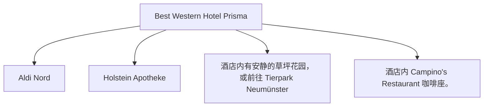

# Day 11 (2026-08-01) - Berlin → Neumünster

## Summary
告别柏林，开始北上回程。第一站前往汉堡北部的 Neumünster 诺伊明斯特，入住 Neumünster Hotel。这里有著名的奥特莱斯，可以进行适当补给和购物。

## Today's Goal
顺利出柏林向北行驶，下午抵达 Neumünster 办理入住，逛奥特莱斯时安排好孩子的活动和休息。

## Dashboard
- **日期（Date）**: 2026-08-01
- **行驶距离（Driving Distance）**: 约 360 km
- **行驶时间（Driving Time）**: 约 3.8 小时
- **预计剩余电量（Expected SOC）**: 出发 90%+ -> 抵达 30% (已精确计算)
- **天气（Weather）**: 晴朗 (预计 19-24°C)
- **步行距离（Walking Distance）**: 约 2-3 km (Neumünster 城区/Outlet)
- **入住酒店（Hotel）**: Neumünster Hotel (Max-Johannsen-Brücke 1, Neumünster 24537)
- **停车场（Parking）**: Hotel Prisma 专属免费停车场
- **办理入住（Check-in）**: 15:00
- **办理退房（Check-out）**: 09:30 前退房 (Berlin Hotel)
- **今日亮点（Highlights）**: Neumünster Designer Outlet 购物补给，田园风光

---

## Timeline
08:00 | Noora 起床与早餐
09:00 | 办理退房，装车
09:30 | 驱车北上（Berlin → Neumünster）
12:30 | 途中高速服务区充电 + 午餐 + Noora 车上午睡
14:30 | 抵达 Neumünster Hotel，办理 Check-in 稍作安顿
15:30 | 驱车前往 Designer Outlet Neumünster (Oderstraße 10)，接入 Tesla Supercharger 边充电边陪孩子推车购物
18:00 | 奥特莱斯内晚餐 (如 Outlet 内部的特色餐厅，或者自备便当)
19:30 | 充电完毕并结束购物，驱车返回酒店
20:00 | Noora 睡觉时间

---

## Route
驾车路线（Driving route）：Berlin → A24 → A1 → Hamburg → A7 → Neumünster (Max-Johannsen-Brücke 1)
自驾与停车路线：酒店至 Designer Outlet Neumünster (Oderstraße 10) 约 7.5 km，车程约 10 分钟。
停车（Parking）：Outlet 拥有超大型停车场，收费低廉，并设有 Tesla Supercharger 充电车位及残疾人/婴儿推车友好停车区。

---

## Map

*(已在网页版集成 Leaflet.js 交互式地图)*

---

## Charging
Departure SOC: 90%+
Recommended charger: **Tesla Supercharger Neumünster** (Oderstraße 10, 24539 Neumünster - 位于 Designer Outlet 停车场内，可边买东西边完成 Kona EV 的高功率补电)
Backup charger: 途中 Hamburg 附近的 IONITY/Recharge 充电站
Arrival SOC: 75% (包含充电后电量)

---

## Hotel
Address: Max-Johannsen-Brücke 1, Neumünster 24537
Parking: 酒店专属免费停车场。
EV: 酒店内部配备EV充电桩。
Supermarket: Aldi Nord (Rendsburger Str. 90) 或 Lidl (Rendsburger Str. 84, 距离约 1.2 km)。
Pharmacy: Holstein Apotheke (Rendsburger Str. 119, 距离约 1.5 km)。
Hospital: Friedrich-Ebert-Krankenhaus (Friesenstraße 11, 距离约 2.5 km)。
Playground: 酒店内有安静的草坪花园，或前往 Tierpark Neumünster (Geerdtsstraße 100，有巨大的儿童探险游乐场)。
Nearby Coffee: 酒店内 Campino's Restaurant 咖啡座。
Nearby Restaurant: 酒店内 Campino's 餐厅，提供北德特色菜。

---

## Meals
Breakfast: 酒店早餐
Lunch: 途中充电服务区
Dinner: Hotel Prisma 内 Campino's 德式特色餐厅
Coffee: Designer Outlet 购物区内星巴克/咖啡厅
### 推荐餐厅 (Recommended Restaurants)
- **Local Food**:
  - **Postkeller** (Großflecken 34, Neumünster): 位于市中心广场，提供正宗汉堡/北德风味肉食、新鲜啤酒和舒适的阳光露台。
- **Chinese/Asian Food**:
  - **China-Restaurant "Shanghai"** (Plöner Str. 11, Neumünster): 诺伊明斯特本地口碑极佳的中餐厅，提供铁板牛肉和香酥鸭等经典菜式。

---

## Baby Plan
Milk: 定时喂奶
Snack: 磨牙饼干、果泥
Nap: 12:30 - 14:30 车上午睡
Play: Designer Outlet Neumünster 内部配备有超棒的室外 Playground (带滑梯和爬网)，且服务中心提供婴儿车 (Buggy) 租借服务
Bath: 20:30 (回到酒店后洗澡)
Sleep: 21:00 准时入睡

---

## Conference
N/A

---

## Plan A (晴天)
在奥特莱斯宽敞的无障碍步行街推车闲逛，去游乐场玩耍。

---

## Plan B (雨天)
如果下雨，去奥特莱斯有顶棚遮蔽的区域，或者在酒店内休闲，去室内商场游玩。

---

## Expense
- **住宿（Hotel）**: 已预订 (TODO 填写金额)
- **充电（Charging）**: TODO
- **餐饮（Food）**: TODO
- **停车（Parking）**: TODO
- **购物（Shopping）**: TODO

---

## Journal
- **精选照片（Best Photo）**: TODO
- **今日回忆（Today's Memory）**: TODO
- **趣味瞬间（Funny Moment）**: TODO
- **Noora的新发现（Noora Learned）**: TODO
