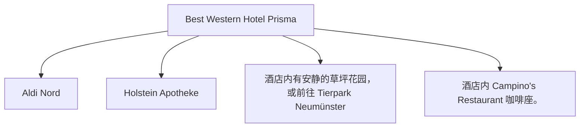

# Day 11 (2026-08-01) - Berlin → Neumünster

## Summary
告别柏林，开始北上回程。第一站前往汉堡北部的 Neumünster 诺伊明斯特，入住 Neumünster Hotel。这里有著名的奥特莱斯，可以进行适当补给和购物。

## Today's Goal
顺利出柏林向北行驶，下午抵达 Neumünster 办理入住，逛奥特莱斯时安排好孩子的活动和休息。

## Dashboard
- **日期（Date）**: 2026-08-01
- **行驶距离（Driving Distance）**: 约 355 km
- **行驶时间（Driving Time）**: 约 3小时45分纯驾驶；含午餐、充电和幼儿休息，建议按5小时预留
- **预计剩余电量（Expected SOC）**: 建议 90–95% 出发 → 预计抵达 Neumünster SOC: 25–40% (在 Outlet 购物充电后约 70–80%)
- **天气（Weather）**: 出发前 48 小时更新；当天早晨再次确认
- **步行距离（Walking Distance）**: 约 2-3 km (Neumünster 城区/Outlet)
- **入住酒店（Hotel）**: Neumünster Hotel (Max-Johannsen-Brücke 1, Neumünster 24537)
- **停车场（Parking）**: Hotel Prisma 专属免费停车场
- **办理入住（Check-in）**: 15:00
- **办理退房（Check-out）**: 11:00
- **今日亮点（Highlights）**: Neumünster Designer Outlet 购物补给，田园风光

---

## Timeline
08:00 | Noora 起床与早餐
09:00 | 办理退房，装车
09:30 | 驱车北上（Berlin → Neumünster）
12:30 | 途中高速服务区充电 + 午餐 + Noora 车上午睡
14:30 | 抵达 Neumünster Hotel，办理 Check-in 稍作安顿
15:30 | 驱车前往 Designer Outlet Neumünster (Oderstraße 10)，接入 Tesla Supercharger 边充电边陪孩子推车购物
18:00 | 奥特莱斯内晚餐 (如 Outlet 内部的特色餐厅，或者自备便当)
19:30 | 充电完毕并结束购物，驱车返回酒店
20:00 | Noora 睡觉时间

---

## Route
驾车路线（Driving route）：Berlin → A24 → A1 → Hamburg → A7 → Neumünster (Max-Johannsen-Brücke 1)
自驾与停车路线：酒店至 Designer Outlet Neumünster (Oderstraße 10) 约 7.5 km，车程约 10 分钟。
停车（Parking）：Outlet 拥有超大型停车场，收费低廉，并设有 Tesla Supercharger 充电车位及残疾人/婴儿推车友好停车区。

---

## Map

*(已在网页版集成 Leaflet.js 交互式地图)*

---

## Charging

Departure SOC: 90–95%

Recommended charger:
Tesla Supercharger Wittenburg (途中超充) 及 Neumünster Designer Outlet 停车场内 Tesla 充电桩

Backup charger:
Wittenburg 沿线快充站 或 Neumünster 城区快充

Arrival SOC:
25–40% (Outlet充电前) / 70–80% (Outlet充电后)

### Charging decision rule

- **切换条件**：如果导航预测抵达 Neumünster Outlet 充电站低于 15%，应在途中 Wittenburg 提前补充 15 分钟。
- **充电目标**：在 Wittenburg 途中充至 75% 左右，到达 Outlet 后利用购物时间通过 Tesla 快充补电至 80% 左右。
- **实时确认**：出发前确认 Wittenburg 和 Neumünster Supercharger 的枪头占用和收费情况。

---

## Hotel
Address: Max-Johannsen-Brücke 1, Neumünster 24537, Germany
Parking: 酒店专属免费停车场。
EV: 酒店内部配备EV充电桩。
Supermarket: Aldi Nord (Rendsburger Str. 90) 或 Lidl (Rendsburger Str. 84, 距离约 1.2 km)。
Pharmacy: Holstein Apotheke (Rendsburger Str. 119, 距离约 1.5 km)。
Hospital: Friedrich-Ebert-Krankenhaus (Friesenstraße 11, 距离约 2.5 km)。
Playground: 酒店内有安静的草坪花园，或前往 Tierpark Neumünster (Geerdtsstraße 100，有巨大的儿童探险游乐场)。
Nearby Coffee: 酒店内 Campino's Restaurant 咖啡座。
Nearby Restaurant: 酒店内 Campino's 餐厅，提供北德特色菜。

---

## Meals

Breakfast: 酒店自理
Lunch: 途中服务区
Dinner: Hotel Prisma 内 Campino's 德式特色餐厅
Coffee: Designer Outlet 购物区内星巴克/咖啡厅

### 推荐餐厅 (Recommended Restaurants)

- **首选 (First Choice)**: **Hotel Prisma 内 Campino's 餐厅** (入住后直接在酒店餐厅享用丰盛的北德特色晚餐，省去抱疲劳孩子到处找餐厅的麻烦)。
- **备选 (Backup)**: **Designer Outlet 内部餐饮区** (仅在购物按计划顺利进行、全家状态极佳时使用，不安排市中心正式晚餐)。
- **最稳方案 (Safe Fallback)**: 酒店附近 Aldi Nord/Lidl 采购面包、生鲜及辅食回房间用晚餐。
- **执行原则**：餐厅预约不是硬性节点。如果抵达延误或 Noora 疲劳，立即改为外带、超市采购或住宿简餐。

---

## Baby Plan
Milk: 定时喂奶
Snack: 磨牙饼干、果泥
Nap: 12:30 - 14:30 车上午睡
Play: Designer Outlet Neumünster 内部配备有超棒的室外 Playground (带滑梯和爬网)，且服务中心提供婴儿车 (Buggy) 租借服务
Bath: 20:30 (回到酒店后洗澡)
Sleep: 21:00 准时入睡

---

## Conference
N/A

---

## Plan A (晴天)
在奥特莱斯宽敞的无障碍步行街推车闲逛，去游乐场玩耍。

---

## Plan B (雨天)
如果下雨，去奥特莱斯有顶棚遮蔽的区域，或者在酒店内休闲，去室内商场游玩。

---

## Expense
- **住宿（Hotel）**: 已预订 (1106 NOK)
- **充电（Charging）**: 预算：预计 35 EUR；实际：旅行中填写
- **餐饮（Food）**: 预算：预计 80 EUR；实际：旅行中填写
- **停车（Parking）**: 预算：免费；实际：旅行中填写
- **购物（Shopping）**: 预算：预计 200 EUR；实际：旅行中填写

---

## Journal
- **精选照片（Best Photo）**: 旅行中填写
- **今日回忆（Today's Memory）**: 旅行中填写
- **趣味瞬间（Funny Moment）**: 旅行中填写
- **Noora的新发现（Noora Learned）**: 旅行中填写
