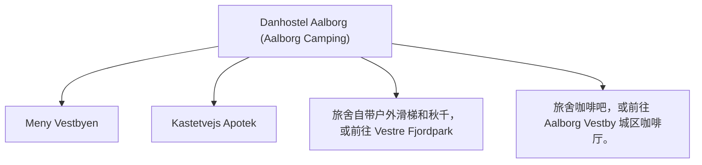

# Day 12 (2026-08-02) - Neumünster → Aalborg

## Summary
继续北上横穿丹麦半岛，抵达丹麦北部城市 Aalborg 奥尔堡，入住 Aalborg Hotel。这是回程轮渡港口前的最后一站。

## Today's Goal
跨越德丹边境，完成较长距离的安全驾驶，下午抵达 Aalborg 办理入住，为明早登船做好充足休整。

## Dashboard
- **日期（Date）**: 2026-08-02
- **行驶距离（Driving Distance）**: 约 360 km
- **行驶时间（Driving Time）**: 约 3.8 小时
- **预计剩余电量（Expected SOC）**: 出发 90%+ -> 抵达 25% (已精确计算)
- **天气（Weather）**: 晴转多云 (预计 18-22°C)
- **步行距离（Walking Distance）**: 约 3-4 km (Aalborg 港区/老城)
- **入住酒店（Hotel）**: Aalborg Hotel (50 Skydebanevej, Aalborg 9000)
- **停车场（Parking）**: Danhostel Aalborg 专属免费停车场
- **办理入住（Check-in）**: 16:00
- **办理退房（Check-out）**: 09:30 前退房 (Neumünster Hotel)
- **今日亮点（Highlights）**: 丹麦日德兰半岛风景，Aalborg 峡湾风光

---

## Timeline
08:00 | Noora 起床与早餐
09:00 | 整理行李，办理退房
09:30 | 出发自驾（Neumünster → Aalborg）
12:30 | 跨过边境后在丹麦超充站充电 + 午餐 + Noora 车上午睡
14:30 | 继续北上通过 Kolding, Aarhus
16:00 | 抵达 Aalborg Hotel，办理 Check-in 入住
16:30 | 沿 Limfjord 峡湾边散步，寻找 Playground 让 Noora 伸展肢体
18:00 | 晚餐
20:00 | Noora 睡觉时间
21:00 | 检查明日 Fjord Line 船票，理清登船流程，收拾好全部行李

---

## Route
驾车路线（Driving route）：Neumünster → A7 → 边境 → E45 → Aalborg (50 Skydebanevej)
步行路线：TODO 酒店周边林荫道或峡湾边步行路线
停车（Parking）：50 Skydebanevej 酒店专用停车场 (TODO)

---

## Map

*(已在网页版集成 Leaflet.js 交互式地图)*

---

## Charging
Departure SOC: 90%+
Recommended charger: 丹麦 E45 高速沿线超充（如 Tesla Randers 或 Ionity 站点）(TODO)
Backup charger: Circle K Kolding (途中备用充电站)
Arrival SOC: 25% (建议今晚充至 80%~90%，以应对明天港口登船和下船后的路程)

---

## Hotel
Address: 50 Skydebanevej, Aalborg 9000
Parking: 旅舍提供专属免费露天停车场。
EV: 码头及露营区公共充电站（Clever/Norlys）。
Supermarket: Meny Vestbyen (Otto Mønsteds Vej 1, 距离约 1.5 km)。
Pharmacy: Kastetvejs Apotek (Kastetvej 43, 距离约 1.8 km)。
Hospital: Aalborg Universitetshospital (Hobrovej 18-22, 距离约 4.5 km)。
Playground: 旅舍自带户外滑梯和秋千，或前往 Vestre Fjordpark (Skydebanevej 14, 距离约 800米，有大型水上乐园和沙坑)。
Nearby Coffee: 旅舍咖啡吧，或前往 Aalborg Vestby 城区咖啡厅。
Nearby Restaurant: Aalborg Marina 游艇码头餐厅（如 Restaurant Marina）。

---

## Meals
Breakfast: 酒店内
Lunch: 途中丹麦超充服务区
Dinner: Aalborg 游艇码头 Restaurant Marina 丹麦特色海鲜
Coffee: Vestre Fjordpark 湖畔咖啡座

---

## Baby Plan
Milk: 定时冲奶
Snack: 备齐路途水果、饼干
Nap: 12:30 - 14:30 车上午睡
Play: Limfjord 峡湾边的 Playground
Bath: 19:30
Sleep: 20:00 准时入睡

---

## Conference
N/A

---

## Plan A (晴天)
在 Aalborg 峡湾公园的草坪野餐，Noora 户外玩耍。

---

## Plan B (雨天)
如果下雨，直接回酒店房间，进行室内亲子阅读与玩具互动，保护体力。

---

## Expense
- **住宿（Hotel）**: 已预订 (TODO 填写金额)
- **充电（Charging）**: TODO
- **餐饮（Food）**: TODO
- **停车（Parking）**: TODO
- **购物（Shopping）**: TODO

---

## Journal
- **精选照片（Best Photo）**: TODO
- **今日回忆（Today's Memory）**: TODO
- **趣味瞬间（Funny Moment）**: TODO
- **Noora的新发现（Noora Learned）**: TODO
