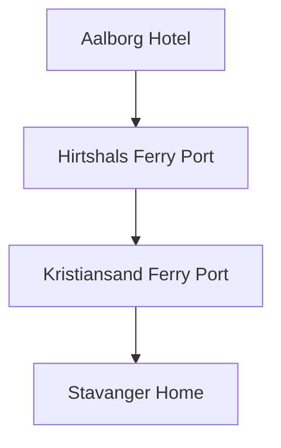

# Day 13 (2026-08-03) - Aalborg → Hirtshals → 轮渡 → Kristiansand → Stavanger

## Summary
最后一天。大清早退房赶往 Hirtshals 港口，乘坐 Fjord Line 轮渡返回 Kristiansand（已订船上充电）。下船后驱车返回 Stavanger 温馨的家，结束 13 天精彩的欧洲家庭公路之旅。

## Today's Goal
08:45 前必须抵达 Hirtshals 码头办理 Fjord Line 检票手续。在船上完成 Kona 电力补给。下午安全平稳驱车返回 Stavanger。

## Dashboard
- **日期（Date）**: 2026-08-03
- **行驶距离（Driving Distance）**: 约 50 km (丹麦) + 235 km (挪威) = 285 km
- **行驶时间（Driving Time）**: 约 4小时10分纯驾驶 (丹麦约40分，挪威约3.5小时)；另需计算轮渡时间与上下船等待，建议按 8-9小时预留总行程
- **预计剩余电量（Expected SOC）**: 建议 80–90% 从 Aalborg 出发 (下船预计 65%+) → 预计抵达 Stavanger SOC: 30%+
- **天气（Weather）**: 出发前 48 小时更新；当天早晨再次确认
- **步行距离（Walking Distance）**: 约 1-2 km
- **入住酒店（Hotel）**: Return Home (Stavanger)
- **停车场（Parking）**: Stavanger 自家车库/车位
- **办理入住（Check-in）**: N/A
- **办理退房（Check-out）**: 08:00 前退房 (Aalborg Hotel)
- **今日亮点（Highlights）**: Fjord Line 船上充电体验，凯旋回家

---

## Timeline
07:15 | 快速退房并打包车辆行李
07:45 | 驱车自驾（Aalborg → Hirtshals Port）
08:30 | 抵达 Hirtshals 港口排队检票
08:45 | Fjord Line Check-in 截止
09:45 | Fjord Line 轮渡准时开船（Hirtshals → Kristiansand），车辆接入船上充电
10:15 | 享用船上午餐/早午餐，带 Noora 户外看海，在儿童角玩耍
12:10 | 抵达 Kristiansand 港口，排队下船
12:30 | 驶上 E39 高速，返回 Stavanger（Noora 车上午睡）
16:00 | 抵达 Stavanger 家中，将行李卸车，安顿 Noora
18:00 | 家中晚餐，记录旅程回忆
20:00 | Noora 睡在熟悉的婴儿床上，旅行圆满结束

---

## Route
驾车路线（Driving route）：Aalborg → E45 → Hirtshals Port → (Ferry) → Kristiansand Port → E39 → Stavanger Home
步行路线：无
停车（Parking）：Ferry 舱内充电车位，Stavanger 自家车位

---

## Map

*(已在网页版集成 Leaflet.js 交互式地图)*

---

## Charging

Departure SOC: 80–90%

Recommended charger:
Fjord Line HSC Fjord FSTR 轮渡车载充电桩 (已预订船上充电，但最终电量无法预先百分百保证)

Backup charger:
Kristiansand Rona 快速充电站 或 E39 沿线 Mandal / Lyngdal 快充站

Arrival SOC:
30%+

### Charging decision rule

- **切换条件**：下船时如果发现船上充电未成功或电量低于 65%，或者导航预测抵达 Stavanger 低于 15%，应在 Kristiansand 补电 15–20分钟再上路。
- **充电目标**：安全回家电量即可，通常在路途中充至 50% 左右即足够直达 Stavanger 家中。
- **实时确认**：登船时主动向工作人员出示“Ladepunkt el-bil”预订凭证，确保车辆在充电区域停放。

---

## Hotel
Address: Stavanger Home
Parking: 家中车库
EV: 家中充电桩
Supermarket: Stavanger 当地超市
Pharmacy: Stavanger 当地药店
Hospital: Stavanger 医院
Playground: 家附近游乐场
Nearby Coffee: 常用咖啡店
Nearby Restaurant: 常用餐厅

---

## Meals

Breakfast: 旅舍内自理或自备简餐
Lunch: HSC Fjord FSTR 轮渡上简餐 (无需在途中安排正式餐厅停留)
Dinner: Stavanger 家中温馨晚餐
Coffee: Fjord Line 轮渡咖啡厅

### 推荐餐厅 (Recommended Restaurants)

- **首选 (First Choice)**: **Stavanger 家中温馨晚餐** (回到温暖的家，自制晚餐或外卖，最适合结束长途跋涉的旅程)。
- **备选 (Backup)**: 途中 E39 快餐店 (如 McDonald's / Circle K，仅作紧急应急之用)。
- **最稳方案 (Safe Fallback)**: 轮渡简餐与自备零食 (把晚餐推迟到回家之后，不在路上作任何不必要的停留)。
- **执行原则**：餐厅预约不是硬性节点。如果抵达延误或 Noora 疲劳，立即改为外带、超市采购或住宿简餐。

---

## Baby Plan
Milk: 船上及途中冲奶
Snack: 水果零食
Nap: 12:30 - 15:30 挪威路段车上熟睡（长途睡眠）
Play: 船上儿童角游乐
Bath: 19:30 回家洗澡
Sleep: 20:00 在熟悉的家中床上顺利入睡

---

## Conference
N/A

---

## Plan A (晴天)
行车顺畅，轮渡无延误，傍晚平安到家。

---

## Plan B (雨天)
如遇到海上大风大浪轮渡延误，在港口或船上做好安抚，下船后减速慢行，视情况在途中增补一次充电。

---

## Expense
- **住宿（Hotel）**: N/A (回到温暖的家)
- **充电（Charging）**: 预算：99 NOK (轮渡充电预订已付) + 预计 100 NOK；实际：旅行中填写
- **餐饮（Food）**: 预算：预计 300 NOK；实际：旅行中填写
- **停车（Parking）**: 预算：免费；实际：旅行中填写
- **购物（Shopping）**: 预算：N/A；实际：旅行中填写

---

## Journal
- **精选照片（Best Photo）**: 旅行中填写
- **今日回忆（Today's Memory）**: 旅行中填写
- **趣味瞬间（Funny Moment）**: 旅行中填写
- **Noora的新发现（Noora Learned）**: 旅行中填写
